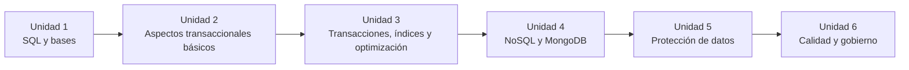

# Bases de Datos Aplicadas — UNLaM

Apuntes, guías de referencia y ejercicios prácticos de la cursada, organizados por unidad.

{: .note }
> Este sitio usa una estructura de documentación navegable con búsqueda, anclas por encabezado, tabla de contenidos lateral en páginas extensas y soporte para diagramas Mermaid y fórmulas TeX.

## Contenido

### [Unidad 1 — Conceptos básicos. Repaso SQL]({{ '/unidad-1/' | relative_url }})
DDL, DML, constraints, NULL, JOINs, vistas, procedimientos almacenados, triggers, funciones de usuario, window functions, CTE, SQL dinámico, PIVOT.

### [Unidad 2 — BD Transaccionales: aspectos básicos]({{ '/unidad-2/' | relative_url }})
Arquitectura de SQL Server, instalación, ODBC/JDBC, collation.

### [Unidad 3 — BD Transaccionales: aspectos avanzados]({{ '/unidad-3/' | relative_url }})
Transacciones, ACID, concurrencia, bloqueos, índices, optimización de consultas.

### [Unidad 4 — BD No Transaccionales (NoSQL)]({{ '/unidad-4/' | relative_url }})
NoSQL, MongoDB, MongoDB Query Language, Data Lakes, KDD.

### [Unidad 5 — Protección de los datos]({{ '/unidad-5/' | relative_url }})
Seguridad, DCL, roles, backups, alta disponibilidad, réplicas.

### [Unidad 6 — Calidad en bases de datos]({{ '/unidad-6/' | relative_url }})
Calidad de datos, ISO/IEC 25012, GDPR, gobierno de datos.

## Mapa de cursada

---

## Bibliografía

- Elmasri, Navathe — *Fundamentos de Sistemas de Bases de Datos* · Pearson · 5ta ed. · 2007
- Silberschatz, Korth, Sudarshan — *Fundamentos de Bases de Datos* · McGraw-Hill · 4ta ed. · 2002

**Recursos online**
- [Microsoft Learn — Modern Data Warehouse](https://learn.microsoft.com/en-us/training/modules/examine-components-of-modern-data-warehouse/)
- [Microsoft Learn — Azure Data Lake Storage](https://learn.microsoft.com/en-us/training/modules/intro-to-azure-data-lake-storage/)
- [MongoDB University — Introduction to MongoDB](https://learn.mongodb.com/learning-paths/introduction-to-mongodb)
