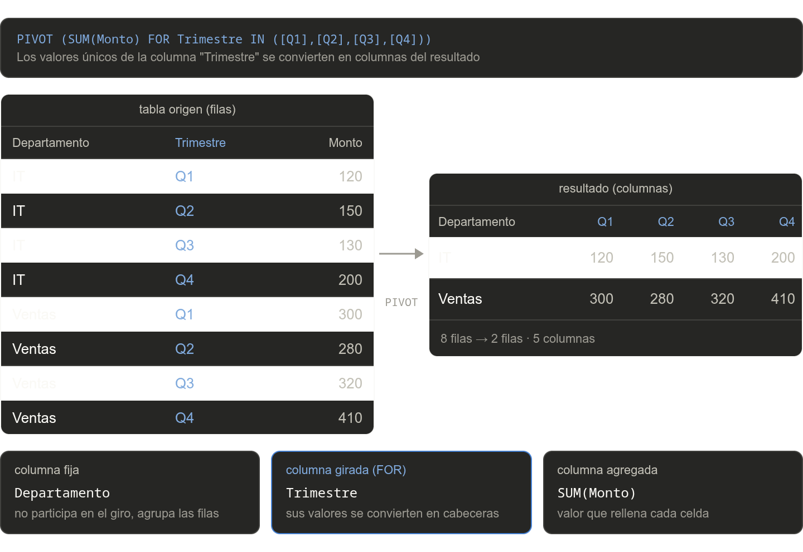
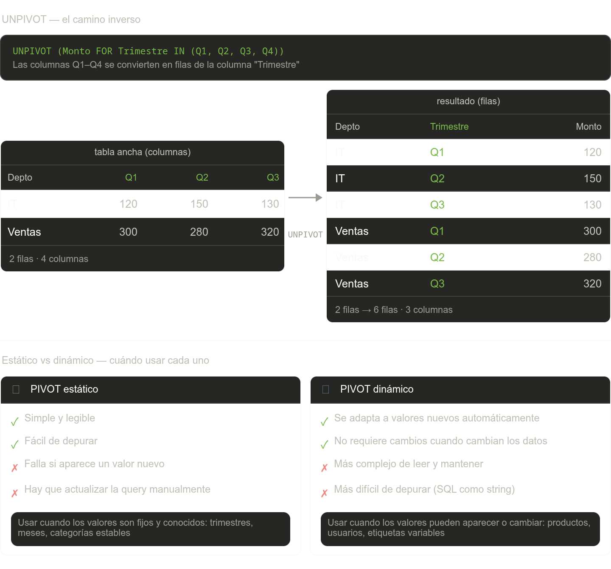

# PIVOT

`PIVOT` transforma filas en columnas. Tomás datos almacenados verticalmente (una fila por valor) y los presentás horizontalmente (un valor por columna), lo que facilita comparaciones y reportes.

---

## El problema que resuelve

Supongamos esta tabla de ventas:

| Departamento | Trimestre | Monto
---------------|-----------|------
| IT           | Q1        |   120
| IT           | Q2        |   150
| IT           | Q3        |   130
| IT           | Q4        |   200
| Ventas       | Q1        |   300
| Ventas       | Q2        |   280
| Ventas       | Q3        |   320
| Ventas       | Q4        |   410


**Sin PIVOT** — los trimestres están apilados verticalmente, difícil de comparar de un vistazo.

**Con PIVOT** — cada trimestre se convierte en una columna propia:

| Departamento | Q1  | Q2  | Q3  | Q4
---------------|-----|------|----|----
| IT           | 120 | 150 | 130 | 200
| Ventas       | 300 | 280 | 320 | 410

```
      ↑                                 ↑
columna fija                    columnas pivoteadas
(se mantiene)           (generadas desde los valores de "Trimestre")
```
> PIVOT no cambia los datos — solo cambia cómo se presentan.



---

## ¿Qué hace cada parte de PIVOT?

```sql
SELECT Departamento, [Q1], [Q2], [Q3], [Q4]
FROM (
    SELECT Departamento, Trimestre, Monto   -- subconsulta fuente
    FROM Ventas
) AS origen
PIVOT (
    SUM(Monto)                   -- qué agregar
    FOR Trimestre                -- qué columna girar
    IN ([Q1], [Q2], [Q3], [Q4]) -- qué valores se vuelven columnas
) AS pv
```

Los tres componentes obligatorios dentro de `PIVOT`:

| Componente | Qué define |
|---|---|
| `FUNCION_AGREG(columna)` | Qué hacer con los valores que se "apilan" en la misma celda: `SUM`, `COUNT`, `AVG`, etc. |
| `FOR columna` | Cuál es la columna cuyos _valores_ se van a convertir en nombres de columna |
| `IN ([v1], [v2], ...)` | Los valores concretos que se convierten en columnas |

## Qué ocurre si la tabla tiene más columnas
Supongamos que ahora la tabla `Ventas` también tiene:

```text
Departamento | Trimestre | Monto | Año | Vendedor
````

y hacemos:

```sql
SELECT Departamento, [Q1], [Q2], [Q3], [Q4]
FROM Ventas
PIVOT (
    SUM(Monto)
    FOR Trimestre IN ([Q1], [Q2], [Q3], [Q4])
) AS pv;
```

El problema es que `PIVOT` agrupa automáticamente por todas las columnas que no forman parte de:

* la agregación (`Monto`);
* la columna pivotada (`Trimestre`).

Entonces SQL Server también agrupará por:

```text
Departamento, Año, Vendedor
```

Esto puede generar múltiples filas para un mismo departamento.

Ejemplo conceptual:

| Departamento | Año  | Vendedor | Q1  |
| ------------ | ---- | -------- | --- |
| IT           | 2025 | Juan     | 120 |
| IT           | 2025 | Ana      | 90  |

En lugar de:

| Departamento | Q1  |
| ------------ | --- |
| IT           | 210 |

Por eso suele utilizarse una subquery:

```sql
FROM (
    SELECT Departamento, Trimestre, Monto
    FROM Ventas
) AS origen
```

La subquery permite controlar exactamente qué columnas participan en el `PIVOT`, evitando que columnas adicionales afecten la agrupación interna.

## Regla práctica

> 📌 El `SELECT` externo decide qué columnas se muestran.
> La subquery decide qué columnas participan realmente en el `PIVOT`.


---

## Sintaxis base

```sql
SELECT <columnas_fijas>, [valor_col1], [valor_col2], ...
FROM (
    <subconsulta_con_los_datos>
) AS origen
PIVOT (
    FUNCION_AGREGADO(columna_a_agregar)
    FOR columna_a_girar IN ([valor_col1], [valor_col2], ...)
) AS tabla_pivoteada
```

---

## PIVOT estático

Los nombres de columna se conocen de antemano y se escriben directamente.

**Escenario:** ventas por departamento, una columna por trimestre.

```sql
SELECT Departamento, [Q1], [Q2], [Q3], [Q4]
FROM (
    SELECT Departamento, Trimestre, Monto
    FROM Ventas
) AS origen
PIVOT (
    SUM(Monto)
    FOR Trimestre IN ([Q1], [Q2], [Q3], [Q4])
) AS pv
```

| Departamento | Q1  | Q2  | Q3  | Q4  |
|---|---|---|---|---|
| IT | 120 | 150 | 130 | 200 |
| Ventas | 300 | 280 | 320 | 410 |

### Celdas NULL

Si no hay datos para una combinación (por ejemplo, IT no tuvo ventas en Q3), la celda queda en `NULL`. Usá `ISNULL` para reemplazarlo:

```
IT  | Q1: 120 | Q2: 150 | Q3: NULL | Q4: 200
                                ↑
                   no hubo registro para esa combinación
```

```sql
SELECT Departamento,
    ISNULL([Q1], 0) AS Q1,
    ISNULL([Q2], 0) AS Q2,
    ISNULL([Q3], 0) AS Q3,
    ISNULL([Q4], 0) AS Q4
FROM (
    SELECT Departamento, Trimestre, Monto
    FROM Ventas
) AS origen
PIVOT (SUM(Monto) FOR Trimestre IN ([Q1],[Q2],[Q3],[Q4])) AS pv
```

---

## PIVOT dinámico

Cuando los valores de columna no se conocen de antemano (o cambian), se construye la lista con SQL dinámico.

```
Paso 1: descubrir los valores únicos
  SELECT DISTINCT Trimestre FROM Ventas
  → 'Q1', 'Q2', 'Q3', 'Q4'  (hoy)
  → 'Q1', 'Q2', 'Q3', 'Q4', 'Q5'  (mañana, si se agrega Q5)
              ↓
  Se arma la cadena: '[Q1], [Q2], [Q3], [Q4]'

Paso 2: inyectar esa cadena en la consulta PIVOT
  SET @query = 'SELECT ... PIVOT (SUM(Monto) FOR Trimestre IN (' + @cols + ')) AS pv'

Paso 3: ejecutar
  EXEC sp_executesql @query
```

```sql
DECLARE @cols   NVARCHAR(MAX)
DECLARE @query  NVARCHAR(MAX)

-- 1. Construir la lista de columnas desde los datos reales
SELECT @cols = STRING_AGG('[' + Trimestre + ']', ', ')
FROM (SELECT DISTINCT Trimestre FROM Ventas) AS t

-- 2. Armar y ejecutar el PIVOT con esa lista
SET @query = '
    SELECT Departamento, ' + @cols + '
    FROM (
        SELECT Departamento, Trimestre, Monto
        FROM Ventas
    ) AS origen
    PIVOT (
        SUM(Monto)
        FOR Trimestre IN (' + @cols + ')
    ) AS pv'

EXEC sp_executesql @query
```

> La diferencia clave es que `@cols` se arma en tiempo de ejecución, por lo que funciona aunque aparezcan nuevos trimestres en los datos.

### Estático vs dinámico — cuándo usar cada uno

| | PIVOT estático | PIVOT dinámico |
|---|---|---|
| **Cuándo usarlo** | Los valores de columna son fijos y conocidos | Los valores pueden cambiar o no se conocen de antemano |
| **Ventajas** | Simple, legible, fácil de depurar | Se adapta automáticamente a valores nuevos |
| **Desventajas** | Falla si aparece un valor nuevo en los datos | Más complejo de leer, mantener y depurar |
| **Ejemplo típico** | Trimestres Q1–Q4, meses del año | Productos, usuarios, etiquetas variables |

---

## UNPIVOT — el camino inverso

`UNPIVOT` hace lo contrario: convierte columnas en filas.

```
Tabla con columnas:                 Resultado con UNPIVOT (filas):
──────────────────────────          ──────────────────────────────
Depto  | Q1  | Q2  | Q3            Depto  | Trimestre | Monto
IT     | 120 | 150 | 130    →      IT     | Q1        |   120
Ventas | 300 | 280 | 320           IT     | Q2        |   150
                                   IT     | Q3        |   130
                                   Ventas | Q1        |   300
                                   Ventas | Q2        |   280
                                   Ventas | Q3        |   320
```

```sql
SELECT Departamento, Trimestre, Monto
FROM (
    SELECT Departamento, Q1, Q2, Q3, Q4
    FROM ResumenVentas
) AS origen
UNPIVOT (
    Monto FOR Trimestre IN (Q1, Q2, Q3, Q4)
) AS unpv
```

> Nota: `UNPIVOT` elimina las filas con `NULL`. Si necesitás conservarlas, usá `CROSS APPLY` o `UNION ALL`.




---

## Errores frecuentes

| Error | Causa | Solución |
|---|---|---|
| La columna no aparece | El valor en `IN` no coincide exactamente (mayúsculas, espacios) | Verificar los valores con `SELECT DISTINCT` |
| Columnas duplicadas en el resultado | La subconsulta trae columnas extra que SQL Server intenta agregar como fijo | Seleccionar solo las columnas necesarias en la subconsulta |
| Error de conversión | La función de agregado recibe tipos incompatibles | Verificar el tipo de la columna que se agrega |
| `STRING_AGG` no disponible | SQL Server < 2017 | Usar `FOR XML PATH` para construir la lista |

### Alternativa a `STRING_AGG` para SQL Server anterior a 2017

```sql
SELECT @cols = STUFF(
    (SELECT ', [' + Trimestre + ']'
     FROM (SELECT DISTINCT Trimestre FROM Ventas) t
     FOR XML PATH('')), 1, 2, '')
```

---

## Regla práctica

```
¿Estás leyendo datos de una tabla "larga"    → PIVOT   (filas → columnas)
¿Estás normalizando una tabla "ancha"?       → UNPIVOT (columnas → filas)
¿Los valores de columna pueden cambiar?      → PIVOT dinámico con sp_executesql
```
