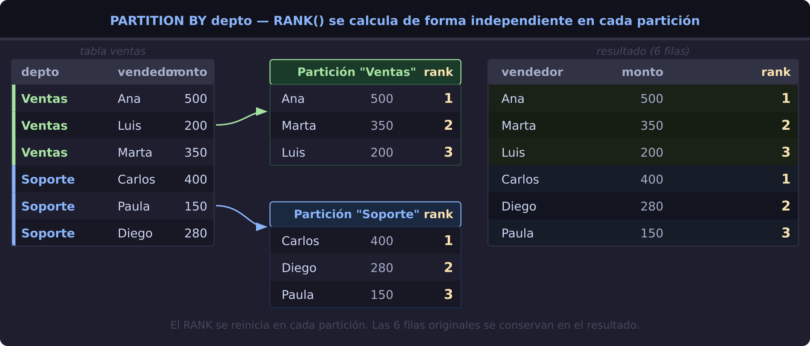
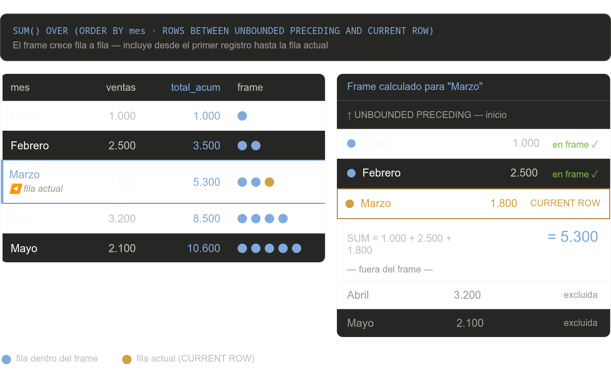

# Window Functions

Las Window Functions (funciones de ventana) permiten realizar cálculos sobre un conjunto de filas relacionadas con la fila actual **sin colapsar el resultado** como hace `GROUP BY`. Podés rankear, acumular, comparar o navegar entre filas manteniendo todo el detalle del resultado.

---

## El problema que resuelven

Supongamos esta tabla de ventas por vendedor y departamento:

| vendedor | depto   | monto |
|----------|---------|------:|
| Ana      | Ventas  |   500 |
| Luis     | Ventas  |   200 |
| Marta    | Ventas  |   350 |
| Carlos   | Soporte |   400 |
| Paula    | Soporte |   150 |

**Con `GROUP BY`** podés sumar por depto, pero perdés las filas individuales:

```sql
SELECT depto, SUM(monto) AS total
FROM ventas
GROUP BY depto
```

| depto   | total |
|---------|------:|
| Ventas  |  1050 |
| Soporte |   550 |

**Con una Window Function** calculás el total _por depto_ pero conservás cada fila:

```sql
SELECT vendedor, depto, monto,
       SUM(monto) OVER (PARTITION BY depto) AS total_depto
FROM ventas
```

| vendedor | depto   | monto | total_depto |
|----------|---------|------:|------------:|
| Ana      | Ventas  |   500 |        1050 |
| Luis     | Ventas  |   200 |        1050 |
| Marta    | Ventas  |   350 |        1050 |
| Carlos   | Soporte |   400 |         550 |
| Paula    | Soporte |   150 |         550 |

> La función se aplica _dentro_ de cada partición pero **las filas no se colapsan**.

---

## ¿Qué es la "ventana"?

La ventana es el conjunto de filas que cada función "ve" cuando procesa una fila específica. `PARTITION BY` divide la tabla en grupos independientes — cada uno es una ventana separada con su propio cómputo.



Cada partición tiene su propio ranking. El `RANK` de Carlos es 1 dentro de "Soporte", independientemente de lo que ocurra en "Ventas".

---

## Anatomía de `OVER()`

```sql
FUNCION() OVER (
    PARTITION BY columna         -- divide en grupos (opcional)
    ORDER BY columna [ASC|DESC]  -- ordena dentro de cada grupo
    ROWS BETWEEN ... AND ...     -- define el "frame" dentro del grupo (opcional)
) AS alias
```

| Cláusula | ¿Qué hace? | ¿Obligatoria? |
|----------|------------|:---:|
| `PARTITION BY` | Divide en particiones. Si se omite, toda la tabla es una sola ventana. | No |
| `ORDER BY` | Ordena filas dentro de la partición antes de aplicar la función. | Generalmente sí |
| frame (`ROWS/RANGE BETWEEN`) | Limita las filas que se incluyen en el cálculo dentro de la partición. | No |

---

## El frame de la ventana

El **frame** define exactamente qué filas se incluyen en el cálculo para cada fila. Es la parte que más confunde, pero es la que hace posibles los totales acumulados y promedios móviles.

**Sintaxis:**
```sql
ROWS BETWEEN <inicio> AND <fin>
```

| Valor | Significado |
|-------|-------------|
| `UNBOUNDED PRECEDING` | Desde el primer registro de la partición |
| `N PRECEDING` | N filas antes de la fila actual |
| `CURRENT ROW` | La fila actual |
| `N FOLLOWING` | N filas después de la fila actual |
| `UNBOUNDED FOLLOWING` | Hasta el último registro de la partición |

**Frames más usados:**

```sql
-- Total acumulado (más común):
SUM(monto) OVER (ORDER BY fecha ROWS BETWEEN UNBOUNDED PRECEDING AND CURRENT ROW)

-- Promedio móvil de 3 períodos:
AVG(monto) OVER (ORDER BY fecha ROWS BETWEEN 2 PRECEDING AND CURRENT ROW)

-- Toda la partición (equivale a no poner frame):
SUM(monto) OVER (PARTITION BY depto ROWS BETWEEN UNBOUNDED PRECEDING AND UNBOUNDED FOLLOWING)
```

El siguiente diagrama muestra cómo el frame crece fila a fila para un total acumulado:



---

## Parte 0 — Funciones de agregado como window functions

`SUM`, `AVG`, `COUNT`, `MIN` y `MAX` se pueden usar como window functions añadiendo `OVER()`. A diferencia del `GROUP BY`, **no colapsan las filas**.

### Total acumulado (running total)

```sql
SELECT
    fecha,
    monto,
    SUM(monto) OVER (ORDER BY fecha
                     ROWS BETWEEN UNBOUNDED PRECEDING AND CURRENT ROW) AS acumulado
FROM ventas
```

| fecha  | monto | acumulado |
|--------|------:|----------:|
| Enero  |  1000 |      1000 |
| Febrero|  2500 |      3500 |
| Marzo  |  1800 |      5300 |
| Abril  |  3200 |      8500 |
| Mayo   |  2100 |     10600 |

### Porcentaje sobre el total del grupo

```sql
SELECT
    vendedor,
    depto,
    monto,
    SUM(monto) OVER (PARTITION BY depto) AS total_depto,
    CAST(monto * 100.0 / SUM(monto) OVER (PARTITION BY depto) AS DECIMAL(5,1)) AS pct_depto
FROM ventas
```

| vendedor | depto  | monto | total_depto | pct_depto |
|----------|--------|------:|------------:|----------:|
| Ana      | Ventas |   500 |        1050 |      47.6 |
| Marta    | Ventas |   350 |        1050 |      33.3 |
| Luis     | Ventas |   200 |        1050 |      19.0 |

### Promedio móvil de 3 períodos

```sql
SELECT
    fecha,
    monto,
    AVG(monto) OVER (ORDER BY fecha
                     ROWS BETWEEN 2 PRECEDING AND CURRENT ROW) AS media_movil_3
FROM ventas
```

### Diferencia respecto al máximo de la partición

```sql
SELECT
    vendedor,
    depto,
    monto,
    MAX(monto) OVER (PARTITION BY depto) AS maximo_depto,
    MAX(monto) OVER (PARTITION BY depto) - monto AS diferencia_al_max
FROM ventas
```

---

## Parte 1 — Funciones de ranking

Devuelven un número de posición para cada fila dentro de su partición.

### `ROW_NUMBER()`

Número secuencial único, sin empates. Aunque dos filas tengan el mismo valor, cada una recibe un número distinto.

```sql
ROW_NUMBER() OVER (ORDER BY monto DESC) AS nro
```

| vendedor | monto | nro |
|----------|------:|----:|
| Ana      |   500 |   1 |
| Marta    |   350 |   2 |
| Luis     |   200 |   3 |

> Ideal para **paginación** o para quedarse con "la primera fila de cada grupo" filtrando `WHERE nro = 1`.

---

### `RANK()`

Mismo número para empates, pero el siguiente número **se saltea**.

```sql
RANK() OVER (ORDER BY cantidad DESC) AS rank
```

| producto       | cantidad | rank |
|----------------|:--------:|:----:|
| Paint - Silver |    49    |  1   |
| Paint - Blue   |    49    |  1   |
| Paint - Red    |    41    |  **3** ← salta el 2 |
| Paint - Yellow |    30    |  4   |

---

### `DENSE_RANK()`

Igual que `RANK()` pero **sin saltos**: los números son siempre consecutivos.

```sql
DENSE_RANK() OVER (ORDER BY cantidad DESC) AS rank
```

| producto       | cantidad | rank |
|----------------|:--------:|:----:|
| Paint - Silver |    49    |  1   |
| Paint - Blue   |    49    |  1   |
| Paint - Red    |    41    |  **2** ← sin salto |
| Paint - Yellow |    30    |  3   |

> **¿Cuándo usar cuál?** `RANK` cuando el número refleje "cuántos te superan". `DENSE_RANK` cuando necesitás grupos consecutivos (ej: top 3 sin importar empates).

---

### `NTILE(n)`

Distribuye las filas en `n` grupos iguales y asigna a cada fila el número de su grupo. Útil para **cuartiles, quintiles, deciles**.

```sql
NTILE(4) OVER (ORDER BY monto DESC) AS cuartil
```

Si el total de filas no es divisible exactamente por `n`, los grupos más grandes van primero (ej: 53 filas en 5 grupos → 11, 11, 11, 10, 10).

---

## Parte 2 — Funciones analíticas

### `LAG()` y `LEAD()` — navegar entre filas

`LAG()` accede a una fila **anterior**; `LEAD()` accede a una fila **siguiente**. Evitan necesitar un self-join para comparar filas consecutivas.

```sql
LAG (expresión [, offset] [, default]) OVER ([PARTITION BY ...] ORDER BY ...)
LEAD(expresión [, offset] [, default]) OVER ([PARTITION BY ...] ORDER BY ...)
```

- `offset`: cuántas filas hacia atrás/adelante (por defecto: 1).
- `default`: valor si no existe la fila destino (por defecto: `NULL`).

**Caso de uso clásico — variación período a período:**

```sql
SELECT
    fecha,
    ventas,
    LAG(ventas, 1, 0) OVER (ORDER BY fecha)         AS ventas_anterior,
    ventas - LAG(ventas, 1, 0) OVER (ORDER BY fecha) AS variacion
FROM resumen_mensual
```

| fecha   | ventas | ventas_anterior | variacion |
|---------|-------:|----------------:|----------:|
| Enero   |   1000 |               0 |      1000 |
| Febrero |   2500 |            1000 |      1500 |
| Marzo   |   1800 |            2500 |      -700 |

---

### `FIRST_VALUE()` y `LAST_VALUE()`

Devuelven el primer o último valor dentro de la ventana ordenada.

```sql
-- Para cada empleado, mostrar quién tiene menos horas de vacaciones en su puesto:
FIRST_VALUE(apellido) OVER (
    PARTITION BY puesto
    ORDER BY horas_vacaciones ASC
    ROWS BETWEEN UNBOUNDED PRECEDING AND UNBOUNDED FOLLOWING
) AS menor_vacaciones_en_puesto
```

> `ROWS BETWEEN UNBOUNDED PRECEDING AND UNBOUNDED FOLLOWING` es casi siempre necesario con `LAST_VALUE()` para que vea toda la partición, no solo hasta la fila actual.

---

### `PERCENT_RANK()` y `CUME_DIST()`

Calculan la posición relativa de una fila dentro de su partición como un valor entre 0 y 1.

| Función | Fórmula | Primera fila | ¿Puede ser 0? |
|---------|---------|:---:|:---:|
| `PERCENT_RANK()` | `(rank - 1) / (total - 1)` | 0.0 | Sí |
| `CUME_DIST()` | `rank / total` | `1/n` | No |

```sql
PERCENT_RANK() OVER (PARTITION BY depto ORDER BY sueldo) AS pct_rank
CUME_DIST()    OVER (PARTITION BY depto ORDER BY sueldo) AS cume_dist
```

`CUME_DIST` incluye la fila actual en el conteo; `PERCENT_RANK` no. Por eso `CUME_DIST` nunca devuelve 0.

---

## Tabla comparativa

| Función | Tipo | Empates posibles | Números consecutivos | Frame |
|---------|------|:---:|:---:|:---:|
| `ROW_NUMBER()` | Ranking | No | Siempre | No |
| `RANK()` | Ranking | Sí | No (hay saltos) | No |
| `DENSE_RANK()` | Ranking | Sí | Siempre | No |
| `NTILE(n)` | Ranking | Sí (grupos) | — | No |
| `SUM() OVER` | Agregado | — | — | Sí |
| `AVG() OVER` | Agregado | — | — | Sí |
| `COUNT() OVER` | Agregado | — | — | Sí |
| `LAG()` | Analítica | — | — | No |
| `LEAD()` | Analítica | — | — | No |
| `FIRST_VALUE()` | Analítica | — | — | Sí |
| `LAST_VALUE()` | Analítica | — | — | Sí |
| `PERCENT_RANK()` | Analítica | — | 0–1 | No |
| `CUME_DIST()` | Analítica | — | 0–1 | No |
