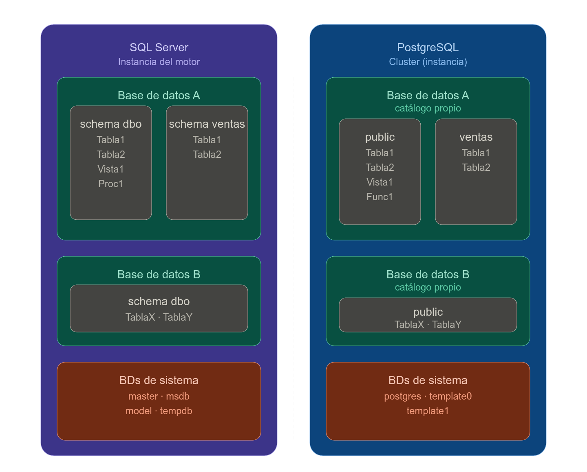
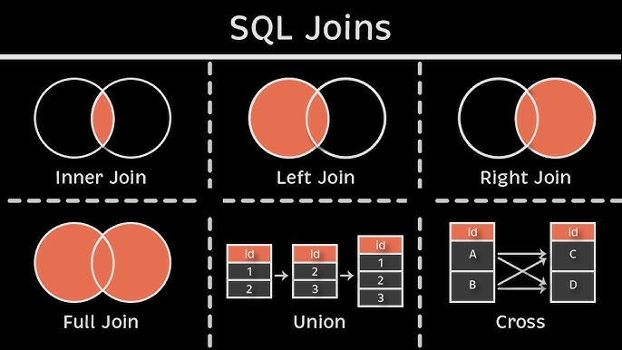

- [Conceptos básicos](#conceptos-básicos)
  - [Qué es una base de datos](#qué-es-una-base-de-datos)
  - [Qué es un DBMS](#qué-es-un-dbms)
  - [¿Siempre conviene usar un DBMS?](#siempre-conviene-usar-un-dbms)
  - [DBMS más utilizados](#dbms-más-utilizados)
  - [Cómo elegir un DBMS](#cómo-elegir-un-dbms)
  - [DBA vs programador de base de datos](#dba-vs-programador-de-base-de-datos)
- [Repaso de SQL](#repaso-de-sql)
  - [Modelo de datos y abstracción](#modelo-de-datos-y-abstracción)
    - [Tipos de restricciones (constraints)](#tipos-de-restricciones-constraints)
  - [Tipos de datos](#tipos-de-datos)
  - [Catálogos y schemas](#catálogos-y-schemas)
  - [Crear un catálogo / base de datos](#crear-un-catálogo--base-de-datos)
    - [`COLLATE` en SQL Server](#collate-en-sql-server)
    - [Ejemplo](#ejemplo)
    - [¿Se puede modificar después?](#se-puede-modificar-después)
    - [Idea clave](#idea-clave)
  - [Crear un schema](#crear-un-schema)
  - [Crear tablas dentro del schema](#crear-tablas-dentro-del-schema)
  - [Consultar usando el schema](#consultar-usando-el-schema)
  - [Diferencia conceptual](#diferencia-conceptual)
  - [DDL y DML](#ddl-y-dml)
    - [DDL — Data Definition Language](#ddl--data-definition-language)
    - [DML — Data Manipulation Language](#dml--data-manipulation-language)
  - [Integridad referencial, PK y FK](#integridad-referencial-pk-y-fk)
    - [Integridad referencial](#integridad-referencial)
    - [Clave primaria (PK)](#clave-primaria-pk)
    - [Clave foránea (FK)](#clave-foránea-fk)
  - [Restricciones (constraints)](#restricciones-constraints)
  - [NULL](#null)
    - [ISNULL vs COALESCE](#isnull-vs-coalesce)
  - [Consultas básicas](#consultas-básicas)
    - [Subconsultas](#subconsultas)
  - [JOINs y UNIONs](#joins-y-unions)
    - [Tipos de JOIN](#tipos-de-join)
    - [UNION](#union)
  - [Funciones de agregado](#funciones-de-agregado)
  - [Vistas](#vistas)
  - [Procedimientos almacenados](#procedimientos-almacenados)
    - [Explicación breve](#explicación-breve)
    - [Invocación](#invocación)
  - [Triggers](#triggers)
    - [Tabla (DML trigger)](#tabla-dml-trigger)
    - [Vista (INSTEAD OF trigger)](#vista-instead-of-trigger)
    - [Base de datos (DDL trigger)](#base-de-datos-ddl-trigger)
  - [Funciones de usuario](#funciones-de-usuario)
  - [Window Functions](#window-functions)
    - [Tipos de window functions](#tipos-de-window-functions)
  - [Common Table Expressions (CTE)](#common-table-expressions-cte)
    - [CTE recursiva](#cte-recursiva)
  - [SQL Dinámico](#sql-dinámico)
  - [PIVOT](#pivot)
  - [Resumen rápido de objetos de una BD](#resumen-rápido-de-objetos-de-una-bd)


# Conceptos básicos

## Qué es una base de datos

Una base de datos es una colección organizada de datos que representa algún
aspecto del mundo real. No es simplemente un archivo con información — tiene
un significado coherente, está diseñada para un propósito específico y apunta
a un grupo de usuarios concreto.

La diferencia clave con manejar datos en archivos individuales es que una BD
centraliza todo en un único repositorio, eliminando redundancias e
inconsistencias. Pensá en intentar mantener sincronizados los datos de alumnos,
notas, exámenes e inscripciones en archivos separados — ese caos es exactamente
lo que una BD resuelve.

## Qué es un DBMS

El DBMS (Database Management System) es el software que gestiona la base de
datos. No es la BD en sí, sino la capa que permite crearla, consultarla,
protegerla y mantenerla. SQL Server, PostgreSQL, MySQL y MongoDB son ejemplos
de DBMS.

Un buen DBMS debe ser eficiente, confiable, seguro y multiusuario. Sus
responsabilidades van desde permitir el acceso concurrente de múltiples
aplicaciones hasta proteger los datos ante fallos de hardware, accesos no
autorizados o errores de software.

## ¿Siempre conviene usar un DBMS?

No siempre. Un DBMS agrega complejidad y overhead que en ciertos contextos no
se justifica:

- Si los datos son estáticos y no van a cambiar durante el ciclo de vida del sistema.
- Si el entorno tiene recursos limitados, como sistemas embebidos.
- Si la aplicación es monousuario y simple.
- Si el costo de licenciamiento, hardware y capacitación supera el beneficio.

La regla general es: si necesitás concurrencia, integridad, seguridad o escala,
usá un DBMS. Si no, puede ser sobredimensionado.

## DBMS más utilizados

A nivel mundial los más populares son Oracle, MySQL, SQL Server, PostgreSQL y
MongoDB. En Argentina el ranking es similar: MySQL lidera, seguido por SQL
Server, PostgreSQL, MongoDB y MariaDB.

Un dato relevante: SQL es el lenguaje más usado en Argentina según la encuesta
de sueldos de OpenQube 2025, por encima de JavaScript y Python. Saber SQL bien
es una de las habilidades más transversales del mercado.

## Cómo elegir un DBMS

No existe un DBMS universalmente mejor. La elección depende del contexto:

| Factor | Qué evaluar |
|---|---|
| Costo | Licenciamiento pago vs código abierto |
| Despliegue | Embebido, on premise o cloud |
| Características | Encriptación, alta disponibilidad, escalabilidad |
| Equipo | Curva de aprendizaje y conocimiento disponible |

## DBA vs programador de base de datos

Son roles distintos que suelen confundirse:

| | DBA | Programador de BD |
|---|---|---|
| Objetivo | Garantizar disponibilidad y continuidad del sistema | Diseñar e implementar los objetos y la lógica de la BD |
| Tareas | Accesos, backups, monitoreo, hardware, performance del servidor | Tablas, vistas, índices, SPs, funciones, triggers, performance del código |
| Perfil | Especialista en pocas tecnologías | Puede trabajar con varias tecnologías |

En términos simples: el DBA se asegura de que el sistema *funcione y esté
disponible*. El programador se asegura de que *esté bien construido*. En equipos
pequeños, una misma persona suele cumplir ambos roles.


# Repaso de SQL

## Modelo de datos y abstracción

La **abstracción de datos** oculta los detalles físicos de almacenamiento y expone solo las características esenciales para comprender y trabajar con los datos.

Un **modelo de datos** es una colección de conceptos que describen la *estructura* de una base de datos: tipos de datos, relaciones entre entidades y restricciones que aplican sobre ellos.

### Tipos de restricciones (constraints)

| Tipo | Descripción | Ejemplo |
|------|-------------|---------|
| **Implícitas** | Impuestas por el tipo de dato | Un campo `int` solo acepta números enteros |
| **Explícitas** | Definidas en el esquema (PK, FK, CHECK…) | "El cliente referenciado debe existir" |
| **Semánticas** | Reglas de negocio manejadas en la aplicación | "Descuento del 70% no válido en ciertos proveedores" |

> 📌 Las restricciones **implícitas y explícitas** las hace cumplir el RDBMS. Las **semánticas** quedan a cargo de la lógica de la aplicación.

## Tipos de datos

Los tipos básicos son estándar ANSI; cada RDBMS puede agregar los propios.

| Tipo de dato   |              Tamaño |                 Valor mínimo |                Valor máximo | Uso típico                                   |
| -------------- | ------------------: | ---------------------------: | --------------------------: | -------------------------------------------- |
| `BIT`          |        1 bit aprox. |                          `0` |                         `1` | Valores booleanos: activo/inactivo, sí/no    |
| `TINYINT`      |              1 byte |                          `0` |                       `255` | Estados, edades, cantidades muy chicas       |
| `SMALLINT`     |             2 bytes |                    `-32.768` |                    `32.767` | Cantidades chicas                            |
| `INT`          |             4 bytes |             `-2.147.483.648` |             `2.147.483.647` | IDs, contadores, cantidades generales        |
| `BIGINT`       |             8 bytes | `-9.223.372.036.854.775.808` | `9.223.372.036.854.775.807` | IDs enormes, tablas con muchísimos registros |
| `DECIMAL(p,s)` |        5 a 17 bytes |               Depende de `p` |              Depende de `p` | Importes, porcentajes, valores exactos       |
| `NUMERIC(p,s)` |        5 a 17 bytes |               Depende de `p` |              Depende de `p` | Igual que `DECIMAL`                          |
| `SMALLMONEY`   |             4 bytes |              `-214.748,3648` |              `214.748,3647` | Dinero, aunque suele preferirse `DECIMAL`    |
| `MONEY`        |             8 bytes |  `-922.337.203.685.477,5808` |  `922.337.203.685.477,5807` | Dinero, aunque suele preferirse `DECIMAL`    |
| `REAL`         |             4 bytes |           aprox. `-3.40E+38` |           aprox. `3.40E+38` | Números aproximados                          |
| `FLOAT`        | 8 bytes por defecto |          aprox. `-1.79E+308` |          aprox. `1.79E+308` | Cálculos científicos o aproximados           |

> 💡 Preferir `varchar` sobre `char` cuando la longitud varía mucho. Usar `nvarchar` cuando el sistema debe manejar caracteres de múltiples idiomas.

## Catálogos y schemas

En SQL Server, el concepto de **catálogo** se corresponde normalmente con una **base de datos**.

Es decir:

```text
Catálogo ≈ Database
Schema   ≈ Esquema dentro de una base de datos
Tabla    ≈ Objeto dentro de un schema
```

---

## Crear un catálogo / base de datos

```sql
CREATE DATABASE unlam;
```

Luego se selecciona esa base de datos para trabajar sobre ella:

```sql
USE unlam;
```


### `COLLATE` en SQL Server

En `CREATE DATABASE`, `COLLATE` indica la **collation por defecto** que va a usar la base de datos.


```sql
CREATE DATABASE unlam
COLLATE Latin1_General_CI_AS;
```

Esa collation define reglas para comparar y ordenar texto:

* Mayúsculas/minúsculas
* Acentos
* Caracteres especiales
* Orden alfabético
* Sensibilidad cultural/idiomática

### Ejemplo

```sql
Latin1_General_CI_AS
```

Significa:

```text
CI = Case Insensitive
AS = Accent Sensitive
```

Entonces:

```text
'Casa' = 'casa'     -- porque no distingue mayúsculas
'casa' <> 'casá'    -- porque sí distingue acentos
```

### ¿Se puede modificar después?

Sí, se puede modificar:

```sql
ALTER DATABASE unlam
COLLATE Modern_Spanish_CI_AS;
```

Pero cuidado: eso cambia la collation **por defecto de la base**, no necesariamente la de columnas `VARCHAR`, `CHAR`, `TEXT`, `NVARCHAR`, etc. que ya fueron creadas con otra collation.

Para cambiar columnas existentes, hay que hacerlo columna por columna:

```sql
ALTER TABLE bbdda.alumno
ALTER COLUMN apellido VARCHAR(100)
COLLATE Modern_Spanish_CI_AS NOT NULL;
```

### Idea clave

* `COLLATE` define la collation por defecto.
* Se puede cambiar después.
* Cambiarla después puede ser costoso si ya existen tablas con columnas de texto.
* Lo ideal es definirla bien al crear la base.

## Crear un schema

Un **schema** sirve para agrupar objetos dentro de una base de datos.

```sql
CREATE SCHEMA bbdda;
```

## Crear tablas dentro del schema

```sql
CREATE TABLE bbdda.alumno (
    id_alumno INT IDENTITY(1,1) PRIMARY KEY,
    nombre VARCHAR(100) NOT NULL,
    apellido VARCHAR(100) NOT NULL,
    email VARCHAR(150) NULL
);
```

```sql
CREATE TABLE bbdda.materia (
    id_materia INT IDENTITY(1,1) PRIMARY KEY,
    nombre VARCHAR(100) NOT NULL,
    codigo VARCHAR(20) NOT NULL
);
```

```sql
CREATE TABLE bbdda.inscripcion (
    id_inscripcion INT IDENTITY(1,1) PRIMARY KEY,
    id_alumno INT NOT NULL,
    id_materia INT NOT NULL,
    fecha_inscripcion DATE NOT NULL,

    CONSTRAINT FK_inscripcion_alumno
        FOREIGN KEY (id_alumno)
        REFERENCES bbdda.alumno(id_alumno),

    CONSTRAINT FK_inscripcion_materia
        FOREIGN KEY (id_materia)
        REFERENCES bbdda.materia(id_materia)
);
```

---

## Consultar usando el schema

Cuando una tabla pertenece a un schema, conviene referenciarla siempre con el formato:

```sql
schema.tabla
```
Ejemplo

```sql
SELECT * FROM bbdda.alumno;
```

---

## Diferencia conceptual

| Concepto | En SQL Server | Para qué sirve                    |
| -------- | ------------- | --------------------------------- |
| Catálogo | Base de datos | Contenedor principal de datos     |
| Schema   | Esquema       | Agrupa objetos dentro de una base |
| Tabla    | Tabla         | Guarda registros                  |
| Columna  | Campo         | Define un dato de cada registro   |



<!--  -->

## DDL y DML

### DDL — Data Definition Language
Define y modifica la **estructura** de la base de datos.

| Sentencia | Propósito |
|-----------|-----------|
| `CREATE` | Crear DB, tabla, vista, índice, SP, trigger… |
| `DROP` | Eliminar un objeto |
| `ALTER` | Modificar la definición de un objeto |
| `TRUNCATE` | Vaciar el contenido de una tabla (conserva la estructura) |

### DML — Data Manipulation Language
Opera sobre los **datos** dentro de las estructuras.

| Sentencia | Propósito |
|-----------|-----------|
| `INSERT` | Insertar filas |
| `UPDATE` | Modificar filas existentes |
| `DELETE` | Eliminar filas |
| `MERGE` | Insertar / actualizar / borrar según la coincidencia con una fuente |

> ℹ️ Los motores modernos no distinguen estrictamente entre DDL, DML, DQL (consultas), DCL (control de acceso) y TCL (transacciones): todos son sentencias SQL de primera clase.

## Integridad referencial, PK y FK

### Integridad referencial
Mecanismo por el que el RDBMS garantiza que un valor que aparece en una tabla como referencia a otra **exista efectivamente** en la tabla referenciada.

### Clave primaria (PK)
- Conjunto **mínimo** de atributos que identifican de forma unívoca cada fila.
- Implícitamente `NOT NULL` y `UNIQUE`.
- Define el **índice clúster** (orden físico de almacenamiento).
- Buenas prácticas: usar valores **crecientes** (p. ej. `IDENTITY`) y **no modificables**.

```sql
-- Forma corta
CREATE TABLE ddbba.alumno (
    DNI      int PRIMARY KEY,
    Apellido char(50)
);

-- Forma explícita (permite dar nombre al constraint)
CREATE TABLE ddbba.alumno (
    DNI     int,
    Apellido char(50),
    CONSTRAINT pk_alumno PRIMARY KEY CLUSTERED (DNI)
);
```

> ⚠️ Solo puede haber **un único índice clustered por tabla**, porque define el orden físico de almacenamiento de los datos y una tabla solo puede estar ordenada de una manera a la vez.

La distinción es:

| Tipo | Cantidad permitida | Almacenamiento |
|------|--------------------|----------------|
| `CLUSTERED` | **1 por tabla** | Los datos de la tabla **son** el índice |
| `NONCLUSTERED` | Hasta 999 por tabla | Estructura separada que apunta a los datos |

Por eso cuando queremos que el clustered esté en una columna distinta a la PK, tenemos que declarar la PK explícitamente como `NONCLUSTERED`:

```sql
CREATE TABLE movimientos (
    ID      int         CONSTRAINT pk_mov PRIMARY KEY NONCLUSTERED,
    fecha   datetime,
    monto   decimal(10,2),
    INDEX ix_fecha CLUSTERED (fecha)  -- el orden físico lo dicta la fecha
);
```

> Si intentamos crear un segundo índice clustered SQL Server arroja un error.


### Clave foránea (FK)
- Referencia a la PK de otra tabla, estableciendo la relación entre ambas.
- Genera una restricción implícita: no se puede insertar un valor que no exista en la tabla referenciada.
- **No** crea índices automáticamente → conviene crearlos manualmente.
- Admite acciones en cascada: `ON UPDATE CASCADE` / `ON DELETE CASCADE`.

```sql
-- FK de un solo campo en una sola línea
CREATE TABLE bbdda.comision (
    id_comision INT IDENTITY(1,1) PRIMARY KEY,
    id_materia INT NOT NULL REFERENCES bbdda.materia(id_materia)
);

-- FK compuesta
CREATE TABLE bbdda.examen (
    id_examen INT IDENTITY(1,1) PRIMARY KEY,
    dni INT NOT NULL,
    id_curso INT NOT NULL,
    nota TINYINT NOT NULL,

    CONSTRAINT FK_examen_curso
        FOREIGN KEY (id_curso, dni)
        REFERENCES bbdda.curso(id_curso, dni)
        ON DELETE CASCADE
);
```

> ⚠️ Las columnas de FK deben tener **el mismo tipo de dato** que las columnas referenciadas.

## Restricciones (constraints)

Además de PK y FK, se pueden definir restricciones adicionales sobre columnas:

| Constraint | Efecto |
|------------|--------|
| `UNIQUE`   | Prohíbe duplicados (a diferencia de PK, admite un solo `NULL`) |
| `CHECK`    | Valida que el valor cumpla una condición |
| `NOT NULL` | Prohíbe valores nulos |
| `DEFAULT`  | Asigna un valor por defecto si no se indica ninguno |

```sql
CREATE TABLE bbdda.alumno (
    dni INT CHECK (dni > 0),
    nombre CHAR(20) UNIQUE,
    patente CHAR(7),

    CONSTRAINT ck_alumno_patente CHECK (
        patente LIKE '[A-Z][A-Z][0-9][0-9][0-9][A-Z][A-Z]'  -- formato Mercosur
        OR patente LIKE '[A-Z][A-Z][A-Z][0-9][0-9][0-9]'    -- formato antiguo
    )
);
```

> 📌 Las restricciones nombradas con `CONSTRAINT` se identifican en el catálogo y facilitan su posterior eliminación o modificación.

## NULL

`NULL` representa un valor **ausente, desconocido o no aplicable**. Su manejo tiene particularidades importantes:

| Comportamiento | Detalle |
|----------------|---------|
| `NULL = NULL` | Siempre es **FALSE** |
| Comparación | Usar `IS NULL` / `IS NOT NULL` |
| Reemplazo | `ISNULL(valor, 0)` o `COALESCE(valor, 0)` |
| `COUNT(columna)` | **No** cuenta NULLs — sí los cuenta `COUNT(*)` |
| `AVG(columna)` | **Ignora** los NULLs al calcular el promedio |
| Concatenación | `'Hola' + NULL` → `NULL` |
| JOIN | Las filas con NULL en el campo de unión **no aparecen** en un INNER JOIN |

### ISNULL vs COALESCE

Ambas reemplazan un `NULL` por un valor alternativo, pero tienen diferencias importantes:

| | `ISNULL` | `COALESCE` |
|---|---|---|
| Estándar | SQL Server / Sybase | **ANSI SQL** (funciona en todos los motores) |
| Parámetros | Exactamente 2 | 2 o más |
| Tipo de retorno | El tipo del **primer** parámetro | El tipo de **mayor precedencia** entre los parámetros |

La diferencia más práctica es que `COALESCE` acepta múltiples valores y devuelve el primero que no sea `NULL`:

```sql
-- Con ISNULL solo podés tener un fallback
SELECT ISNULL(telefono, 'Sin teléfono')

-- Con COALESCE podés encadenar varios fallbacks
SELECT COALESCE(telefono_celular, telefono_fijo, telefono_trabajo, 'Sin teléfono')
```

La diferencia de tipo de retorno puede generar comportamientos inesperados con `ISNULL`:

```sql
DECLARE @valor char(3) = NULL;

SELECT ISNULL(@valor, 'valor por defecto')   -- devuelve 'val'  ← trunca al tipo del primer parámetro (char(3))
SELECT COALESCE(@valor, 'valor por defecto') -- devuelve 'valor por defecto'  ← respeta el tipo más amplio
```

> 💡 En general conviene usar `COALESCE` por ser estándar y más predecible en cuanto a tipos. `ISNULL` es exclusivo de SQL Server y puede sorprenderte con el truncamiento.
> 
## Consultas básicas

```sql
SELECT campo1, campo2
FROM   esquema.tabla
WHERE  condicion
ORDER BY campo1 ASC
```

**Orden conceptual de evaluación:**

```
FROM → (JOIN) → WHERE → GROUP BY → HAVING → SELECT → ORDER BY
```

> En realidad el optimizador de consultas puede reordenar y paralelizar los pasos según el plan de ejecución más eficiente.

### Subconsultas
Se pueden anidar consultas en `WHERE`, `FROM` o `SELECT`:

```sql
-- Subconsulta en WHERE
SELECT campo1
FROM   esquema.tabla1
WHERE  campo2 IN (
    SELECT campoX
    FROM   esquema.tabla2
    WHERE  campoY IS NULL
);

-- Subconsulta en FROM (tabla derivada)
SELECT t.nombre, t.total
FROM (
    SELECT nombre, SUM(monto) AS total
    FROM   ventas
    GROUP BY nombre
) AS t
WHERE t.total > 1000;
```

## JOINs y UNIONs

### Tipos de JOIN




```sql
-- INNER JOIN: solo filas que coinciden en ambas tablas
SELECT e.nombre, d.nombre AS departamento
FROM   empleados e
INNER JOIN departamentos d ON e.id_depto = d.id;

-- LEFT JOIN: todos los empleados, aunque no tengan departamento asignado
SELECT e.nombre, d.nombre AS departamento
FROM   empleados e
LEFT JOIN departamentos d ON e.id_depto = d.id;

-- FULL OUTER JOIN: todos los empleados y todos los departamentos
SELECT e.nombre, d.nombre AS departamento
FROM   empleados e
FULL OUTER JOIN departamentos d ON e.id_depto = d.id;
```

### UNION
Combina los resultados de dos consultas. Las columnas deben ser **compatibles en tipo y cantidad**.

```sql
SELECT nombre FROM clientes
UNION          -- elimina duplicados
SELECT nombre FROM proveedores;

SELECT nombre FROM clientes
UNION ALL      -- mantiene duplicados (más rápido)
SELECT nombre FROM proveedores;
```

## Funciones de agregado

Resumen grupos de filas en un único valor por grupo.

| Función | Descripción |
|---------|-------------|
| `COUNT(*)` / `COUNT(col)` | Cantidad de filas / valores no-NULL |
| `SUM(col)` | Suma |
| `AVG(col)` | Promedio (ignora NULLs) |
| `MIN(col)` / `MAX(col)` | Mínimo / máximo |

```sql
SELECT  nombreCatedra,
        COUNT(*)          AS cantidad_comisiones,
        SUM(inscriptos)   AS total_inscriptos,
        AVG(inscriptos)   AS promedio
FROM    ddbba.curso
GROUP BY nombreCatedra
HAVING  SUM(inscriptos) > 90
ORDER BY total_inscriptos DESC;
```

> 📌 
> **`WHERE`** filtra filas **antes** del agrupamiento.  
> **`HAVING`** filtra grupos **después** de aplicar las funciones de agregado.  
> Agregar `DISTINCT` dentro de la función: `COUNT(DISTINCT campo)` para contar valores únicos.

## Vistas

Una vista es una **tabla virtual** cuya definición es una consulta almacenada. No almacena datos propios (salvo las vistas materializadas).

```sql
CREATE OR ALTER VIEW bbdda.cursos_copados
WITH SCHEMABINDING
AS
    SELECT
        nombre_catedra,
        dia_cursada,
        turno,
        SUM(inscriptos) AS total_inscriptos
    FROM bbdda.curso
    WHERE puntuacion > 3
    GROUP BY
        nombre_catedra,
        dia_cursada,
        turno;
```

**Usos frecuentes**
- Simplificar consultas complejas reutilizables.
- Controlar el acceso: exponer solo ciertas columnas o filas.
- Mantener retrocompatibilidad cuando cambia la estructura de las tablas base.

> ⚠️ Para usar `INSERT`/`UPDATE`/`DELETE` sobre una vista hay restricciones: no puede incluir `GROUP BY`, `DISTINCT`, funciones de agregado, `UNION`, ni más de una tabla base (en la mayoría de RDBMS).

## Procedimientos almacenados

Rutinas compiladas y almacenadas en el motor. Se ejecutan en el servidor, reduciendo el tráfico de red.

```sql
CREATE OR ALTER PROCEDURE bbdda.inscribir_alumno
    @dni INT,
    @id_curso INT,
    @resultado INT = 0 OUTPUT
AS
BEGIN
    SET NOCOUNT ON;

    IF EXISTS (
        SELECT 1
        FROM bbdda.alumno
        WHERE dni = @dni
    )
    BEGIN
        INSERT INTO bbdda.inscripcion (dni, id_curso, fecha)
        VALUES (@dni, @id_curso, GETDATE());

        SET @resultado = 1;
    END
    ELSE
    BEGIN
        SET @resultado = -1;
    END
END;
GO
```

### Explicación breve

* `CREATE OR ALTER PROCEDURE`: crea el procedimiento si no existe, o lo modifica si ya existe.
* `bbdda.inscribir_alumno`: nombre del procedimiento usando `schema.nombre`.
* `@dni` y `@id_curso`: parámetros de entrada.
* `@resultado INT OUTPUT`: parámetro de salida.
* `SET NOCOUNT ON`: evita mensajes extra de filas afectadas.
* `IF EXISTS`: verifica si existe el alumno.
* Si existe, inserta la inscripción y devuelve `1`.
* Si no existe, devuelve `-1`.

`BEGIN` y `END` se utilizan para englobar los statements a ejecutar si la condicion dentro del `IF` o `ELSE` se cumple

Referencia: !(https://learn.microsoft.com/en-us/sql/t-sql/language-elements/begin-end-transact-sql?view=sql-server-ver17)[begin-end-transact-sql]

### Invocación

```sql
DECLARE @resultado INT;

EXEC bbdda.inscribir_alumno
    @dni = 12345678,
    @id_curso = 10,
    @resultado = @resultado OUTPUT;

SELECT @resultado AS resultado;
```

**Ventajas:** reutilización, seguridad (se otorga permiso al SP, no a las tablas), plan de ejecución cacheado.

## Triggers

SP especial que se ejecuta **automáticamente** ante eventos DML (`INSERT`, `UPDATE`, `DELETE`) o DDL.

```sql
CREATE OR ALTER TRIGGER ddbba.tg_auditoria_inscripcion
ON ddbba.inscripcion
AFTER INSERT, UPDATE
AS
BEGIN
    -- 'inserted' contiene las filas nuevas/modificadas
    -- 'deleted'  contiene las filas anteriores (en UPDATE y DELETE)
    INSERT INTO ddbba.log_cambios (tabla, fecha, cantidad)
    SELECT 'inscripcion', GETDATE(), COUNT(1)
    FROM inserted;
END;
```

| Momento | Descripción |
|---------|-------------|
| `AFTER` (o `FOR`) | Se ejecuta **después** de que la operación se aplica |
| `INSTEAD OF` | **Reemplaza** la operación original (útil en vistas) |

> ⚠️ No reciben parámetros. Usar las pseudotablas `inserted` y `deleted` para acceder a los datos afectados.

En SQL Server los triggers se pueden aplicar a tres tipos de objetos:

| Objeto | Tipo de trigger | Eventos |
|--------|----------------|---------|
| **Tabla** | DML trigger | `INSERT`, `UPDATE`, `DELETE` |
| **Vista** | DML trigger (`INSTEAD OF`) | `INSERT`, `UPDATE`, `DELETE` |
| **Base de datos** | DDL trigger | `CREATE`, `ALTER`, `DROP` y otros |

### Tabla (DML trigger)
El más común. Se dispara ante cambios en los datos.

```sql
CREATE TRIGGER ddbba.tg_auditoria
ON ddbba.empleados
AFTER INSERT, UPDATE
AS
BEGIN
    INSERT INTO ddbba.log (fecha, cantidad)
    SELECT GETDATE(), COUNT(*) FROM inserted;
END;
```

### Vista (INSTEAD OF trigger)
Se usa para hacer `INSERT`/`UPDATE`/`DELETE` sobre vistas que normalmente no lo permiten. **Reemplaza** la operación en lugar de ejecutarse después.

```sql
CREATE TRIGGER ddbba.tg_vista_empleados
ON ddbba.v_empleados    -- vista
INSTEAD OF INSERT
AS
BEGIN
    -- redirige la inserción a las tablas base
    INSERT INTO ddbba.empleados (nombre, id_depto)
    SELECT nombre, id_depto FROM inserted;
END;
```

### Base de datos (DDL trigger)
Se dispara ante cambios estructurales. Útil para auditar o prevenir modificaciones no autorizadas.

```sql
-- Impedir que se eliminen tablas en producción
CREATE TRIGGER tg_no_drop
ON DATABASE
FOR DROP_TABLE
AS
BEGIN
    PRINT 'No se permite eliminar tablas.';
    ROLLBACK;
END;
```

> 💡 También existe el **logon trigger** a nivel de instancia, que se dispara cuando un usuario inicia sesión. Se usa para restricciones de acceso como limitar conexiones simultáneas por usuario, pero es poco frecuente.

## Funciones de usuario

Similar a un SP pero **retorna un valor** (escalar o tabla) y puede usarse dentro de una consulta.

```sql
-- Función escalar: retorna un único valor
CREATE OR ALTER FUNCTION ddbba.fn_edad(@fechaNacimiento date)
RETURNS int
AS
BEGIN
    RETURN DATEDIFF(YEAR, @fechaNacimiento, GETDATE())
         - CASE WHEN MONTH(@fechaNacimiento) * 100 + DAY(@fechaNacimiento)
                     > MONTH(GETDATE()) * 100 + DAY(GETDATE())
                THEN 1 ELSE 0 END;
END;

-- Uso en consulta
SELECT nombre, ddbba.fn_edad(fecha_nacimiento) AS edad
FROM   ddbba.alumno;
```

**Diferencias clave vs procedimientos almacenados:**

| | Función | Procedimiento |
|---|---------|---------------|
| Parámetros de salida | Solo retorno | Admite OUTPUT |
| Uso en SELECT/WHERE | ✅ | ❌ |
| Puede modificar datos | ❌ (generalmente) | ✅ |

## Window Functions

Realizan cálculos sobre un **conjunto de filas relacionadas** con la fila actual, sin colapsar el resultado en una sola fila (a diferencia de `GROUP BY`).

```sql
-- Promedio diario por ciudad junto con cada venta individual
SELECT  id, fecha, ciudad, monto,
        AVG(monto)   OVER (PARTITION BY fecha, ciudad) AS promedio_dia,
        SUM(monto)   OVER (PARTITION BY ciudad ORDER BY fecha
                           ROWS UNBOUNDED PRECEDING)   AS acumulado,
        ROW_NUMBER() OVER (PARTITION BY ciudad ORDER BY monto DESC) AS ranking
FROM ddbba.venta
ORDER BY ciudad, fecha;
```

**Estructura general:**
```sql
función() OVER (
    [PARTITION BY col1, col2]   -- define el "grupo" (ventana)
    [ORDER BY col3]             -- orden dentro de la ventana
    [ROWS/RANGE BETWEEN ...]    -- tamaño del marco
)
```

### Tipos de window functions

| Categoría | Funciones |
|-----------|-----------|
| **Agregado** | `SUM`, `AVG`, `COUNT`, `MIN`, `MAX` |
| **Ranking** | `ROW_NUMBER()`, `RANK()`, `DENSE_RANK()`, `NTILE(n)` |
| **Valor** | `LAG(col, n)`, `LEAD(col, n)`, `FIRST_VALUE()`, `LAST_VALUE()` |

> 📌 Solo se pueden usar en `SELECT` y `ORDER BY`. **No** en `WHERE`, `GROUP BY` ni `HAVING`.

**Ejemplo práctico — top 3 productos más vendidos por categoría:**
```sql
SELECT *
FROM (
    SELECT  categoria, producto, SUM(cantidad) AS total,
            RANK() OVER (PARTITION BY categoria ORDER BY SUM(cantidad) DESC) AS pos
    FROM    ventas
    GROUP BY categoria, producto
) ranked
WHERE pos <= 3;
```

## Common Table Expressions (CTE)

Resultados temporales **con nombre**, válidos solo durante una consulta. Hacen el código más legible que las subconsultas anidadas.

```sql
WITH VentasPorCiudad AS (
    SELECT ciudad, SUM(monto) AS total
    FROM   ddbba.venta
    WHERE  YEAR(fecha) = 2024
    GROUP BY ciudad
),
Ranking AS (
    SELECT ciudad, total,
           RANK() OVER (ORDER BY total DESC) AS pos
    FROM   VentasPorCiudad
)
SELECT ciudad, total
FROM   Ranking
WHERE  pos <= 5;
```

### CTE recursiva

Útil para estructuras jerárquicas (organigramas, categorías anidadas):

```sql
WITH Jerarquia AS (
    -- Caso base: raíz
    SELECT id, nombre, id_jefe, 0 AS nivel
    FROM   empleados
    WHERE  id_jefe IS NULL

    UNION ALL

    -- Caso recursivo
    SELECT e.id, e.nombre, e.id_jefe, j.nivel + 1
    FROM   empleados e
    INNER JOIN Jerarquia j ON e.id_jefe = j.id
)
SELECT * FROM Jerarquia ORDER BY nivel, nombre;
```

> ⚠️ La recursividad puede volverse costosa. Preferir bucles iterativos si la profundidad es variable o desconocida.

## SQL Dinámico

Permite construir y ejecutar sentencias SQL en **tiempo de ejecución**, útil cuando la consulta no se puede conocer de antemano (columnas o tablas variables, filtros opcionales, etc.).

```sql
DECLARE @tabla     nvarchar(100) = N'ddbba.alumno';
DECLARE @columna   nvarchar(100) = N'Apellido';
DECLARE @sql       nvarchar(MAX);

SET @sql = N'SELECT ' + QUOTENAME(@columna)
         + N' FROM '  + @tabla
         + N' WHERE DNI > 0';

EXEC sp_executesql @sql;
```

> ⚠️ **Riesgo de SQL Injection:** nunca concatenar texto ingresado por el usuario directamente. Usar `sp_executesql` con parámetros tipados, o `QUOTENAME()` para identificadores.

```sql
-- Versión segura con parámetro tipado
DECLARE @sql nvarchar(MAX) = N'SELECT * FROM ddbba.alumno WHERE DNI = @p_dni';
EXEC sp_executesql @sql,
                   N'@p_dni int',
                   @p_dni = 12345678;
```

## PIVOT

Transpone filas en columnas para presentar datos de forma más legible (p. ej.: meses como columnas).

```sql
-- Primero preparamos los datos con un CTE
WITH ventas_resumidas (total, ciudad, mes) AS (
    SELECT
        monto,
        ciudad,
        CAST(MONTH(fecha) AS VARCHAR(2)) + '-' + CAST(YEAR(fecha) AS VARCHAR(4))
    FROM bbdda.venta
)
-- Luego aplicamos el PIVOT
SELECT *
FROM ventas_resumidas
PIVOT (
    SUM(total)
    FOR mes IN (
        [1-2024], [2-2024], [3-2024], [4-2024],
        [5-2024], [6-2024], [7-2024], [8-2024]
    )
) AS ventas_cruzadas;
```

**Resultado visual:**

| Ciudad | 1-2024 | 2-2024 | 3-2024 | … |
|--------|-------:|-------:|-------:|---|
| Buenos Aires | 36799 | 34226 | 40616 | … |
| Rosario | 31380 | 26425 | 21720 | … |

> 📌 Cuando las columnas del PIVOT no se conocen de antemano (p. ej. meses dinámicos), combinar con **SQL Dinámico** para generarlas automáticamente.

## Resumen rápido de objetos de una BD

| Objeto | Para qué sirve |
|--------|----------------|
| **Tabla** | Almacena datos persistentes |
| **Vista** | Consulta reutilizable con nombre (tabla virtual) |
| **Stored Procedure** | Lógica ejecutable en el servidor, con parámetros |
| **Función** | Como SP pero retorna valor y se usa dentro de consultas |
| **Trigger** | Se dispara automáticamente ante eventos DML/DDL |
| **Índice** | Acelera búsquedas; el clúster define el orden físico |
| **Constraint** | Regla de integridad (PK, FK, UNIQUE, CHECK, DEFAULT) |

*Fuentes: Elmasri-Navathe (caps. 2, 3, 4, 5, 13, 16) · Silberschatz-Korth (caps. 4, 6, 22) · learn.microsoft.com*