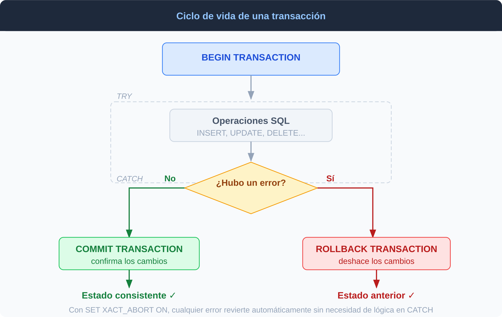
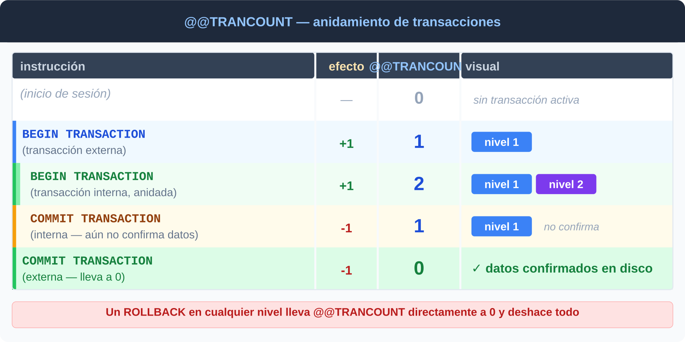
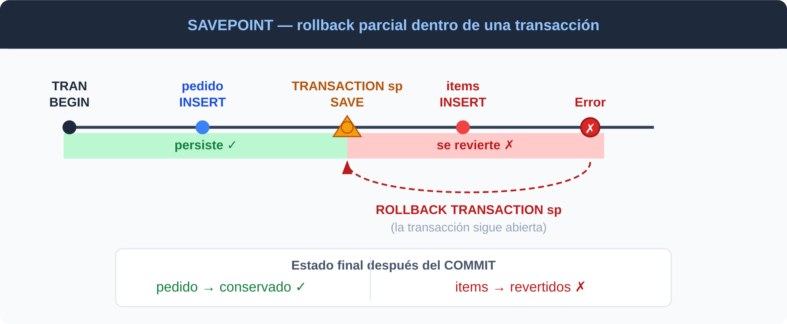
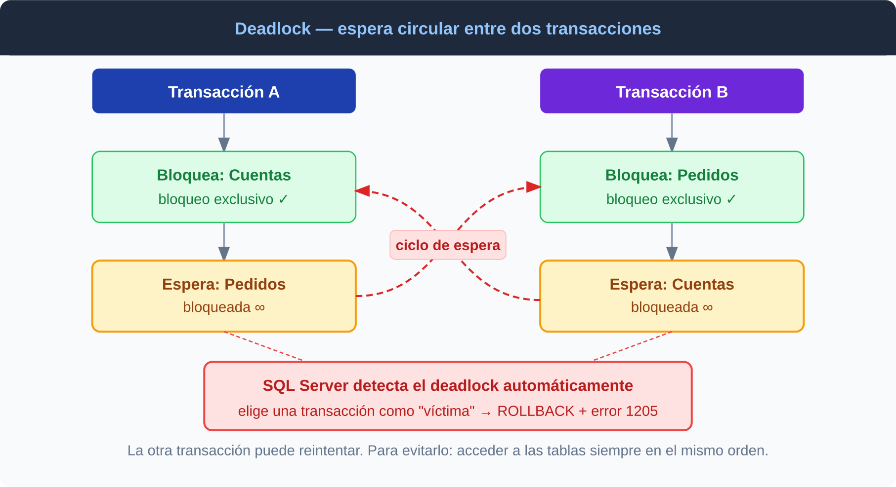

# Transacciones en SQL Server

Una **transacción** es una unidad lógica de trabajo compuesta por una o más operaciones SQL que se ejecutan como un bloque indivisible: o todas tienen éxito (`COMMIT`) o ninguna se aplica (`ROLLBACK`). Es el mecanismo que garantiza las propiedades ACID.

---

## El problema que resuelven

Sin transacciones, una transferencia bancaria que falla a mitad de camino deja los datos en un estado inconsistente:

```
Sin transacción:
  UPDATE cuentas SET saldo = saldo - 500 WHERE id = 1  ✓
  [falla del servidor]
  UPDATE cuentas SET saldo = saldo + 500 WHERE id = 2  ✗ nunca se ejecutó
  → se perdieron $500, los datos quedaron rotos
```

Con una transacción, si cualquier operación falla, todas se deshacen automáticamente:

```
Con transacción:
  BEGIN TRANSACTION
    UPDATE cuentas SET saldo = saldo - 500 WHERE id = 1  ✓
    [falla del servidor]
    UPDATE cuentas SET saldo = saldo + 500 WHERE id = 2  ✗
  → ROLLBACK automático: ambas cuentas vuelven al estado original
```

---

## Modos de transacción en SQL Server

| Modo | Descripción |
|------|-------------|
| **Autocommit** | Cada sentencia es su propia transacción. Es el modo por defecto. |
| **Explícito** | El desarrollador abre y cierra la transacción con `BEGIN / COMMIT / ROLLBACK`. |
| **Implícito** | `SET IMPLICIT_TRANSACTIONS ON` — SQL Server abre una transacción automáticamente antes de cada DML, pero el cierre es manual. Poco usado en la práctica porque es fácil olvidar el `COMMIT` y dejar bloqueos abiertos. |

---

## Sintaxis base

```sql
BEGIN TRANSACTION          -- o BEGIN TRAN

    -- operaciones SQL

COMMIT TRANSACTION         -- confirma todos los cambios
-- o
ROLLBACK TRANSACTION       -- deshace todos los cambios
```

**Ejemplo — transferencia bancaria:**

```sql
BEGIN TRANSACTION

    UPDATE cuentas SET saldo = saldo - 500 WHERE cuenta_id = 1  -- débito
    UPDATE cuentas SET saldo = saldo + 500 WHERE cuenta_id = 2  -- crédito

    IF EXISTS (SELECT 1 FROM cuentas WHERE saldo < 0)
    BEGIN
        ROLLBACK TRANSACTION
        PRINT 'Fondos insuficientes — transacción revertida'
        RETURN
    END

COMMIT TRANSACTION
PRINT 'Transferencia exitosa'
```



---

## Control de errores con TRY / CATCH

El patrón estándar en SQL Server para transacciones robustas. Si ocurre cualquier error dentro del bloque `TRY`, la ejecución salta automáticamente al `CATCH`.

```sql
BEGIN TRANSACTION       -- va ANTES del TRY, no dentro

BEGIN TRY

    UPDATE cuentas SET saldo = saldo - 500 WHERE cuenta_id = 1
    UPDATE cuentas SET saldo = saldo + 500 WHERE cuenta_id = 2

    COMMIT TRANSACTION

END TRY
BEGIN CATCH

    IF @@TRANCOUNT > 0
        ROLLBACK TRANSACTION

    THROW   -- relanza el error al llamador

END CATCH
```

> El `BEGIN TRANSACTION` va **antes** del `BEGIN TRY` para que el `ROLLBACK` del `CATCH` pueda revertirla. Si lo ponés dentro del `TRY` y el propio `BEGIN TRANSACTION` falla, no habría nada que revertir.

> `THROW` sin argumentos dentro de un `CATCH` relanza el error original con toda su información. Preferilo sobre `RAISERROR`.

### Funciones de error disponibles en el CATCH

| Función | Qué devuelve |
|---|---|
| `ERROR_MESSAGE()` | Texto descriptivo del error |
| `ERROR_NUMBER()` | Código numérico del error |
| `ERROR_SEVERITY()` | Nivel de severidad (1–25) |
| `ERROR_STATE()` | Estado del error |
| `ERROR_LINE()` | Línea donde ocurrió |
| `ERROR_PROCEDURE()` | Nombre del SP o trigger donde ocurrió |

```sql
BEGIN CATCH
    SELECT
        ERROR_NUMBER()    AS numero,
        ERROR_MESSAGE()   AS mensaje,
        ERROR_SEVERITY()  AS severidad,
        ERROR_LINE()      AS linea,
        ERROR_PROCEDURE() AS procedimiento
END CATCH
```

---

## @@TRANCOUNT — nivel de anidamiento

`@@TRANCOUNT` indica cuántas transacciones explícitas están abiertas en la sesión actual.

- Cada `BEGIN TRANSACTION` lo **incrementa en 1**.
- Cada `COMMIT TRANSACTION` lo **decrementa en 1**. Los datos solo se confirman en disco cuando llega a 0.
- Un `ROLLBACK` sin savepoint lo lleva **directamente a 0** y revierte todo, sin importar el nivel de anidamiento.



```sql
SELECT @@TRANCOUNT      -- 0: sin transacción abierta

BEGIN TRANSACTION
SELECT @@TRANCOUNT      -- 1

BEGIN TRANSACTION       -- transacción anidada
SELECT @@TRANCOUNT      -- 2

COMMIT                  -- @@TRANCOUNT → 1 (todavía no confirma)
COMMIT                  -- @@TRANCOUNT → 0 (confirma todo)
```

Verificar `@@TRANCOUNT` antes de hacer `ROLLBACK` es un patrón defensivo esencial para evitar errores si la transacción ya fue revertida automáticamente:

```sql
BEGIN CATCH
    IF @@TRANCOUNT > 0
        ROLLBACK TRANSACTION
    THROW
END CATCH
```

### Transacciones anidadas

```sql
BEGIN TRANSACTION outer_tx      -- @@TRANCOUNT = 1

    INSERT INTO logs VALUES ('inicio')

    BEGIN TRANSACTION inner_tx  -- @@TRANCOUNT = 2
        UPDATE productos SET stock = stock - 1 WHERE id = 5
    COMMIT TRANSACTION inner_tx -- @@TRANCOUNT = 1, NO confirma nada todavía

COMMIT TRANSACTION outer_tx     -- @@TRANCOUNT = 0, recién aquí se confirma todo
```

> Un `ROLLBACK` en cualquier nivel deshace **todo**, sin importar cuántos `COMMIT` internos se hayan ejecutado.

---

## SAVE TRANSACTION — puntos de guardado

Un savepoint marca un punto dentro de una transacción al que se puede hacer rollback parcial sin cancelar toda la transacción.



```sql
BEGIN TRANSACTION

    INSERT INTO pedidos (cliente_id, total) VALUES (10, 250.00)

    SAVE TRANSACTION sp_pedido          -- marca el punto de restauración

    INSERT INTO detalle_pedido (pedido_id, producto_id, cantidad)
    VALUES (SCOPE_IDENTITY(), 99, 1)    -- falla: producto 99 no existe

    IF @@ERROR <> 0
    BEGIN
        ROLLBACK TRANSACTION sp_pedido  -- deshace solo el detalle
        PRINT 'Detalle revertido, pedido conservado'
    END

COMMIT TRANSACTION
```

```
Estado después del ROLLBACK al savepoint:
  pedido          → conservado (estaba antes del savepoint)
  detalle_pedido  → revertido (estaba después del savepoint)
  @@TRANCOUNT     → sigue en 1, la transacción sigue abierta
```

> `ROLLBACK TRANSACTION <nombre>` no cierra la transacción — solo vuelve a ese punto. Todavía hay que ejecutar un `COMMIT` o `ROLLBACK` final.

---

## XACT_ABORT — fallar rápido

`SET XACT_ABORT ON` hace que cualquier error en tiempo de ejecución revierte la transacción completa y la termina automáticamente, sin necesidad de lógica explícita en el `CATCH`.

```sql
SET XACT_ABORT ON

BEGIN TRANSACTION

    INSERT INTO tabla_a VALUES (1)
    INSERT INTO tabla_b VALUES (NULL)  -- viola NOT NULL → rollback automático
    INSERT INTO tabla_c VALUES (3)     -- nunca se ejecuta

COMMIT TRANSACTION
-- la transacción ya fue revertida por el segundo INSERT
```

| | `XACT_ABORT OFF` (defecto) | `XACT_ABORT ON` |
|---|---|---|
| Error leve (ej: overflow aritmético) | Solo cancela la sentencia, la transacción sigue | Cancela toda la transacción |
| Error grave (violación de constraint) | Cancela la transacción | Cancela la transacción |
| En stored procedures | El SP puede continuar | El SP termina |

> **Recomendación:** usar `SET XACT_ABORT ON` en stored procedures que manejan transacciones. Combinado con `TRY/CATCH` es la forma más segura.

```sql
SET XACT_ABORT ON

BEGIN TRANSACTION
BEGIN TRY

    -- operaciones

    COMMIT TRANSACTION

END TRY
BEGIN CATCH

    IF @@TRANCOUNT > 0
        ROLLBACK TRANSACTION

    THROW

END CATCH
```

---

## Bloqueos y concurrencia

Las transacciones en SQL Server usan bloqueos para mantener el aislamiento. Entender los tipos básicos es clave para diagnosticar problemas de rendimiento y deadlocks.

| Tipo de bloqueo | Cuándo se usa | Compatibilidad |
|---|---|---|
| Shared (S) | `SELECT` (lecturas) | Compatible con otros S, incompatible con X |
| Exclusive (X) | `INSERT`, `UPDATE`, `DELETE` | Incompatible con cualquier otro |
| Update (U) | Fase previa a un UPDATE | Compatible con S, incompatible con X y U |
| Intent (IS, IX) | Indica intención de bloquear filas hijas | Varía |

### Deadlock

Ocurre cuando dos transacciones se bloquean mutuamente esperando recursos que la otra tiene. Ninguna puede avanzar.



SQL Server detecta deadlocks automáticamente, elige una transacción como **víctima** (la de menor costo de rollback), la revierte y lanza el error **1205**. La otra puede continuar.

```sql
BEGIN TRY
    BEGIN TRANSACTION
        UPDATE pedidos  SET estado = 'x' WHERE pedido_id = 1
        UPDATE clientes SET activo = 0   WHERE cliente_id = 10
    COMMIT TRANSACTION
END TRY
BEGIN CATCH
    IF ERROR_NUMBER() = 1205    -- víctima de deadlock
    BEGIN
        IF @@TRANCOUNT > 0 ROLLBACK TRANSACTION
        -- reintentar o notificar al cliente
    END
    ELSE
        THROW
END CATCH
```

**Para minimizar deadlocks:**

- Acceder a las tablas siempre en el **mismo orden** en todas las transacciones.
- Mantener las transacciones lo más **cortas** posible.
- Usar `SNAPSHOT` isolation para eliminar bloqueos de lectura.
- Añadir **índices** apropiados para reducir el rango de filas bloqueadas.

```sql
-- Configurar timeout de espera para obtener un bloqueo
SET LOCK_TIMEOUT 5000    -- milisegundos; -1 = esperar indefinidamente
```

---

## Niveles de aislamiento

Controlan qué ve una transacción respecto de cambios no confirmados de otras. Más aislamiento = más consistencia, pero mayor contención (bloqueos).

### Problemas de concurrencia que el aislamiento previene

| Problema | Descripción |
|----------|-------------|
| **Dirty read** | Una transacción lee datos que otra aún no confirmó |
| **Non-repeatable read** | La misma consulta dentro de una transacción devuelve distintos valores porque otra los modificó |
| **Phantom read** | Una consulta devuelve filas distintas en dos ejecuciones porque otra transacción insertó o borró filas |

### Niveles disponibles en SQL Server

```sql
SET TRANSACTION ISOLATION LEVEL <nivel>
```

| Nivel | Dirty read | Non-repeatable | Phantom | Rendimiento |
|-------|:---:|:---:|:---:|---|
| `READ UNCOMMITTED` | posible | posible | posible | Máximo |
| `READ COMMITTED` *(defecto)* | bloqueado | posible | posible | Alto |
| `REPEATABLE READ` | bloqueado | bloqueado | posible | Medio |
| `SERIALIZABLE` | bloqueado | bloqueado | bloqueado | Más bajo |
| `SNAPSHOT` | bloqueado | bloqueado | bloqueado | Alto (usa versiones) |

### Ejemplos de uso

```sql
-- Lectura sucia: aceptar datos sin confirmar (reportes aproximados)
SET TRANSACTION ISOLATION LEVEL READ UNCOMMITTED
SELECT * FROM pedidos

-- Equivalente con hint de tabla (sin cambiar el nivel de la sesión):
SELECT * FROM pedidos WITH (NOLOCK)

-- Evitar que otra transacción modifique filas que ya leí:
SET TRANSACTION ISOLATION LEVEL REPEATABLE READ
BEGIN TRANSACTION
    SELECT saldo FROM cuentas WHERE cuenta_id = 1
    -- ... lógica ...
    UPDATE cuentas SET saldo = saldo - 100 WHERE cuenta_id = 1
COMMIT

-- Aislamiento total (ninguna fila nueva puede aparecer):
SET TRANSACTION ISOLATION LEVEL SERIALIZABLE
BEGIN TRANSACTION
    SELECT COUNT(*) FROM pedidos WHERE fecha = CAST(GETDATE() AS DATE)
    -- garantizado: el conteo no cambia aunque otra sesión inserte
COMMIT
```

### SNAPSHOT isolation

`SNAPSHOT` es especial: en lugar de bloqueos usa **versiones de fila** almacenadas en `tempdb`. Los lectores no bloquean a los escritores ni viceversa, lo que reduce la contención drásticamente. Requiere habilitarse a nivel de base de datos:

```sql
-- Una sola vez, requiere permisos de administrador:
ALTER DATABASE mi_bd SET ALLOW_SNAPSHOT_ISOLATION ON

-- Usar en la sesión:
SET TRANSACTION ISOLATION LEVEL SNAPSHOT
BEGIN TRANSACTION
    SELECT * FROM inventario WHERE producto_id = 7
    -- ve el estado de la BD en el momento en que comenzó la transacción
COMMIT
```

---

## Patrón recomendado para stored procedures

El patrón que combina `XACT_ABORT`, `TRY/CATCH` y verificación de `@@TRANCOUNT`:

```sql
CREATE OR ALTER PROCEDURE dbo.transferir_saldo
    @origen  INT,
    @destino INT,
    @monto   DECIMAL(10,2)
AS
BEGIN
    SET NOCOUNT ON
    SET XACT_ABORT ON

    BEGIN TRANSACTION

    BEGIN TRY

        UPDATE cuentas SET saldo = saldo - @monto WHERE cuenta_id = @origen
        UPDATE cuentas SET saldo = saldo + @monto WHERE cuenta_id = @destino

        IF (SELECT saldo FROM cuentas WHERE cuenta_id = @origen) < 0
            THROW 50001, 'Saldo insuficiente.', 1

        COMMIT TRANSACTION

    END TRY
    BEGIN CATCH

        IF @@TRANCOUNT > 0
            ROLLBACK TRANSACTION

        THROW

    END CATCH
END
GO
```

---

## Buenas prácticas

**Mantener las transacciones cortas.** Cuanto más larga la transacción, más tiempo se mantienen los bloqueos y más probable es generar contención con otras sesiones.

```sql
-- MAL: transacción larga con procesamiento en el medio
BEGIN TRANSACTION
    SELECT datos FROM tabla
    -- [procesamiento que tarda 5 segundos]  ← bloqueo abierto todo este tiempo
    UPDATE tabla SET resultado = @valor
COMMIT TRANSACTION

-- BIEN: calcular primero, transaccionar solo el cambio
DECLARE @valor INT
SELECT @valor = ... FROM tabla      -- sin transacción
-- [procesamiento]
BEGIN TRANSACTION
    UPDATE tabla SET resultado = @valor
COMMIT TRANSACTION
```

**Nunca dejar una transacción abierta esperando input del usuario.** Un `BEGIN TRANSACTION` con un cuadro de diálogo de confirmación en el medio puede dejar bloqueos abiertos indefinidamente.

**Siempre verificar `@@TRANCOUNT` antes de `ROLLBACK`.** Si no hay transacción activa, un `ROLLBACK` genera error.

**Usar `THROW` en lugar de `RAISERROR` para relanzar errores.** `THROW` sin argumentos dentro de un `CATCH` relanza el error original con toda su información preservada.

---

## Referencia rápida

```sql
BEGIN TRANSACTION                         -- abrir transacción
COMMIT TRANSACTION                        -- confirmar
ROLLBACK TRANSACTION                      -- deshacer todo
SAVE TRANSACTION <nombre>                 -- crear savepoint
ROLLBACK TRANSACTION <nombre>             -- deshacer hasta savepoint

SELECT @@TRANCOUNT                        -- nivel de anidamiento actual

SET XACT_ABORT ON                         -- rollback automático ante cualquier error
SET TRANSACTION ISOLATION LEVEL <nivel>  -- cambiar aislamiento de la sesión
SET LOCK_TIMEOUT <ms>                     -- timeout para obtener un bloqueo

SELECT * FROM tabla WITH (NOLOCK)         -- lectura sucia a nivel de tabla
```

| Concepto | Descripción |
|---|---|
| `BEGIN TRANSACTION` | Inicia una transacción explícita |
| `COMMIT TRANSACTION` | Confirma los cambios permanentemente |
| `ROLLBACK TRANSACTION` | Deshace todos los cambios de la transacción |
| `SAVE TRANSACTION nombre` | Define un punto de restauración parcial |
| `ROLLBACK TRANSACTION nombre` | Revierte hasta el savepoint (sin cerrar la transacción) |
| `@@TRANCOUNT` | Nivel de anidamiento de transacciones activo |
| `SET XACT_ABORT ON` | Revierte automáticamente ante cualquier error |
| `SET LOCK_TIMEOUT ms` | Tiempo máximo de espera para obtener un bloqueo |
| `ERROR_MESSAGE()` | Texto del error (usar dentro del CATCH) |
| `THROW` | Relanza el error original desde el CATCH |
