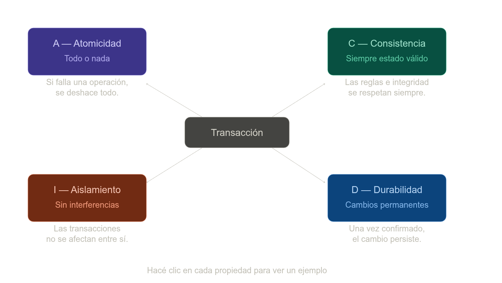

[← Unidad 2](../)

- [Unidad 2 — BD Transaccionales: aspectos básicos](#unidad-2--bd-transaccionales-aspectos-básicos)
  - [Bases de datos transaccionales (OLTP)](#bases-de-datos-transaccionales-oltp)
    - [Propiedades ACID](#propiedades-acid)
      - [Atomicidad](#atomicidad)
      - [Consistencia](#consistencia)
      - [Isolation](#isolation)
  - [El problema sin aislamiento](#el-problema-sin-aislamiento)
  - [Los tres problemas clásicos](#los-tres-problemas-clásicos)
  - [Niveles de aislamiento](#niveles-de-aislamiento)
  - [El balance en la práctica](#el-balance-en-la-práctica)
      - [Commit y Rollback](#commit-y-rollback)
    - [Ventajas y desventajas](#ventajas-y-desventajas)
    - [OLTP vs OLAP](#oltp-vs-olap)
  - [BD, Data Warehouse y Data Lake](#bd-data-warehouse-y-data-lake)
  - [Arquitectura distribuida y clústeres](#arquitectura-distribuida-y-clústeres)
    - [Modalidades de despliegue](#modalidades-de-despliegue)
    - [Always On (SQL Server)](#always-on-sql-server)
  - [Motor de base de datos SQL Server](#motor-de-base-de-datos-sql-server)
    - [Instalación y componentes](#instalación-y-componentes)
      - [Ediciones](#ediciones)
      - [Tipos de instancia](#tipos-de-instancia)
    - [SQL Server Configuration Manager](#sql-server-configuration-manager)
    - [Conexión local y remota](#conexión-local-y-remota)
      - [Conexión local](#conexión-local)
      - [Conexión remota](#conexión-remota)
      - [String de conexión típica](#string-de-conexión-típica)
    - [Autenticación](#autenticación)
  - [Collation / Intercalación](#collation--intercalación)
    - [Sensibilidades](#sensibilidades)
    - [Niveles de collation](#niveles-de-collation)
    - [Consultar y cambiar el collation](#consultar-y-cambiar-el-collation)
      - [Cambiar el collation de la instancia](#cambiar-el-collation-de-la-instancia)
    - [Cláusula COLLATE en queries](#cláusula-collate-en-queries)
  - [Bases de datos en memoria](#bases-de-datos-en-memoria)
    - [Durabilidad](#durabilidad)
    - [Implementación en SQL Server](#implementación-en-sql-server)
    - [Comparativa de tipos de tabla](#comparativa-de-tipos-de-tabla)
  - [ODBC y JDBC](#odbc-y-jdbc)
    - [ODBC](#odbc)
    - [JDBC](#jdbc)
  - [Formatos de intercambio de datos](#formatos-de-intercambio-de-datos)
    - [EDI — Electronic Data Interchange](#edi--electronic-data-interchange)
    - [CSV / TSV](#csv--tsv)
    - [Ancho fijo](#ancho-fijo)
    - [XML — eXtended Markup Language](#xml--extended-markup-language)
    - [JSON — JavaScript Object Notation](#json--javascript-object-notation)
    - [YAML — YAML Ain't a Markup Language](#yaml--yaml-aint-a-markup-language)
  - [APIs — Application Programming Interface](#apis--application-programming-interface)
    - [Tipos de API](#tipos-de-api)
    - [Protocolos de comunicación](#protocolos-de-comunicación)
      - [Ejemplo de interacción REST](#ejemplo-de-interacción-rest)
      - [Postman](#postman)

---

# Unidad 2 — BD Transaccionales: aspectos básicos

## Bases de datos transaccionales (OLTP)

Una **base de datos transaccional** (OLTP, _Online Transaction Processing_) es aquella diseñada para procesar un gran volumen de transacciones pequeñas de forma concurrente: inserciones, actualizaciones, eliminaciones y consultas puntuales.

Una **transacción** es una unidad lógica de trabajo formada por una o más operaciones SQL que deben ejecutarse como un todo indivisible. Si alguna operación falla, todas se revierten.

Ejemplos de sistemas OLTP: banca en línea, e-commerce, sistemas de reservas de vuelos, terminales punto de venta (POS).

### Propiedades ACID



| Propiedad | Significado |
|-----------|-------------|
| **Atomicidad** | La transacción se ejecuta completa o no se ejecuta. No hay estados intermedios visibles. |
| **Consistencia** | La transacción lleva la base de datos de un estado consistente a otro. No viola restricciones de integridad. |
| **Isolation (Aislamiento)** | Las transacciones concurrentes se comportan como si se ejecutasen secuencialmente. Los cambios de una transacción no son visibles para otras hasta que se confirman. |
| **Durabilidad** | Una vez confirmada (commit), la transacción persiste aunque ocurra una falla del sistema. |

#### Atomicidad

La **atomicidad** garantiza que una transacción se ejecuta como una unidad indivisible: o todas sus operaciones tienen éxito, o ninguna se aplica. No existe un estado intermedio visible para la base de datos.

El ejemplo clásico es una transferencia bancaria. Supongamos que Lucía le transfiere $500 a Marcos:

```sql
BEGIN TRANSACTION;

  UPDATE cuentas SET saldo = saldo - 500 WHERE titular = 'Lucía';
  UPDATE cuentas SET saldo = saldo + 500 WHERE titular = 'Marcos';

COMMIT;
```

Hay dos operaciones. Si el sistema se cae después del primer `UPDATE` pero antes del segundo, ¿qué pasa? Sin atomicidad, Lucía perdería $500 y Marcos no recibiría nada. Con atomicidad, la base de datos detecta que la transacción no se completó y hace un `ROLLBACK` automático, dejando ambas cuentas como estaban.

```
Estado inicial:   Lucía $1000  |  Marcos $200

Caso exitoso (COMMIT):
  1. Lucía  → $500  ✓
  2. Marcos → $700  ✓
  → ambos cambios se confirman juntos

Caso con fallo (ROLLBACK):
  1. Lucía  → $500  ✓
  2. [falla del sistema]
  → se deshace el paso 1, Lucía vuelve a $1000
```

En la práctica, los motores de base de datos implementan esto con un **write-ahead log (WAL)**: antes de modificar los datos reales, escriben en un log qué se va a cambiar. Si algo falla, el motor lee el log al reiniciar y revierte las operaciones incompletas.

#### Consistencia

La **consistencia** garantiza que una transacción lleva la base de datos de un estado válido a otro estado válido, respetando todas las reglas definidas (restricciones, claves foráneas, tipos de datos, etc.). Una transacción no puede dejar los datos en un estado que viole esas reglas.

La diferencia clave con atomicidad: la atomicidad habla de *si* los cambios se aplican; la consistencia habla de *qué* cambios son válidos.

El ejemplo: un sistema de stock con una restricción que dice que el saldo de unidades nunca puede ser negativo.

```sql
-- Restricción definida en la tabla
CREATE TABLE stock (
    producto   VARCHAR(50),
    unidades   INT CHECK (unidades >= 0)  -- nunca puede ser negativo
);

-- Intento de venta de 10 unidades cuando solo hay 3
BEGIN TRANSACTION;
  UPDATE stock SET unidades = unidades - 10 WHERE producto = 'Auriculares';
COMMIT;
```

```
Estado inicial:   Auriculares → 3 unidades

Sin consistencia:
  3 - 10 = -3 unidades  ← estado inválido, viola la restricción
  → la base de datos queda rota

Con consistencia:
  La BD detecta que -3 viola CHECK (unidades >= 0)
  → rechaza la transacción completa
  → Auriculares sigue en 3 unidades (estado válido)
```

Otro ejemplo común son las claves foráneas:

```sql
-- No podés agregar un pedido de un cliente que no existe
INSERT INTO pedidos (id_pedido, id_cliente, total)
VALUES (101, 9999, 500);
-- Error: id_cliente = 9999 no existe en la tabla clientes
-- La BD rechaza el INSERT para mantener consistencia referencial
```

Las reglas que protege la consistencia tienen dos orígenes:

Las que define el motor (restricciones `CHECK`, `NOT NULL`, `UNIQUE`, claves foráneas) se verifican automáticamente. Las que define la aplicación (por ejemplo, "el total de un pedido debe coincidir con la suma de sus ítems") son responsabilidad del desarrollador — el motor no las conoce y no las puede validar solo.

#### Isolation

El **aislamiento** garantiza que las transacciones concurrentes no se interfieren entre sí. Cada transacción debe ejecutarse como si fuera la única en el sistema, aunque haya cientos corriendo al mismo tiempo.

Es la propiedad más compleja de ACID porque implica un balance: más aislamiento = más consistencia, pero menos rendimiento.

---

## El problema sin aislamiento

Dos cajeros atienden a la misma cuenta simultáneamente:

```
Saldo inicial de cuenta: $1000

Cajero A (retiro $700)        Cajero B (retiro $600)
────────────────────────      ────────────────────────
1. Lee saldo → $1000
                              2. Lee saldo → $1000
3. Calcula: 1000 - 700 = 300
                              4. Calcula: 1000 - 600 = 400
5. Escribe saldo → $300
                              6. Escribe saldo → $400  ← pisa el paso 5

Resultado final: $400
Debería ser:     -$300 (o rechazado por saldo insuficiente)
El banco perdió $700.
```

Esto se llama **lost update** (actualización perdida) — uno de los tres problemas clásicos de concurrencia.

---

## Los tres problemas clásicos

**1. Dirty read** — leer datos que todavía no se confirmaron:

```
Transacción A                 Transacción B
─────────────────────         ─────────────────────
UPDATE saldo = 1500           
                              SELECT saldo → 1500  ← lee el cambio no confirmado
ROLLBACK (falla)              
                              usa 1500 para calcular algo
                              → decisión basada en un dato que nunca existió
```

**2. Non-repeatable read** — la misma consulta devuelve resultados distintos dentro de la misma transacción:

```
Transacción A                 Transacción B
─────────────────────         ─────────────────────
SELECT saldo → 1000           
                              UPDATE saldo = 500
                              COMMIT
SELECT saldo → 500  ← el mismo SELECT devuelve otro valor
```

**3. Phantom read** — aparecen o desaparecen filas entre dos lecturas:

```
Transacción A                 Transacción B
─────────────────────         ─────────────────────
SELECT COUNT(*) → 10 pedidos
                              INSERT nuevo pedido
                              COMMIT
SELECT COUNT(*) → 11 pedidos  ← apareció una fila "fantasma"
```

---

## Niveles de aislamiento

SQL define cuatro niveles, cada uno bloqueando más problemas a cambio de más costo de rendimiento:

| Nivel | Dirty read | Non-repeatable read | Phantom read |
|---|:---:|:---:|:---:|
| `READ UNCOMMITTED` | posible | posible | posible |
| `READ COMMITTED` | bloqueado | posible | posible |
| `REPEATABLE READ` | bloqueado | bloqueado | posible |
| `SERIALIZABLE` | bloqueado | bloqueado | bloqueado |

```sql
-- Configurar el nivel para una transacción
SET TRANSACTION ISOLATION LEVEL REPEATABLE READ;

BEGIN TRANSACTION;
  SELECT saldo FROM cuentas WHERE id = 42;
  -- ninguna otra transacción puede modificar esta fila hasta el COMMIT
  SELECT saldo FROM cuentas WHERE id = 42;
  -- garantizado: devuelve el mismo valor
COMMIT;
```

---

## El balance en la práctica

La mayoría de los sistemas usan `READ COMMITTED` (el default en PostgreSQL y SQL Server) porque es el punto medio más razonable: evita el problema más grave (leer basura no confirmada) sin el costo de bloquear todo.

`SERIALIZABLE` es el único nivel que garantiza aislamiento total, pero puede reducir el rendimiento significativamente en sistemas con mucha concurrencia, porque las transacciones se bloquean entre sí con más frecuencia.

#### Commit y Rollback

```sql
BEGIN TRANSACTION;

    UPDATE cuentas SET saldo = saldo - 1000 WHERE id = 1;
    UPDATE cuentas SET saldo = saldo + 1000 WHERE id = 2;

COMMIT;   -- confirma ambas operaciones
```

Si algo falla antes del `COMMIT`:

```sql
BEGIN TRANSACTION;

    UPDATE cuentas SET saldo = saldo - 1000 WHERE id = 1;
    -- error: id = 99 no existe
    UPDATE cuentas SET saldo = saldo + 1000 WHERE id = 99;

ROLLBACK; -- revierte todo, el saldo de id=1 vuelve a su valor original
```

En SQL Server, con `SET XACT_ABORT ON` el rollback ocurre automáticamente ante cualquier error dentro de la transacción.

### Ventajas y desventajas

| Ventajas | Desventajas |
|----------|-------------|
| Integridad de datos garantizada (ACID) | No optimizado para análisis y reportes complejos |
| Soporte de alta concurrencia | Consultas analíticas pesadas degradan el rendimiento |
| Recuperación ante fallos | Esquemas normalizados → múltiples JOINs en queries analíticas |
| Historial de cambios mediante logs | Escalado costoso en volúmenes muy grandes |

### OLTP vs OLAP

| Característica | OLTP | OLAP |
|----------------|------|------|
| Propósito | Operaciones del día a día | Análisis e informes |
| Operaciones | INSERT, UPDATE, DELETE, SELECT puntual | SELECT con agregaciones complejas |
| Usuarios concurrentes | Miles | Decenas |
| Volumen de datos por query | Pocos registros | Millones de filas |
| Diseño | Normalizado (3FN o superior) | Desnormalizado (estrella, copo de nieve) |
| Ejemplos | ERP, banca, e-commerce | Data Warehouse, Business Intelligence |

---

## BD, Data Warehouse y Data Lake

| | Base de datos (OLTP) | Data Warehouse | Data Lake |
|---|---|---|---|
| **Datos** | Actuales, transaccionales | Históricos, integrados de múltiples fuentes | Crudos, cualquier formato |
| **Estructura** | Normalizada | Desnormalizada (estrella/copo de nieve) | Sin estructura predefinida (schema-on-read) |
| **Propósito** | Operaciones diarias | Análisis y reporting | Exploración, machine learning, big data |
| **Usuarios** | Aplicaciones, usuarios finales | Analistas, BI tools | Data scientists, ingenieros de datos |
| **Carga** | Tiempo real | ETL periódico (noche/semana) | ELT (transformación posterior) |
| **Costo storage** | Medio | Alto | Bajo |
| **Ejemplos** | SQL Server, MySQL | SQL Server Analysis Services, Redshift | Azure Data Lake, S3 |

**ETL** (_Extract, Transform, Load_): proceso clásico de carga en un DWH. Los datos se extraen de las fuentes, se transforman (limpian, integran) y se cargan transformados.

**ELT** (_Extract, Load, Transform_): variante moderna para Data Lakes. Los datos se cargan crudos y se transforman después, cuando se necesitan.

---

## Arquitectura distribuida y clústeres

Una **base de datos distribuida** almacena datos en múltiples nodos (servidores) que cooperan como si fuesen un sistema único.

Un **clúster** es un conjunto de servidores que trabajan juntos para proporcionar:

- **Alta disponibilidad**: si un nodo falla, otro toma el control (_failover_).
- **Escalabilidad horizontal**: agregar nodos para manejar más carga.
- **Balanceo de carga**: distribuir consultas entre nodos.

### Modalidades de despliegue

**En la nube**: escalado automático según demanda, pago por uso, alta disponibilidad gestionada (ej: Azure SQL Managed Instance, Amazon RDS).

**Servidores dedicados (on-premise)**: control total sobre hardware y configuración, mayor inversión inicial, requiere administración propia.

### Always On (SQL Server)

SQL Server implementa alta disponibilidad mediante **Always On Availability Groups**:
- Un nodo primario recibe lecturas y escrituras.
- Nodos secundarios reciben réplicas del log de transacciones.
- En caso de falla del primario, un secundario asume automáticamente.

---

## Motor de base de datos SQL Server

SQL Server es el **RDBMS** (_Relational Database Management System_ / SGBD) de Microsoft. Implementa el estándar SQL con extensiones propias (T-SQL).

### Instalación y componentes

| Componente | Descripción |
|-----------|-------------|
| **SQL Server Engine** | El motor propiamente dicho: procesa consultas, gestiona transacciones, almacena datos |
| **SSMS** (SQL Server Management Studio) | IDE gráfico para administrar instancias, ejecutar queries, diseñar esquemas |
| **SQL Server Configuration Manager** | Gestión de servicios de Windows y configuración de red (protocolos, puertos) |
| **SQL Server Agent** | Automatización de tareas: jobs, alertas, mantenimiento programado |
| **SQL Server Browser** | Resuelve nombres de instancias nombradas para conexiones remotas |

#### Ediciones

| Edición | Uso |
|---------|-----|
| Developer | Gratuita, funcionalidades completas, solo para desarrollo/testing |
| Express | Gratuita, limitada (10 GB, sin Agent), para aplicaciones pequeñas |
| Standard | Licenciada, funcionalidades parciales |
| Enterprise | Licenciada, funcionalidades completas (Always On, columnstore, etc.) |

#### Tipos de instancia

- **Instancia default**: se identifica solo con el nombre del servidor (`MI_SERVIDOR`). El servicio se llama `MSSQLSERVER`.
- **Instancia nombrada**: se identifica con `SERVIDOR\NOMBRE_INSTANCIA`. El servicio se llama `MSSQL$NOMBRE_INSTANCIA`. Un servidor puede tener múltiples instancias nombradas.

### SQL Server Configuration Manager

Permite:
- Iniciar/detener/pausar servicios de SQL Server.
- Habilitar o deshabilitar protocolos de red (TCP/IP, Named Pipes, Shared Memory).
- Configurar el puerto TCP (por defecto **1433** para la instancia default).
- Gestionar alias de servidores y certificados SSL.

### Conexión local y remota

#### Conexión local

No requiere configuración adicional. Se puede usar:
- `.` (punto)
- `localhost`
- Nombre del equipo
- `(local)`

#### Conexión remota

Para habilitar conexiones remotas:

1. En **SQL Server Configuration Manager** → _SQL Server Network Configuration_ → habilitar **TCP/IP**.
2. Verificar que el puerto **1433** está abierto en el firewall de Windows (`netsh advfirewall firewall add rule...` o desde el panel de control).
3. Si se usa una **instancia nombrada**, habilitar el servicio **SQL Server Browser** (traduce `SERVIDOR\INSTANCIA` al puerto dinámico correspondiente).
4. En SSMS de la instancia, habilitar conexiones remotas: _Server Properties → Connections → Allow remote connections_.

#### String de conexión típica

```
Server=mi_servidor,1433;Database=mi_bd;User Id=usuario;Password=contraseña;
```

Para instancia nombrada:

```
Server=mi_servidor\INSTANCIA;Database=mi_bd;Integrated Security=True;
```

### Autenticación

| Modo | Descripción |
|------|-------------|
| **Windows Authentication** | Usa las credenciales del sistema operativo. SQL Server verifica la identidad contra Active Directory o la cuenta local de Windows. Más segura en entornos de red Windows. |
| **SQL Server Authentication** | Usuario y contraseña gestionados por el propio motor SQL Server. Necesario para conexiones desde otros sistemas operativos o aplicaciones externas. |

Para usar autenticación mixta (ambas), el servidor debe estar configurado en modo **SQL Server and Windows Authentication** (_Server Properties → Security_).

---

## Collation / Intercalación

El **collation** (intercalación) define el **patrón de bits** usado para representar caracteres y las **reglas de comparación y ordenación** que se aplican a los datos de texto.

En términos prácticos determina:
- Si `'a'` y `'A'` son iguales (Case Insensitive) o distintos (Case Sensitive).
- Si `'a'` y `'á'` son iguales (Accent Insensitive) o distintos (Accent Sensitive).
- El orden en que aparecen los registros al hacer `ORDER BY` sobre columnas de texto.

El nombre de un collation sigue el patrón: `Idioma_Sensibilidades`, por ejemplo: `Modern_Spanish_CI_AI`.

### Sensibilidades

| Código | Nombre | Descripción |
|--------|--------|-------------|
| **CI** | Case Insensitive | `'a'` = `'A'` |
| **CS** | Case Sensitive | `'a'` ≠ `'A'` |
| **AI** | Accent Insensitive | `'a'` = `'á'` = `'â'` |
| **AS** | Accent Sensitive | `'a'` ≠ `'á'` |
| **WI** | Width Insensitive | Ignora diferencia entre caracteres de un byte y dos bytes (relevante en japonés/chino) |
| **WS** | Width Sensitive | Distingue caracteres por ancho |
| **KI** | Kana Insensitive | Ignora diferencia entre Hiragana y Katakana (japonés) |
| **KS** | Kana Sensitive | Distingue Hiragana de Katakana |

Combinaciones comunes en español:

| Collation | Comportamiento |
|-----------|---------------|
| `Modern_Spanish_CI_AI` | Insensible a mayúsculas y acentos (más permisivo) |
| `Modern_Spanish_CI_AS` | Insensible a mayúsculas, sensible a acentos |
| `Modern_Spanish_CS_AI` | Sensible a mayúsculas, insensible a acentos |
| `Modern_Spanish_CS_AS` | Sensible a mayúsculas y acentos (más estricto) |

### Niveles de collation

El collation puede definirse en tres niveles; cada nivel hereda del superior si no se especifica:

```
Instancia (default para nuevas BD)
  └── Base de datos (default para nuevas tablas/columnas)
        └── Columna (overrides el de la BD para esa columna)
```

Esto permite tener, por ejemplo, una base de datos `CI_AI` con una columna particular `CS_AS` para búsquedas exactas.

### Consultar y cambiar el collation

```sql
-- Collation de la instancia
SELECT SERVERPROPERTY('collation');

-- Collation de todas las bases de datos
SELECT name, collation_name FROM sys.databases;

-- Collation de todas las columnas de una tabla
SELECT column_name, collation_name
FROM information_schema.columns
WHERE table_name = 'mi_tabla';

-- Listar todos los collations disponibles
SELECT * FROM fn_helpcollations();

-- Crear BD con collation específico
CREATE DATABASE mi_bd COLLATE Modern_Spanish_CI_AI;

-- Crear columna con collation específico
CREATE TABLE personas (
    nombre VARCHAR(100) COLLATE Modern_Spanish_CS_AS NOT NULL
);
```

#### Cambiar el collation de la instancia

Desde línea de comandos (requiere detener el servicio y modo monousuario):

```
sqlservr -m -T4022 -T3659 -s"MSSQLSERVER" -q"Modern_Spanish_CI_AI"
```

> Cambiar el collation de la instancia afecta las bases de datos del sistema pero no automáticamente las de usuario. Es una operación delicada que requiere planificación.

### Cláusula COLLATE en queries

Se puede forzar un collation específico en una comparación sin modificar la definición de la tabla:

```sql
-- Comparación case-sensitive aunque la columna sea CI
SELECT * FROM usuarios
WHERE nombre = 'Juan' COLLATE Modern_Spanish_CS_AS;

-- JOIN entre columnas con distintos collations
SELECT a.nombre, b.ciudad
FROM tabla_a a
JOIN tabla_b b ON a.codigo = b.codigo COLLATE Modern_Spanish_CI_AI;

-- ORDER BY con collation explícito
SELECT nombre FROM productos
ORDER BY nombre COLLATE Modern_Spanish_CS_AS;
```

---

## Bases de datos en memoria

Las bases de datos **en memoria** (_in-memory_) almacenan los datos directamente en RAM en lugar de en disco. Esto las hace extremadamente rápidas: eliminan la latencia de I/O de disco y permiten estructuras de datos optimizadas para acceso en memoria.

**Ventaja principal**: rendimiento muy superior para cargas de trabajo de alta concurrencia y baja latencia.

**Desventaja principal**: la RAM es volátil (los datos se pierden si se apaga el servidor) y más cara que el disco.

Ejemplos de sistemas in-memory: Redis, Memcached, VoltDB. SQL Server incluye soporte nativo mediante **In-Memory OLTP** (anteriormente llamado "Hekaton").

### Durabilidad

Para mitigar la volatilidad, las bases de datos en memoria implementan mecanismos de durabilidad:

| Mecanismo | Descripción |
|-----------|-------------|
| **Snapshots (instantáneas)** | Copia periódica del estado de la memoria al disco |
| **Transaction log** | Registro de todas las transacciones; permite reconstruir el estado tras un reinicio |
| **NVRAM** (_Non-Volatile RAM_) | Memoria que mantiene su contenido sin alimentación (flash-backed DRAM) |

En SQL Server, las tablas en memoria pueden tener dos modos de durabilidad:

| Modo | Descripción |
|------|-------------|
| `SCHEMA_AND_DATA` | Esquema y datos persisten al reiniciar (durabilidad completa) |
| `SCHEMA_ONLY` | Solo el esquema persiste; los datos se pierden al reiniciar (volátil) |

### Implementación en SQL Server

Para usar tablas en memoria, la base de datos necesita un **FILEGROUP** especial de tipo `MEMORY_OPTIMIZED_DATA`:

```sql
-- 1. Agregar filegroup de memoria a la BD
ALTER DATABASE mi_bd
ADD FILEGROUP fg_memoria CONTAINS MEMORY_OPTIMIZED_DATA;

-- 2. Agregar un archivo a ese filegroup
ALTER DATABASE mi_bd
ADD FILE (
    NAME = 'fg_memoria_file',
    FILENAME = 'C:\datos\fg_memoria'
) TO FILEGROUP fg_memoria;

-- 3. Crear tabla en memoria con durabilidad completa
CREATE TABLE productos_cache (
    id       INT NOT NULL,
    nombre   NVARCHAR(100) NOT NULL,
    precio   DECIMAL(10,2) NOT NULL,
    CONSTRAINT PK_productos_cache PRIMARY KEY NONCLUSTERED (id)
) WITH (
    MEMORY_OPTIMIZED = ON,
    DURABILITY = SCHEMA_AND_DATA
);

-- 4. Crear tabla en memoria volátil (solo esquema persiste)
CREATE TABLE sesiones_temp (
    session_id   UNIQUEIDENTIFIER NOT NULL,
    usuario_id   INT NOT NULL,
    inicio       DATETIME2 NOT NULL,
    CONSTRAINT PK_sesiones PRIMARY KEY NONCLUSTERED (session_id)
) WITH (
    MEMORY_OPTIMIZED = ON,
    DURABILITY = SCHEMA_ONLY
);
```

> Las tablas en memoria requieren que todas sus columnas sean `NOT NULL` o tengan un valor por defecto, y la clave primaria debe ser `NONCLUSTERED`.

### Comparativa de tipos de tabla

| Característica | Variable de tabla (`@tabla`) | Tabla temporal (`#tabla`) | Tabla en memoria |
|----------------|------------------------------|---------------------------|-----------------|
| Alcance | Lote/proc actual | Sesión actual | Global (BD) |
| Almacenamiento | TempDB (o memoria) | TempDB | RAM |
| Persiste entre sesiones | No | No | Sí (con `SCHEMA_AND_DATA`) |
| Estadísticas | No | Sí | Sí |
| Índices | Limitado | Sí | Sí (hash / range) |
| Concurrencia | Baja | Media | Muy alta (lock-free) |
| DDL requerido | No | No | Sí (FILEGROUP especial) |

---

## ODBC y JDBC

ODBC y JDBC son **APIs de conectividad** que permiten a las aplicaciones comunicarse con bases de datos de forma independiente del motor específico.

### ODBC

**ODBC** (_Open Database Connectivity_) es una API desarrollada por Microsoft para lenguajes como C y C++. Permite que una aplicación acceda a cualquier base de datos que tenga un driver ODBC instalado, sin cambiar el código de la aplicación.

**Flujo de conexión**:

```
Aplicación cliente
      ↓
Administrador de controladores ODBC (Driver Manager)
      ↓
Controlador específico del motor (ej: SQL Server ODBC Driver)
      ↓
Fuente de datos SQL (SQL Server, MySQL, Oracle, etc.)
```

**String de conexión ODBC (SQL Server)**:

```
Driver={ODBC Driver 17 for SQL Server};
Server=mi_servidor,1433;
Database=mi_bd;
Uid=usuario;
Pwd=contraseña;
```

**Configuración**: Los DSN (_Data Source Names_) se crean desde el panel "Orígenes de datos ODBC" de Windows, o mediante string de conexión directa en el código.

### JDBC

**JDBC** (_Java Database Connectivity_) es la API equivalente para el lenguaje Java. Forma parte del JDK estándar y permite acceder a cualquier base de datos relacional mediante el driver JDBC correspondiente.

**Flujo de conexión**: idéntico al de ODBC pero orientado a Java.

**String de conexión JDBC (SQL Server)**:

```
jdbc:sqlserver://mi_servidor:1433;
    databaseName=mi_bd;
    user=usuario;
    password=contraseña;
    encrypt=true;
    trustServerCertificate=true;
```

**Dependencia Maven** (driver Microsoft):

```xml
<dependency>
    <groupId>com.microsoft.sqlserver</groupId>
    <artifactId>mssql-jdbc</artifactId>
    <version>12.4.2.jre11</version>
</dependency>
```

| | ODBC | JDBC |
|--|------|------|
| Lenguaje | C, C++, y cualquier lenguaje con binding ODBC | Java |
| Estándar | Microsoft (ampliamente adoptado) | Sun/Oracle (Java EE) |
| Drivers | ODBC Driver Manager + driver específico | Driver JAR del proveedor |
| Configuración | DSN en el SO o string de conexión | String de conexión o DataSource |

---

## Formatos de intercambio de datos

Los formatos de intercambio son **estándares de texto** para almacenar y compartir información entre sistemas. Sus características:

- Siempre de texto simple (ASCII, Unicode).
- Poseen estructura y reglas (sintaxis) como los lenguajes de programación.
- Existen bibliotecas en todos los lenguajes para generarlos e interpretarlos.
- Al adherirse a un estándar no es necesario saber de antemano quién consumirá los datos.

Ejemplos: EDI, CSV, ancho fijo, XML, JSON, YAML.

### EDI — Electronic Data Interchange

**EDI** es un estándar de intercambio electrónico de datos de tipo _computer-to-computer_. Diseñado para reemplazar documentos en papel (facturas, órdenes de compra) en intercambios B2B.

**Características**:
- Texto simple (ASCII, Unicode).
- Existen varios estándares en uso, cada uno con múltiples versiones: **ANSI X12**, **EANCOM**, **HIPAA**, **ODETTE**, **SWIFT**, entre otros.
- En cada intercambio debe indicarse el estándar y versión utilizada.
- El estándar especifica cómo interpretar números, fechas y demás datos.

**Ejemplo (ANSI X12 — factura)**:

```
ST*810*0001~
BIG*20000513*SG427254*20000506*508517*1001~
N1*ST*ABC AEROSPACE CORPORATION*9*123456789-0101~
N3*1000 BOARDWALK DRIVE~
N4*SOMEWHERE*CA*98898~
TDS*14400~
SE*10*0001~
```

`ST*810*0001~` → inicio de una transacción de tipo 810 (factura), número de control 0001.
`BIG*...` → datos generales de la factura (fecha emisión, número, orden de compra asociada).

### CSV / TSV

**CSV** (_Comma-Separated Values_) es un formato tabular donde:
- Cada fila es un registro.
- Las columnas se separan con un carácter delimitador (generalmente `,` o `;`).
- La primera fila puede contener los nombres de las columnas (encabezado).
- Si el delimitador aparece dentro de un valor, debe escaparse o el valor debe ir entre comillas dobles.
- Campos vacíos se representan con dos delimitadores contiguos: `valor1,,valor3`.

**TSV** (_Tab-Separated Values_): variante que usa el carácter tabulador como delimitador.

**Ejemplo CSV**:

```
anio,mes,municipio_nombre,genero,cantidad
2019,1,La Matanza,masculino,74
2019,2,La Matanza,masculino,73
2019,3,La Matanza,femenino,66
```

**Importar CSV en SQL Server**:

```sql
BULK INSERT ventas
FROM 'C:\datos\ventas.csv'
WITH (
    FIELDTERMINATOR = ',',
    ROWTERMINATOR   = '\n',
    FIRSTROW        = 2,        -- saltar encabezado
    CODEPAGE        = '65001'   -- UTF-8
);
```

### Ancho fijo

En el formato de **ancho fijo** cada columna ocupa exactamente una cantidad determinada de caracteres, sin delimitador.

**Reglas**:
- Cada registro ocupa una fila.
- Cada campo tiene una posición y longitud conocidas de antemano (definidas por la especificación del formato).
- Los valores más cortos que la longitud del campo se rellenan con espacios (texto) o ceros a la izquierda (números).
- Todos los registros tienen la misma longitud total.

**Ejemplo** (campos: año[4], mes[2], nombre[20], cantidad[6]):

```
201901La Matanza            000074
201902La Matanza            000073
201903La Matanza            000066
```

Se usa en sistemas legados (mainframes), archivos bancarios (COBRANZA, ACREDITACIONES) y algunos formatos gubernamentales.

### XML — eXtended Markup Language

**XML** es un lenguaje de marcado autodescriptivo: cada dato está delimitado por etiquetas que describen su significado.

**Características**:
- Similar a HTML (es una evolución de SGML).
- No tiene etiquetas predefinidas: el usuario define su propio vocabulario.
- Admite anidado de elementos (estructura jerárquica).
- Puede usar indentación para facilitar la lectura humana.
- Ampliamente usado para archivos de configuración y formatos propietarios (Office Open XML, SVG, etc.).
- Admite validación mediante DTD o XML Schema.

**Estructura básica**:

```xml
<?xml version="1.0" encoding="UTF-8"?>
<respuesta>
    <fila id="1">
        <nombre>GERALDINE</nombre>
        <genero>FEMALE</genero>
        <cantidad>13</cantidad>
    </fila>
    <fila id="2">
        <nombre>GIA</nombre>
        <genero>FEMALE</genero>
        <cantidad>21</cantidad>
    </fila>
</respuesta>
```

**SQL Server — generar XML**:

```sql
-- FOR XML AUTO: genera XML basado en los nombres de tabla/columna
SELECT nombre, apellido FROM clientes FOR XML AUTO;

-- FOR XML PATH: control total sobre la estructura
SELECT
    id          AS '@id',
    nombre      AS 'nombre',
    apellido    AS 'apellido'
FROM clientes
FOR XML PATH('cliente'), ROOT('clientes');
```

**SQL Server — leer XML**:

```sql
DECLARE @xml XML = '
<respuesta>
    <fila><nombre>Juan</nombre><cantidad>5</cantidad></fila>
    <fila><nombre>Ana</nombre><cantidad>3</cantidad></fila>
</respuesta>';

SELECT
    fila.value('nombre[1]',   'VARCHAR(50)') AS nombre,
    fila.value('cantidad[1]', 'INT')         AS cantidad
FROM @xml.nodes('/respuesta/fila') AS t(fila);
```

### JSON — JavaScript Object Notation

**JSON** es un formato de texto ligero basado en pares clave/valor y estructuras anidadas.

**Reglas de sintaxis**:
- Los objetos se delimitan con llaves `{ }`.
- Los arrays (vectores) se delimitan con corchetes `[ ]`.
- Las claves deben ser cadenas entre comillas dobles `"clave"`.
- Los valores pueden ser: cadenas, números, booleanos (`true`/`false`), `null`, objetos o arrays.
- Las claves y valores se separan con `:`. Los pares se separan con `,`.
- El espacio en blanco no es significativo.

**Ejemplo**:

```json
[
    {
        "Posición": "1",
        "Obra": "Poema del Cid.",
        "Enlace": "http://bdh.bne.es/detalle/bdh0000036451"
    },
    {
        "Posición": "2",
        "Obra": "Beato de Liébana: códice de Fernando I.",
        "Enlace": "http://bdh.bne.es/detalle/bdh0000051522"
    }
]
```

**SQL Server — generar JSON**:

```sql
-- FOR JSON AUTO
SELECT nombre, apellido FROM clientes FOR JSON AUTO;

-- FOR JSON PATH: control sobre la estructura
SELECT
    id       AS 'cliente.id',
    nombre   AS 'cliente.nombre',
    apellido AS 'cliente.apellido'
FROM clientes
FOR JSON PATH, ROOT('clientes');
```

**SQL Server — leer JSON**:

```sql
DECLARE @json NVARCHAR(MAX) = '
[
    {"nombre": "Juan", "edad": 30},
    {"nombre": "Ana",  "edad": 25}
]';

-- OPENJSON con esquema explícito
SELECT nombre, edad
FROM OPENJSON(@json)
WITH (
    nombre  VARCHAR(50)  '$.nombre',
    edad    INT          '$.edad'
);
```

### YAML — YAML Ain't a Markup Language

**YAML** es un formato minimalista que usa indentación para definir la estructura, lo que lo hace muy legible para humanos.

**Características**:
- Se considera una versión mejorada de JSON (YAML es un superconjunto de JSON).
- Usa indentación con espacios (nunca tabuladores) para definir la jerarquía.
- Los pares clave-valor se separan con `:` sin comillas (excepto cuando el valor es una cadena con caracteres especiales).
- Los elementos de lista se preceden con un guión `-`.
- Un documento comienza con `---`.

**Ejemplo**:

```yaml
---
storage:
  dbPath: C:\Program Files\MongoDB\Server\4.4\data
  journal:
    enabled: true

systemLog:
  destination: file
  logAppend: true
  path: C:\Program Files\MongoDB\Server\4.4\log\mongod.log

net:
  port: 27017
  bindIp: 127.0.0.1
```

YAML es muy común en configuración de aplicaciones (Docker Compose, Kubernetes, GitHub Actions, etc.). No es el formato más habitual para intercambio de datos en BD, pero aparece en pipelines de datos y herramientas de DevOps.

---

## APIs — Application Programming Interface

Una **API** es un contrato o acuerdo implementado en software que permite el acceso a datos o servicios de un sistema informático desde otro sistema. Es la interfaz a través de la cual dos sistemas se comunican.

Analogía: la API es el mozo de un restaurante — el cliente (aplicación) hace un pedido (request) al mozo (API), el mozo lo lleva a la cocina (sistema/datos) y trae la respuesta (response).

### Tipos de API

| Tipo | Descripción | Ejemplo |
|------|-------------|---------|
| **Abierta / Pública** | Disponible para uso general. Puede requerir una API key para controlar el uso. Puede limitar solicitudes según el plan. | Google Maps, OpenWeather |
| **Interna / Privada** | Solo usada dentro de la organización. | Microservicios internos de una empresa |
| **De socios** | Permite que una organización intercambie información con proveedores, clientes o socios comerciales. | API de banco para fintech socio |

### Protocolos de comunicación

| Protocolo | Descripción |
|-----------|-------------|
| **REST** (_Representational State Transfer_) | Usa HTTP. Recursos identificados por URLs. Operaciones: GET, POST, PUT, DELETE. Respuestas en JSON o XML. El más difundido actualmente. |
| **SOAP** (_Simple Object Access Protocol_) | Protocolo basado en XML. Más verboso, con tipado estricto. Usado en entornos empresariales heredados. |
| **XML-RPC** | Llamadas a procedimientos remotos usando XML. Predecesor de SOAP. |
| **JSON-RPC** | Llamadas a procedimientos remotos usando JSON. Más ligero que SOAP. |

Las **API REST** o **API HTTP** son las más difundidas en la actualidad.

#### Ejemplo de interacción REST

```
GET https://api.ejemplo.com/productos/42
Authorization: Bearer mi_token

→ 200 OK
{
    "id": 42,
    "nombre": "Monitor 27\"",
    "precio": 45000.00,
    "stock": 12
}
```

```
POST https://api.ejemplo.com/ventas
Content-Type: application/json

{
    "producto_id": 42,
    "cantidad": 2,
    "cliente_id": 101
}

→ 201 Created
{ "venta_id": 9875, "total": 90000.00 }
```

#### Postman

**Postman** es una plataforma para crear, documentar y probar APIs. Permite:
- Construir y enviar requests HTTP (GET, POST, PUT, DELETE, etc.).
- Organizar requests en colecciones.
- Definir entornos y variables (para cambiar entre dev/staging/prod).
- Escribir tests automatizados para las respuestas.
- Generar documentación de la API.

Es la herramienta estándar para explorar APIs de terceros e interactuar con ellas a nivel básico.
