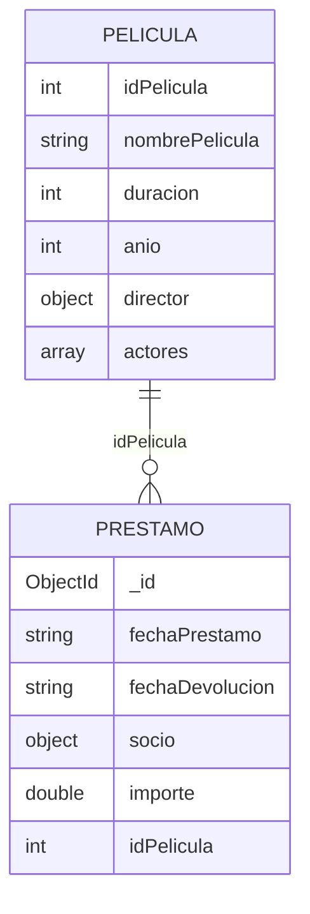

[← Unidad 4](../)

# Integrador — Películas y Préstamos

Esta práctica utiliza dos datasets entregados con la unidad y reúne documentos embebidos, arrays, fechas, CRUD, pipeline, índices y vistas.

## Preparación

Usar los archivos `Peliculas.json` y `Prestamos.json` provistos con el material de la cátedra. No se enlazan mediante la etiqueta Liquid `` porque la carpeta de referencias puede no formar parte del sitio publicado. En Compass:

1. Crear la base `videoclub`.
2. Crear las colecciones `peliculas` y `prestamos`.
3. Importar cada archivo como JSON en su colección.
4. Verificar tipos desde **Schema** o con las consultas siguientes.

```javascript
use videoclub
db.peliculas.countDocuments()
db.prestamos.countDocuments()
db.peliculas.findOne()
db.prestamos.findOne()
```

El documento de película embebe un `director` y contiene un array `actores`. El préstamo embebe el `socio`, pero conserva `idPelicula` para vincular otra colección. Son dos decisiones de modelado distintas.



## Parte A — Consultas directas

Intentá resolver antes de mirar la solución.

### 1. Películas dirigidas por Christopher Nolan

```javascript
db.peliculas.find(
  { "director.apellido": "Nolan", "director.nombre": "Christopher" },
  { _id: 0, nombrePelicula: 1, anio: 1 }
).sort({ anio: 1 })
```

### 2. Películas en las que actúa Al Pacino

MongoDB compara el valor contra cada elemento del array:

```javascript
db.peliculas.find(
  { actores: "Al Pacino" },
  { _id: 0, nombrePelicula: 1, actores: 1 }
)
```

### 3. Películas de 1990 a 2010 inclusive y duración superior a 140 minutos

```javascript
db.peliculas.find({
  anio: { $gte: 1990, $lte: 2010 },
  duracion: { $gt: 140 }
}).sort({ duracion: -1 })
```

### 4. Préstamos de Virrey del Pino con importe mayor a 1000

```javascript
db.prestamos.find(
  {
    "socio.localidad": "Virrey del Pino",
    importe: { $gt: 1000 }
  },
  { _id: 0, socio: 1, importe: 1, idPelicula: 1 }
)
```

### 5. Diferenciar campo ausente de campo nulo

```javascript
db.peliculas.find({ calificacion: { $exists: false } })
db.peliculas.find({ calificacion: null })
```

La segunda forma también puede coincidir con ausencia. Si se necesita “existe y es nulo”:

```javascript
db.peliculas.find({
  calificacion: { $exists: true, $type: "null" }
})
```

## Parte B — Calidad de tipos y actualización

En `Prestamos.json`, `fechaPrestamo` y `fechaDevolucion` son strings `AAAA-MM-DD`. El orden lexicográfico funcionaría mientras el formato sea uniforme, pero no habilita operadores de fecha. Convertirlas una sola vez mejora el modelo:

```javascript
db.prestamos.updateMany(
  {
    fechaPrestamo: { $type: "string" },
    fechaDevolucion: { $type: "string" }
  },
  [
    {
      $set: {
        fechaPrestamo: { $dateFromString: { dateString: "$fechaPrestamo" } },
        fechaDevolucion: { $dateFromString: { dateString: "$fechaDevolucion" } }
      }
    }
  ]
)
```

Verificar:

```javascript
db.prestamos.find({}, {
  fechaPrestamo: 1,
  tipo: { $type: "$fechaPrestamo" }
})
```

Agregar la duración del préstamo en días:

```javascript
db.prestamos.updateMany(
  { fechaPrestamo: { $type: "date" }, fechaDevolucion: { $type: "date" } },
  [
    {
      $set: {
        diasPrestamo: {
          $dateDiff: {
            startDate: "$fechaPrestamo",
            endDate: "$fechaDevolucion",
            unit: "day"
          }
        }
      }
    }
  ]
)
```

## Parte C — Aggregation Pipeline

### 6. Préstamos con el nombre de la película

```javascript
db.prestamos.aggregate([
  {
    $lookup: {
      from: "peliculas",
      localField: "idPelicula",
      foreignField: "idPelicula",
      as: "pelicula"
    }
  },
  { $unwind: { path: "$pelicula", preserveNullAndEmptyArrays: true } },
  {
    $project: {
      _id: 0,
      socio: { $concat: ["$socio.nombre", " ", "$socio.apellido"] },
      localidad: "$socio.localidad",
      pelicula: "$pelicula.nombrePelicula",
      importe: 1,
      diasPrestamo: 1
    }
  },
  { $sort: { importe: -1 } }
])
```

Antes de `$unwind`, `pelicula` es un **array** aunque la relación lógica devuelva una sola coincidencia. `preserveNullAndEmptyArrays` evita perder préstamos cuyo `idPelicula` no tenga película correspondiente.

### 7. Recaudación y cantidad por localidad

```javascript
db.prestamos.aggregate([
  {
    $group: {
      _id: "$socio.localidad",
      prestamos: { $sum: 1 },
      recaudacion: { $sum: "$importe" },
      ticketPromedio: { $avg: "$importe" }
    }
  },
  { $sort: { recaudacion: -1 } },
  {
    $project: {
      _id: 0,
      localidad: "$_id",
      prestamos: 1,
      recaudacion: { $round: ["$recaudacion", 2] },
      ticketPromedio: { $round: ["$ticketPromedio", 2] }
    }
  }
])
```

### 8. Cantidad de películas por director

```javascript
db.peliculas.aggregate([
  {
    $group: {
      _id: {
        id: "$director.idDirector",
        apellido: "$director.apellido",
        nombre: "$director.nombre"
      },
      peliculas: { $sum: 1 },
      titulos: { $push: "$nombrePelicula" },
      duracionPromedio: { $avg: "$duracion" }
    }
  },
  { $sort: { peliculas: -1, "_id.apellido": 1 } }
])
```

### 9. Actores con más apariciones

```javascript
db.peliculas.aggregate([
  { $unwind: "$actores" },
  {
    $group: {
      _id: "$actores",
      apariciones: { $sum: 1 },
      peliculas: { $push: "$nombrePelicula" }
    }
  },
  { $sort: { apariciones: -1, _id: 1 } },
  { $limit: 10 }
])
```

## Parte D — Índices y vista

Crear índices según los filtros y la unión usados:

```javascript
db.peliculas.createIndex(
  { idPelicula: 1 },
  { unique: true, name: "uq_pelicula_id" }
)
db.peliculas.createIndex(
  { "director.apellido": 1, anio: 1 },
  { name: "director_anio" }
)
db.peliculas.createIndex({ actores: 1 }, { name: "actores_multikey" })
db.prestamos.createIndex({ idPelicula: 1 }, { name: "prestamo_pelicula" })
db.prestamos.createIndex(
  { "socio.localidad": 1, importe: -1 },
  { name: "localidad_importe" }
)
```

Comprobar el plan antes y después:

```javascript
db.prestamos.find({ "socio.localidad": "Virrey del Pino" })
  .explain("executionStats")
```

Crear una vista reutilizable con el detalle unido:

```javascript
db.createView("vw_prestamos_detalle", "prestamos", [
  {
    $lookup: {
      from: "peliculas",
      localField: "idPelicula",
      foreignField: "idPelicula",
      as: "pelicula"
    }
  },
  { $unwind: { path: "$pelicula", preserveNullAndEmptyArrays: true } },
  {
    $project: {
      _id: 0,
      fechaPrestamo: 1,
      socio: 1,
      importe: 1,
      titulo: "$pelicula.nombrePelicula",
      director: "$pelicula.director"
    }
  }
])
```

Las vistas son de solo lectura y ejecutan su pipeline al consultarse; no almacenan una copia materializada de los resultados.

## Desafíos sin solución inmediata

1. Obtener el director con mayor recaudación acumulada.
2. Detectar préstamos cuyo `idPelicula` no tenga correspondencia.
3. Obtener la película más prestada; resolver empates.
4. Clasificar importes en rangos con `$bucket`.
5. Usar `$facet` para devolver en una consulta un ranking por localidad y otro por película.
6. Explicar qué índices puede aprovechar cada desafío y demostrarlo con `explain("executionStats")`.
