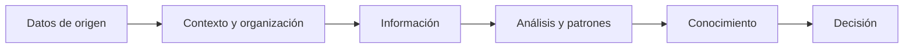
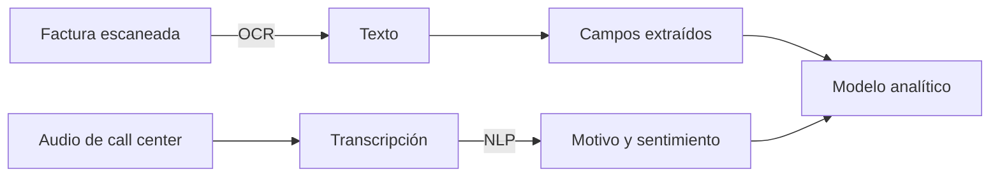
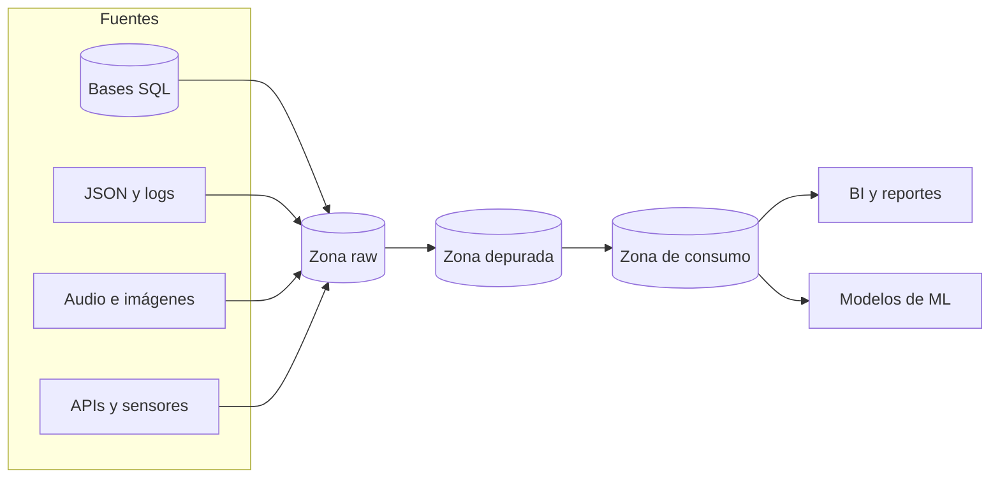
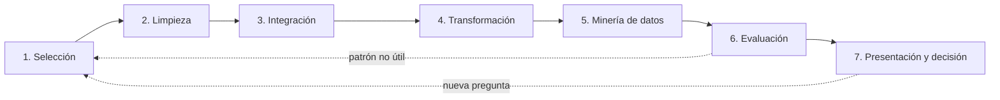

[← Unidad 4](../)

# Datos, Data Lake y KDD

Esta guía conecta tres ideas que suelen estudiarse por separado: **qué forma tienen los datos**, **dónde se almacenan** y **cómo se convierten en conocimiento útil**.

## 1. Datos, información y conocimiento

- Un **dato** es una representación elemental sin interpretación suficiente: `154`, una fotografía o una llamada grabada.
- La **información** aparece al agregar contexto: `154 GB consumidos por el cliente 42 en junio`.
- El **conocimiento** surge al descubrir una regularidad útil: `clientes con caída brusca de consumo y reiterados reclamos presentan alto riesgo de baja`.

## 2. Clasificación según su estructura

| Tipo | Organización | Ejemplos | Procesamiento habitual |
|------|--------------|----------|------------------------|
| **Estructurado** | Esquema explícito, tipos y campos previsibles | Tablas SQL, fecha, importe, código de cliente | SQL, conteos, sumas, promedios |
| **Semiestructurado** | No tiene una tabla rígida, pero posee etiquetas o jerarquía | JSON, XML, HTML, e-mails con encabezados, imagen con metadatos | Parsers, consultas por rutas, motores documentales |
| **No estructurado** | No posee un modelo de campos directamente consultable | Texto libre, audio, video, llamadas, imágenes satelitales o de vigilancia | OCR, NLP, visión artificial, reconocimiento de voz |

> Un formato no determina por sí solo toda la clasificación. Una fotografía es contenido no estructurado, pero puede incluir metadatos EXIF estructurados. Un documento JSON es semiestructurado porque sus claves le aportan organización, aunque distintos documentos no compartan exactamente el mismo esquema.

### Procesamiento de datos no estructurados

**OCR (Optical Character Recognition)** detecta símbolos en una imagen y los transforma en caracteres procesables. Por ejemplo, convierte una factura escaneada en texto del cual luego se extraen CUIT, fecha y total.

**NLP (Natural Language Processing)** analiza lenguaje escrito o hablado. Puede clasificar el motivo de un reclamo, detectar sentimiento o extraer entidades como empresas, personas y ubicaciones.

## 3. Ejemplo integrador: predicción de abandono

Una empresa de internet quiere anticipar qué clientes podrían migrar a la competencia.

| Fuente | Posible clasificación | Señal obtenida |
|--------|-----------------------|----------------|
| Facturación, plan y consumos | Estructurada | Aumento de precio, mora, caída del uso |
| Tickets y registros de navegación | Semi-estructurada | Visitas a páginas de competidores |
| Grabaciones del call center | No estructurada | Reclamos y sentimiento negativo |
| Ubicaciones aproximadas por antenas | Estructurada o semiestructurada | Permanencia en zonas con mala cobertura |

Ninguna señal aislada prueba la baja. El valor aparece al **seleccionar, limpiar, integrar y modelar** las fuentes para estimar una probabilidad y decidir una acción de retención.

## 4. Data Lake

Un **Data Lake** es un repositorio centralizado y escalable que conserva grandes volúmenes de datos, habitualmente en su formato original o **raw**. Puede reunir CSV, JSON, logs, imágenes, audio y video sin obligar a transformarlos previamente en tablas de negocio.

Aunque el material de cátedra destaca el almacenamiento raw, un Data Lake útil necesita gobierno:

- catálogo y metadatos para saber qué existe;
- seguridad y control de acceso;
- trazabilidad del origen (*lineage*);
- reglas de calidad y ciclo de vida;
- zonas raw, depurada y de consumo para evitar un *data swamp* o “pantano de datos”.

### Data Lake vs Data Warehouse

| Criterio | Data Lake | Data Warehouse |
|----------|-----------|----------------|
| Datos | Estructurados, semiestructurados y no estructurados | Principalmente estructurados e integrados |
| Estado al ingresar | Crudo o con transformación mínima | Limpio, transformado y modelado |
| Esquema | **Schema on read**: se interpreta al consumir | **Schema on write**: se valida al cargar |
| Uso | Exploración, ciencia de datos, ML, archivo masivo | BI, indicadores y reportes repetibles |
| Usuarios típicos | Ingenieros y científicos de datos | Analistas y usuarios de negocio |

No son tecnologías enemigas: es habitual que un Data Lake alimente un Data Warehouse con conjuntos ya curados.

## 5. KDD: descubrimiento de conocimiento

**KDD (Knowledge Discovery in Databases)** es el proceso completo, iterativo, de obtener conocimiento válido, novedoso, útil y comprensible a partir de datos. **Data mining no es sinónimo exacto de KDD**: la minería es la etapa algorítmica dentro del proceso total.

### Etapas

1. **Selección:** delimitar el problema y elegir fuentes, registros y atributos relevantes.
2. **Limpieza o preprocesamiento:** tratar faltantes, duplicados, ruido, errores e inconsistencias.
3. **Integración:** combinar fuentes y resolver identidades, unidades y formatos.
4. **Transformación:** normalizar, agregar, discretizar o construir variables útiles.
5. **Minería de datos:** aplicar algoritmos para descubrir patrones.
6. **Evaluación e interpretación:** comprobar calidad, validez y utilidad; descartar correlaciones espurias.
7. **Presentación y decisión:** comunicar resultados y convertirlos en una acción verificable.

### Tareas frecuentes de minería

| Tarea | Pregunta | Ejemplo |
|-------|----------|---------|
| **Clasificación** | ¿A qué clase conocida pertenece? | Cliente con riesgo alto/bajo de baja |
| **Regresión** | ¿Qué valor numérico se espera? | Importe de consumo del próximo mes |
| **Clustering** | ¿Qué grupos naturales existen? | Segmentos de clientes sin etiquetas previas |
| **Asociación** | ¿Qué eventos aparecen juntos? | Productos comprados en la misma operación |
| **Detección de anomalías** | ¿Qué casos se apartan del patrón? | Transacción posiblemente fraudulenta |

## 6. Lo que conviene responder en el parcial

**“¿JSON es no estructurado?”** No. Conserva una estructura jerárquica mediante claves, objetos y arrays; por eso se considera semiestructurado.

**“¿Data Lake es una base NoSQL?”** No necesariamente. Es una arquitectura de almacenamiento; puede utilizar objetos distribuidos y motores NoSQL, pero el concepto no designa un único DBMS.

**“¿KDD y minería son lo mismo?”** En el uso informal pueden confundirse, pero académicamente KDD incluye todo el proceso y data mining es solo una etapa.

**“¿Schema on read significa ausencia total de reglas?”** No. Significa que la estructura de consumo se aplica al leer; siguen siendo indispensables catálogo, seguridad y calidad.

## 7. Autoevaluación

1. Clasificá un CSV, un JSON, una radiografía y sus metadatos.
2. Explicá por qué OCR y NLP son transformaciones previas al análisis, no decisiones de negocio.
3. Diferenciá Data Lake y Data Warehouse usando esquema, formato y usuario.
4. Enumerá las etapas KDD y ubicá la minería dentro del ciclo.
5. Para el caso de abandono, proponé una fuente por cada tipo de dato y una acción final.

