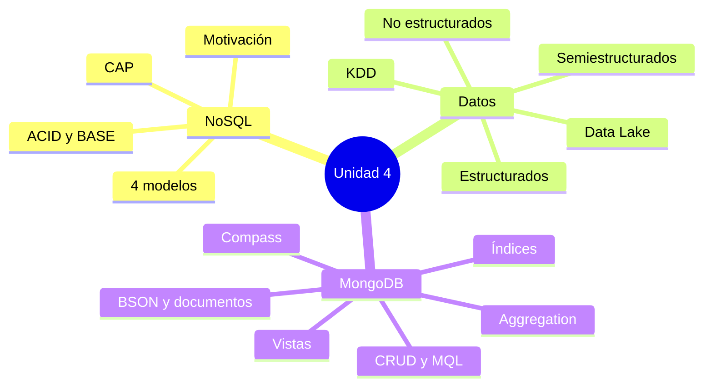
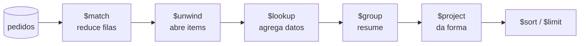

[← Unidad 4](../)

# Guía para el parcial — Unidad 4

Esta página no reemplaza el [apunte completo](../apunte-completo/): organiza lo que conviene poder **explicar, comparar y aplicar** sin depender de la memoria mecánica.

## Mapa de la unidad



## Comparaciones que hay que dominar

| Si preguntan… | La respuesta debe incluir… |
|---------------|----------------------------|
| SQL vs NoSQL | modelo, esquema, relaciones, escala y criterio de elección; no afirmar que uno siempre reemplaza al otro |
| ACID vs BASE | garantía transaccional inmediata frente a disponibilidad/estado flexible/consistencia eventual |
| C, A y P | valor coherente, respuesta de todo nodo no fallado y continuidad ante cortes de comunicación |
| JSON vs BSON | texto interoperable frente a representación binaria con más tipos; MongoDB almacena BSON |
| colección vs tabla | analogía útil, aclarando que los documentos pueden variar de estructura y contener arrays/subdocumentos |
| `find()` vs `aggregate()` | recuperación/filtro directo frente a pipeline de transformación y análisis |
| `$match` vs `$project` | filtrar documentos frente a seleccionar, renombrar o calcular campos |
| `$lookup` vs `$unwind` | unir y producir un array frente a desplegar cada elemento del array |
| COLLSCAN vs IXSCAN | recorrido completo frente a recorrido por índice; contrastar documentos examinados |
| Data Lake vs DWH | raw/schema-on-read frente a curado/schema-on-write |
| KDD vs data mining | proceso total frente a su etapa algorítmica |

## Cómo leer una consulta MQL

Analizala en este orden:

1. **Colección y operación:** `db.ventas.find`, `updateMany` o `aggregate`.
2. **Filtro:** qué documentos participan.
3. **Operador:** comparación, lógica, actualización o etapa.
4. **Ruta:** campo simple o *dot notation* (`cliente.localidad`).
5. **Tipo BSON:** una fecha no se compara igual que un string.
6. **Salida:** proyección, orden, límite o forma final del pipeline.

```javascript
db.ventas.find(
  {
    fecha: { $gte: ISODate("2025-01-01T00:00:00Z") },
    $or: [
      { "cliente.localidad": "Ramos Mejía" },
      { importe: { $gt: 1000 } }
    ]
  },
  { _id: 0, fecha: 1, "cliente.nombre": 1, importe: 1 }
).sort({ importe: -1 }).limit(5)
```

La lectura verbal correcta es: “de `ventas`, obtener desde 2025 las operaciones de Ramos Mejía **o** de importe superior a 1000; mostrar fecha, nombre e importe sin `_id`; ordenar por importe descendente y devolver cinco”.

## Cómo razonar un pipeline



Regla práctica: filtrar temprano, descomponer arrays solo cuando haga falta, agrupar después de disponer del nivel de detalle correcto y proyectar la salida final. Siempre describí **la forma de los documentos después de cada etapa**.

## Preguntas de desarrollo con respuesta esperada

### 1. ¿Por qué surgió NoSQL?

Por límites de costo y techo de la escala vertical, grandes volúmenes de lectura/escritura, necesidad de baja latencia, disponibilidad continua y datos con estructura cambiante. No significa “SQL es inútil”, sino que se elige otro compromiso para determinados problemas.

### 2. ¿Qué significa consistencia eventual?

Durante la propagación puede haber réplicas con versiones distintas; si cesan las actualizaciones y la comunicación funciona, convergen en un tiempo posterior. No significa inconsistencia permanente ni ausencia de reglas.

### 3. ¿Por qué CAP importa solo ante una partición?

Sin corte de comunicación es posible entregar respuestas disponibles y consistentes. Ante la partición hay que decidir entre rechazar/demorar alguna operación para preservar C, o responder aceptando posible divergencia para preservar A.

### 4. ¿Qué aporta el modelo documental?

Permite representar un agregado del dominio como un documento BSON con subdocumentos y arrays, leerlo como bloque y evolucionar campos sin alterar una tabla global. A cambio, hay que diseñar duplicación, tamaño y actualizaciones según los patrones de acceso.

### 5. ¿Qué costo tiene un índice?

Acelera lecturas que coinciden con su prefijo y orden, pero ocupa espacio y cada inserción, eliminación o modificación de campos indexados debe mantenerlo. Por eso no se indexa todo.

## Errores que suelen quitar puntos

- Decir que NoSQL no admite transacciones: MongoDB moderno sí admite transacciones; BASE describe un enfoque frecuente, no una prohibición universal.
- Confundir flexibilidad de esquema con ausencia de validación.
- Usar strings para comparar un campo BSON `Date`.
- Mezclar inclusiones y exclusiones en una proyección, salvo `_id`.
- Olvidar que `$lookup` entrega un array.
- Usar `$unwind` sin considerar documentos con array vacío o ausente.
- Crear `{ city_indx: 1 }` creyendo que `city_indx` es el nombre del índice: eso indexa un campo con ese nombre. Para nombrarlo se usa `{ name: "city_indx" }` como opción.
- Evaluar un índice solo porque existe; hay que observar `explain()`.

## Simulacro breve

1. Definí NoSQL y enumerá cuatro motivos de surgimiento.
2. Compará ACID y BASE con un ejemplo de negocio.
3. Explicá CAP y qué sacrifica una solución CP durante una partición.
4. Elegí un modelo NoSQL para caché, red social, catálogo y telemetría; justificá.
5. Escribí un `find()` con campo anidado, rango, proyección y orden.
6. Escribí un `updateMany()` que agregue un campo y otro que lo elimine.
7. Describí la salida de `$lookup` y la transformación de `$unwind`.
8. Diseñá un pipeline `match → group → project → sort`.
9. Explicá cuándo un índice compuesto puede ayudar y cuál es su costo.
10. Diferenciá Data Lake, Data Warehouse, KDD y minería de datos.

Si una respuesta no incluye al menos una **definición, un contraste y un ejemplo**, todavía no está lista para un parcial de desarrollo.

