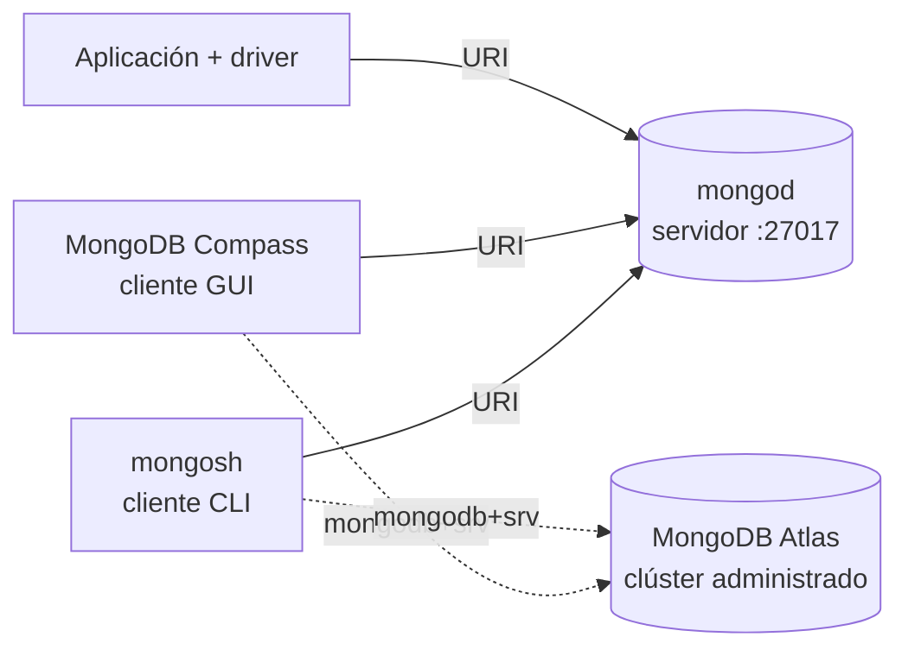

[← Unidad 4](../)

# Instalación y conexión de MongoDB

La instalación tiene tres piezas que suelen confundirse: **el servidor**, **el cliente de consola** y **la interfaz gráfica**.



| Componente | Función | ¿Almacena datos? |
|------------|---------|:----------------:|
| **MongoDB Community Server / `mongod`** | Motor que administra almacenamiento, accesos y operaciones | Sí |
| **`mongosh`** | Shell para enviar comandos MQL al servidor | No |
| **MongoDB Compass** | Cliente gráfico para administrar y consultar | No |
| **MongoDB Atlas** | Servicio de clúster MongoDB administrado en la nube | Sí |

## Instalación local

1. Descargar **MongoDB Community Server** desde el sitio oficial y completar el instalador del sistema operativo.
2. Instalar **MongoDB Shell (`mongosh`)** si el paquete no lo incluye.
3. Instalar **MongoDB Compass** para trabajar con interfaz gráfica.
4. Verificar el servidor con `mongod --version` y el cliente con `mongosh --version`.
5. Iniciar el servicio de MongoDB. En Windows instalado como servicio puede usarse `net start MongoDB` desde una terminal con permisos adecuados.
6. Conectar con la URI local.

```text
mongodb://localhost:27017/
```

El puerto predeterminado es **27017**. Una conexión exitosa de Compass o `mongosh` confirma que hay un servidor escuchando; instalar solamente Compass no crea un motor local.

## Conexión con `mongosh`

```bash
# Servidor local con valores predeterminados
mongosh "mongodb://localhost:27017/"

# Clúster Atlas: usar las credenciales propias
mongosh "mongodb+srv://<usuario>:<password>@<cluster>/<base>"
```

Después de conectar:

```javascript
show dbs
use laboratorio
db.prueba.insertOne({ mensaje: "conexión correcta", fecha: new Date() })
show collections
db.prueba.find()
```

## Conexión desde Compass

1. Abrir **New Connection**.
2. Pegar `mongodb://localhost:27017/` para el servidor local, o la cadena provista por Atlas.
3. Seleccionar **Connect**.
4. Crear una base y una colección con el botón correspondiente, o abrir el shell integrado y ejecutar MQL.

## Conexión a Atlas

Para una conexión remota se necesita, como mínimo:

- clúster activo;
- usuario de base de datos y contraseña;
- dirección IP autorizada en la lista de acceso de red;
- cadena `mongodb+srv://...` del clúster.

{: .warning }
No publiques cadenas con usuario y contraseña en apuntes, repositorios ni capturas. Las credenciales visibles en material histórico deben considerarse comprometidas. Usá marcadores o variables de entorno y rotá cualquier clave expuesta.

## Diagnóstico rápido

| Síntoma | Causa probable | Comprobación |
|---------|----------------|-------------|
| `connection refused` | `mongod` no está iniciado o el puerto es incorrecto | Revisar servicio y puerto 27017 |
| `Authentication failed` | Usuario, contraseña o base de autenticación incorrectos | Regenerar URI y revisar caracteres especiales |
| Atlas agota el tiempo | IP no autorizada o bloqueo de red | Revisar Network Access |
| `mongosh` no se reconoce | Ejecutable no instalado o fuera del `PATH` | Ejecutar `mongosh --version` |
| `show dbs` no muestra la base nueva | Aún no contiene datos | Insertar al menos un documento |

## Checklist de laboratorio

- [ ] Distingo `mongod`, `mongosh`, Compass y Atlas.
- [ ] Puedo conectarme a `mongodb://localhost:27017/`.
- [ ] Sé que `use nombre` selecciona la base, pero su creación persiste al insertar datos.
- [ ] Puedo crear, consultar y eliminar una colección de prueba.
- [ ] Mi URI publicada no contiene credenciales reales.

