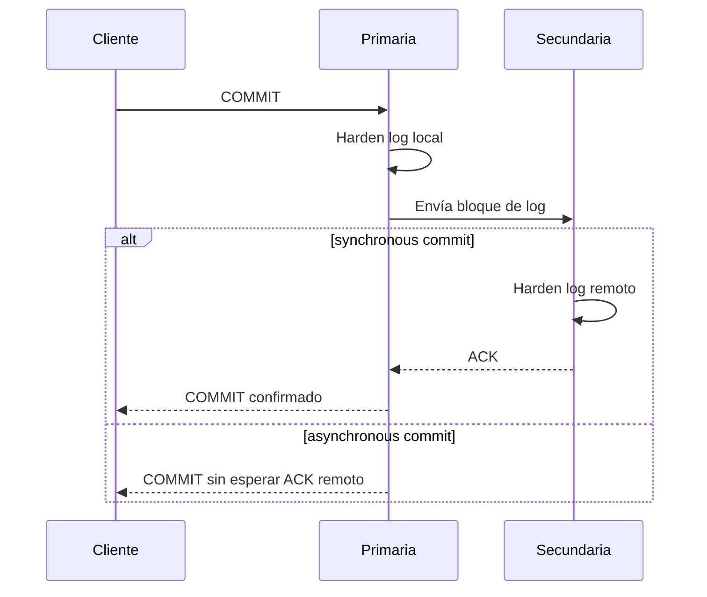
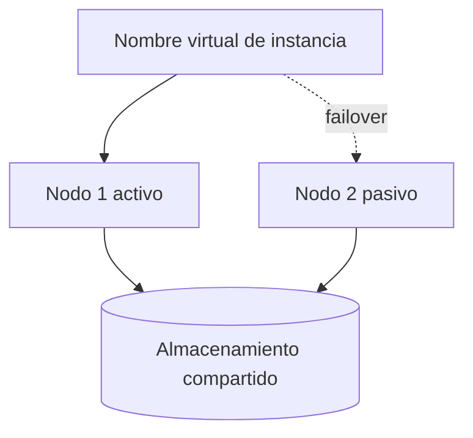
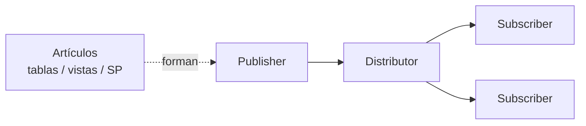
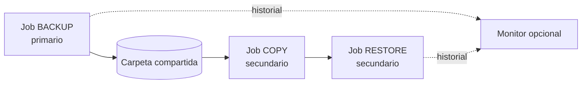

[← Unidad 5](../../)

# Alta disponibilidad, replicación y recuperación ante desastres

No todas las copias resuelven el mismo problema. La primera pregunta no es “¿qué herramienta instalamos?”, sino “¿qué falla debemos tolerar y con qué RPO/RTO?”.

## HA, DR, escalabilidad y backup

| Objetivo | Pregunta | Ejemplo de mecanismo |
|----------|----------|----------------------|
| HA | ¿Cómo reducimos una caída local? | AG síncrono, FCI |
| DR | ¿Cómo recuperamos otro sitio? | AG asíncrono, log shipping, backups off-site |
| Escala de lectura | ¿Cómo descargamos reporting? | Secundaria legible, replicación |
| Recuperación histórica | ¿Cómo volvemos antes del error? | Backup + restore |

Una réplica sincronizada no conserva necesariamente historia: reproduce rápidamente `DROP`, corrupción lógica o cifrado malicioso.

## Availability Groups

Protegen un conjunto de bases de usuario. Cada réplica mantiene su propio almacenamiento y recibe bloques de log.



### Compromiso síncrono y asíncrono

| Aspecto | Síncrono | Asíncrono |
|---------|----------|-----------|
| Latencia de commit | Incluye espera remota | No espera ACK remoto |
| Pérdida potencial | Muy baja si secundario sincronizado | Cola no enviada/rehacida puede perderse |
| Distancia típica | Cercana/baja latencia | DR remoto |
| Failover automático | Posible con réplicas sincronizadas y modo automático | No |

**Failover automático** requiere, entre otras condiciones, dos réplicas en synchronous commit, estado sincronizado, modo automatic y quorum saludable. “Síncrono” por sí solo no lo garantiza.

### Secundarias

Según edición y licenciamiento pueden:

- aceptar conexiones read-only;
- participar en read-only routing;
- ejecutar backups de acuerdo con preferencias;
- descargar reporting o ETL.

El listener ofrece un nombre virtual para reconectar al primario actual. Las aplicaciones necesitan timeouts y reintentos adecuados; el failover no hace que toda transacción en vuelo continúe automáticamente.

### Esqueleto DDL de un AG básico

Una implementación real requiere WSFC, endpoints, permisos, instancias compatibles y una base preparada. El material muestra una definición equivalente a:

```sql
CREATE AVAILABILITY GROUP BasicAG
WITH (
    AUTOMATED_BACKUP_PREFERENCE = PRIMARY,
    BASIC,
    DB_FAILOVER = OFF,
    DTC_SUPPORT = NONE,
    REQUIRED_SYNCHRONIZED_SECONDARIES_TO_COMMIT = 0
)
FOR DATABASE AdventureWorks
REPLICA ON
N'SQLVM1' WITH (
    ENDPOINT_URL = N'TCP://SQLVM1.example.test:5022',
    FAILOVER_MODE = AUTOMATIC,
    AVAILABILITY_MODE = SYNCHRONOUS_COMMIT,
    SEEDING_MODE = AUTOMATIC,
    SECONDARY_ROLE (ALLOW_CONNECTIONS = NO)
),
N'SQLVM2' WITH (
    ENDPOINT_URL = N'TCP://SQLVM2.example.test:5022',
    FAILOVER_MODE = AUTOMATIC,
    AVAILABILITY_MODE = SYNCHRONOUS_COMMIT,
    SEEDING_MODE = AUTOMATIC,
    SECONDARY_ROLE (ALLOW_CONNECTIONS = NO)
);
```

No se memoriza el script: se interpreta qué base integra el grupo, qué endpoint transporta el log y qué compromisos de disponibilidad/failover se configuraron.

## Failover Cluster Instance



FCI conmuta la instancia completa. Protege el nodo, servicio y recursos de instancia, pero el almacenamiento sigue siendo un componente que debe diseñarse con redundancia.

| Criterio | FCI | Availability Group |
|----------|-----|--------------------|
| Unidad protegida | Instancia | Grupo de bases |
| Almacenamiento | Compartido/equivalente | Copia por réplica |
| Secundaria legible | No como copia independiente | Posible |
| Logins/jobs fuera de DB | Viajan con instancia | Deben sincronizarse por otro medio |

## Replicación de SQL Server



Puede filtrar filas y columnas y distribuir solo una parte del modelo.

### Snapshot

Genera y aplica un estado completo. Inicializa replicación transaccional y merge; también sirve cuando el conjunto es pequeño y los cambios son infrecuentes.

### Transaccional

Un agente lee el log del Publisher y distribuye cambios con baja latencia. Se usa en reporting, data warehousing, integración y descarga de lotes/lecturas. Las tablas publicadas normalmente necesitan PK.

### Merge

Publisher y Subscribers pueden modificar datos. Los cambios se combinan y los conflictos se detectan/resuelven. Adecuada para trabajo desconectado, aplicaciones móviles y POS, con mayor complejidad y metadatos.

## Log shipping



Características:

- una primaria y una o más secundarias;
- intervalo y retardo configurables;
- secundarias en `NORECOVERY` o `STANDBY`;
- monitor opcional;
- failover manual;
- RPO aproximado ligado a frecuencia y colas de backup/copy/restore.

El retardo puede permitir reaccionar antes de aplicar un borrado accidental, aunque no sustituye copias históricas.

## Comparación para decidir

| Criterio | AG | FCI | Replicación | Log shipping |
|----------|----|-----|-------------|--------------|
| Failover automático | Sí, bajo condiciones | Sí | No como objetivo principal | No |
| Granularidad | Bases agrupadas | Instancia | Objetos/filas/columnas | Base completa |
| Copia física independiente | Sí | No necesariamente | Copia lógica | Sí, restaurada |
| Lectura secundaria | Posible | No | Sí | Entre restores con STANDBY |
| Recuperación histórica | No | No | No | Limitada; backup sigue siendo necesario |
| Complejidad | Alta | Alta | Media/alta | Media |

## Escenarios de parcial

**“Necesito failover automático local de una base crítica y RPO cercano a cero.”** AG síncrono y automático, o FCI según si se protege base/instancia y almacenamiento.

**“Necesito enviar algunas tablas a sucursales que también trabajan desconectadas.”** Replicación merge, evaluando conflictos.

**“Quiero un DR remoto económico; acepto failover manual y minutos de pérdida.”** Log shipping.

**“Quiero consultar una copia para reporting.”** Secundaria legible de AG si edición/licencia lo permite, o replicación transaccional según consistencia y granularidad.

**“Quiero recuperarme de un DELETE detectado tres días después.”** Backup histórico probado; ninguna réplica actual sustituye ese requisito.
