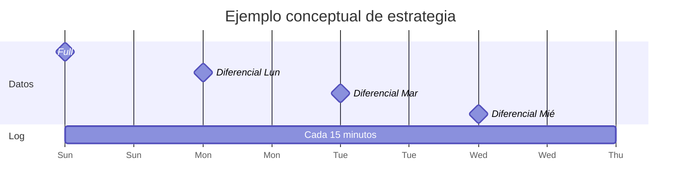
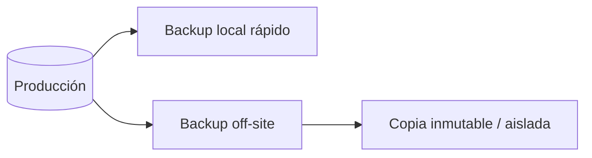

[← Unidad 5](../../)

# Backups, restauración, RPO y RTO

Una estrategia de respaldo se diseña desde la restauración requerida, no desde el comando `BACKUP` disponible.

## Amenaza, objetivo y estrategia

| Pregunta | Decisión resultante |
|----------|---------------------|
| ¿Cuántos datos se pueden perder? | RPO y frecuencia de logs/datos |
| ¿Cuánto puede estar caído el servicio? | RTO, automatización, infraestructura y tamaño |
| ¿Qué incidentes se cubren? | Copias aisladas, off-site, inmutabilidad, HA/DR |
| ¿Cuánto se retiene? | Política diaria, semanal, mensual y legal |
| ¿Cómo se demuestra? | Restore de prueba, `CHECKSUM`, `VERIFYONLY`, `CHECKDB` |

## Tipos de backup

### Full

Copia páginas asignadas y log suficiente para producir una base transaccionalmente consistente al finalizar. Es la base de una secuencia de restauración.

```sql
BACKUP DATABASE LaboratorioU5
TO DISK = 'D:\SQLBackups\LaboratorioU5_full.bak'
WITH INIT, COMPRESSION, CHECKSUM, STATS = 10;
```

### Diferencial

Incluye todas las extensiones modificadas desde el último full **no copy-only**. Es acumulativo: cada diferencial suele ser mayor que el anterior hasta el próximo full.

```sql
BACKUP DATABASE LaboratorioU5
TO DISK = 'D:\SQLBackups\LaboratorioU5_diff.bak'
WITH DIFFERENTIAL, INIT, COMPRESSION, CHECKSUM;
```

Para restaurar solo interesa el diferencial más reciente compatible con el full elegido.

### Log

Contiene registros desde el backup de log anterior y mantiene continua la cadena.

```sql
BACKUP LOG LaboratorioU5
TO DISK = 'D:\SQLBackups\LaboratorioU5_log_001.trn'
WITH INIT, COMPRESSION, CHECKSUM;
```

Todos los logs necesarios deben restaurarse en orden. Un full o diferencial intermedio no rompe la cadena.

### Tail-log

Captura la cola aún no respaldada antes de iniciar una restauración, si el archivo de log sigue accesible.

```sql
BACKUP LOG LaboratorioU5
TO DISK = 'D:\SQLBackups\LaboratorioU5_tail.trn'
WITH NORECOVERY, INIT, CHECKSUM;
```

`NORECOVERY` deja la base lista para la secuencia de restore e impide nuevas operaciones.

### Copy-only

```sql
BACKUP DATABASE LaboratorioU5
TO DISK = 'D:\SQLBackups\LaboratorioU5_export.bak'
WITH COPY_ONLY, INIT, COMPRESSION, CHECKSUM;
```

Un full copy-only no se transforma en la nueva base diferencial; es ideal para una copia extraordinaria sin alterar la estrategia programada.

## Una semana de backups



Ante un incidente el miércoles se usa full del domingo, diferencial del miércoles y logs posteriores a ese diferencial hasta el objetivo.

## Secuencia de restore

### Inspeccionar sin restaurar

```sql
RESTORE HEADERONLY
FROM DISK = 'D:\SQLBackups\LaboratorioU5_full.bak';

RESTORE FILELISTONLY
FROM DISK = 'D:\SQLBackups\LaboratorioU5_full.bak';

RESTORE VERIFYONLY
FROM DISK = 'D:\SQLBackups\LaboratorioU5_full.bak'
WITH CHECKSUM;
```

`VERIFYONLY` comprueba legibilidad y estructura, pero no sustituye una restauración real ni `DBCC CHECKDB`.

### Restaurar con otro nombre y ruta

```sql
RESTORE DATABASE LaboratorioU5_Restore
FROM DISK = 'D:\SQLBackups\LaboratorioU5_full.bak'
WITH
    MOVE 'LaboratorioU5'     TO 'D:\SQLData\LaboratorioU5_Restore.mdf',
    MOVE 'LaboratorioU5_log' TO 'D:\SQLData\LaboratorioU5_Restore.ldf',
    NORECOVERY,
    STATS = 10;
```

Los nombres lógicos usados en `MOVE` se obtienen con `FILELISTONLY`.

### Diferencial y logs

```sql
RESTORE DATABASE LaboratorioU5_Restore
FROM DISK = 'D:\SQLBackups\LaboratorioU5_diff.bak'
WITH NORECOVERY;

RESTORE LOG LaboratorioU5_Restore
FROM DISK = 'D:\SQLBackups\LaboratorioU5_log_003.trn'
WITH NORECOVERY;

RESTORE LOG LaboratorioU5_Restore
FROM DISK = 'D:\SQLBackups\LaboratorioU5_log_004.trn'
WITH STOPAT = '2026-07-22T14:37:00', RECOVERY;
```

Si el punto deseado cae dentro del último log, `STOPAT` evita aplicar operaciones posteriores. Las fechas y zona horaria deben verificarse cuidadosamente.

## Estados de recuperación

| Opción | Estado final | ¿Admite más restores? |
|--------|--------------|:---------------------:|
| `NORECOVERY` | Restoring, no accesible | Sí |
| `STANDBY` | Lectura limitada y archivo undo | Sí, tras expulsar lectores |
| `RECOVERY` | Online | No en esa secuencia |

## Opciones de riesgo

- `REPLACE` permite sobrescribir y omitir ciertas salvaguardas: confirmar destino y backup dos veces.
- `KEEP_REPLICATION` conserva configuración bajo escenarios compatibles.
- `RESTRICTED_USER` recupera limitando acceso.
- `STOPATMARK` y `STOPBEFOREMARK` recuperan respecto de una transacción marcada.

## Backup cifrado

```sql
BACKUP DATABASE LaboratorioU5
TO DISK = 'D:\SQLBackups\LaboratorioU5_enc.bak'
WITH COMPRESSION,
     ENCRYPTION (
       ALGORITHM = AES_256,
       SERVER CERTIFICATE = CertificadoBackup
     ),
     CHECKSUM;
```

El certificado y su clave privada deben respaldarse independientemente. Cifrar el backup y perder la clave equivale a perder el backup.

## 3-2-1 y ransomware



- Las copias no deben compartir todas las credenciales con producción.
- La retención inmutable reduce el riesgo de borrado por atacante.
- Deben monitorearse fallos de jobs y espacio.
- Se prueban restauraciones completas con tiempos medidos.

## Diseñar desde RPO/RTO

Ejemplo: RPO 15 minutos, RTO 2 horas.

- logs cada 10–15 minutos;
- full semanal y diferenciales diarios para reducir tiempo de restore;
- copias off-site/inmutables;
- automatización, documentación y servidor alternativo dimensionado;
- simulacro que demuestre recuperación en menos de 2 horas.

Un cronograma de backup no garantiza RTO: deben medirse transferencia, restore, redo, `CHECKDB`, validación funcional, DNS/conexiones y reapertura del servicio.

## Checklist de restore

- [ ] Confirmé la base destino y evité sobrescribir producción.
- [ ] Identifiqué full, diferencial y secuencia completa de logs por LSN.
- [ ] Capturé tail-log si era posible.
- [ ] Usé `NORECOVERY` hasta la última pieza.
- [ ] Validé nombres lógicos y rutas con `FILELISTONLY`.
- [ ] Ejecuté `DBCC CHECKDB` y pruebas funcionales.
- [ ] Registré duración para contrastar RTO.
- [ ] Documenté pérdida real para contrastar RPO.

