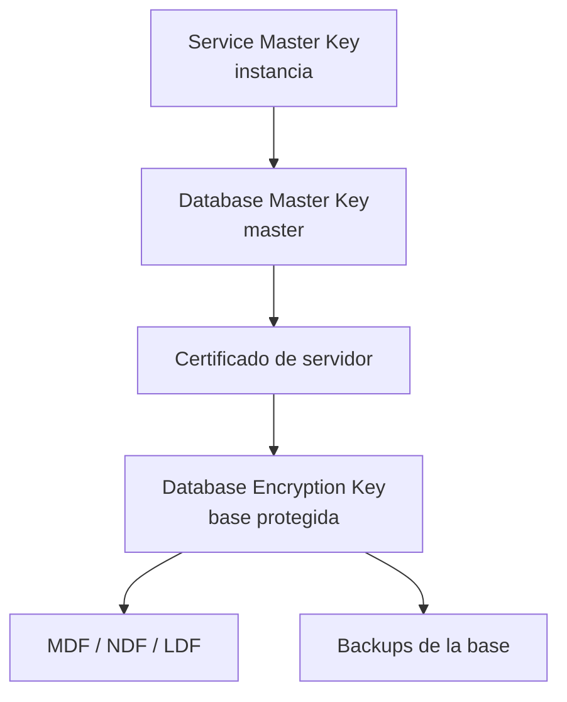
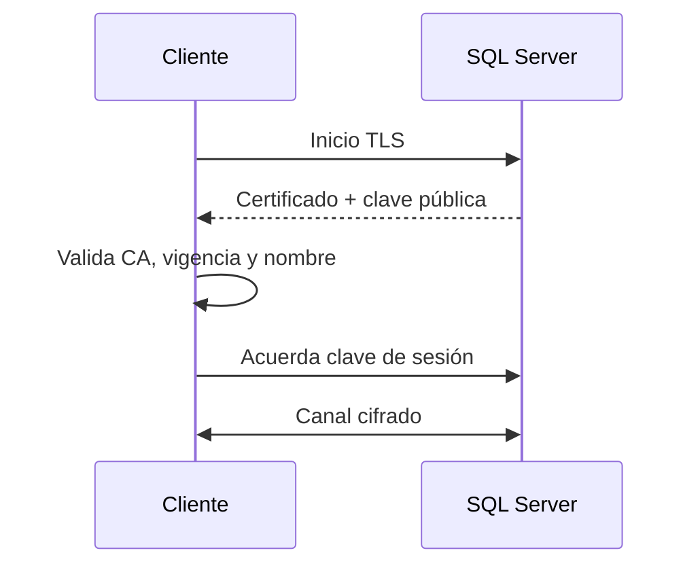

[← Unidad 5](../../)

# Cifrado en reposo y en tránsito

El cifrado reduce el valor de datos robados, pero desplaza el problema hacia la custodia de claves. No corrige permisos excesivos ni reemplaza backup.

## Modelo de amenazas

| Riesgo | Control de cifrado | Control complementario |
|--------|--------------------|------------------------|
| Robo de disco o backup | TDE / backup encryption | Custodia de certificados, POLP |
| Intercepción de red | TLS | Validación de certificado y hostname |
| Usuario DB autorizado consulta una columna | Cifrado de columna o Always Encrypted | Permisos y separación de funciones |
| SQL injection usa cuenta con privilegios | Cifrado no alcanza si el motor descifra | Parámetros y mínimo privilegio |
| Pérdida/corrupción | Cifrado no recupera datos | Backup y DR |

## Conceptos criptográficos

- **Clave simétrica:** misma clave cifra y descifra; rápida para volumen.
- **Clave asimétrica:** par pública/privada; más costosa, útil para protección e identidad.
- **Certificado:** vincula una clave pública con una identidad y firma.
- **Hash:** función unidireccional; no es cifrado reversible.
- **Salt:** valor único agregado antes de hashear contraseñas para impedir tablas precalculadas.

## TDE

Transparent Data Encryption cifra datos y log al escribir en almacenamiento, sin cambiar consultas.



Ejemplo conceptual —requiere edición/versión compatible y custodia segura—:

```sql
USE master;
GO
CREATE MASTER KEY
ENCRYPTION BY PASSWORD = 'Secreto_temporal_para_proteger_DMK!';
GO
CREATE CERTIFICATE CertificadoTDE
WITH SUBJECT = 'Protección TDE de Ventas';
GO

USE Ventas;
GO
CREATE DATABASE ENCRYPTION KEY
WITH ALGORITHM = AES_256
ENCRYPTION BY SERVER CERTIFICATE CertificadoTDE;
GO
ALTER DATABASE Ventas SET ENCRYPTION ON;
```

Respaldar inmediatamente certificado y clave privada:

```sql
USE master;
GO
BACKUP CERTIFICATE CertificadoTDE
TO FILE = 'E:\Claves\CertificadoTDE.cer'
WITH PRIVATE KEY (
  FILE = 'E:\Claves\CertificadoTDE.pvk',
  ENCRYPTION BY PASSWORD = 'Otro_secreto_fuerte_y_separado!'
);
```

Estos archivos y contraseñas no deben quedar junto a los backups que protegen. Sin el certificado no se restaura la base TDE en otra instancia.

### Qué protege TDE

- archivos de datos y transaction log en reposo;
- backups generados desde la base cifrada;
- escenarios de robo/copia de medios.

No protege resultados de `SELECT`, memoria ni la conexión de red. Un administrador autorizado puede leer datos descifrados por el motor.

## Cifrado de columnas con passphrase

Adaptación didáctica del material:

```sql
ALTER TABLE ventas.Tarjeta
ADD NumeroCifrado varbinary(256);
GO

DECLARE @frase nvarchar(128) = N'Obtener_desde_un_gestor_de_secretos';

UPDATE ventas.Tarjeta
SET NumeroCifrado = EncryptByPassPhrase(
      @frase,
      Numero,
      1,
      CONVERT(varbinary(128), TarjetaId)
    )
WHERE TarjetaId = 3681;
```

El autenticador (`TarjetaId`) vincula el ciphertext a la fila. Para descifrar debe usarse exactamente el mismo:

```sql
SELECT CONVERT(varchar(30), DecryptByPassPhrase(
         @frase,
         NumeroCifrado,
         1,
         CONVERT(varbinary(128), TarjetaId)
       )) AS Numero
FROM ventas.Tarjeta
WHERE TarjetaId = 3681;
```

Una passphrase embebida en el procedimiento o repositorio destruye gran parte del beneficio. En producción se evalúan jerarquía de claves, módulos firmados, HSM/Key Vault o Always Encrypted según la amenaza.

### “Cifrado” de la definición de módulos

SQL Server admite `CREATE PROCEDURE ... WITH ENCRYPTION`, que oculta la definición en las vistas de catálogo habituales. Debe entenderse como **ofuscación**, no como una frontera criptográfica robusta ni control de acceso a los datos. También complica soporte y recuperación si no se conserva el código fuente en un repositorio seguro.

## TLS para datos en tránsito



Una configuración correcta requiere:

1. certificado apto para Server Authentication;
2. nombre DNS de conexión presente en CN/SAN;
3. certificado vigente y clave privada accesible al servicio;
4. cadena de CA confiable por los clientes;
5. cifrado requerido en servidor o connection string;
6. drivers actuales y protocolos débiles deshabilitados.

`Encrypt=true;TrustServerCertificate=false` expresa la intención correcta en drivers modernos. Confiar ciegamente en el certificado puede cifrar contra un intermediario y perder autenticación.

## Cifrado de backup independiente

Incluso sin TDE, SQL Server puede cifrar un backup con certificado o clave asimétrica:

```sql
BACKUP DATABASE Ventas
TO DISK = 'D:\SQLBackups\Ventas_seguro.bak'
WITH ENCRYPTION (
       ALGORITHM = AES_256,
       SERVER CERTIFICATE = CertificadoBackup
     ),
     COMPRESSION,
     CHECKSUM;
```

## Gestión de claves

- inventariar clave, propietario, propósito, algoritmo y vencimiento;
- separar claves de datos y restringir acceso;
- respaldar certificados y claves privadas antes de necesitarlos;
- probar restore en otra instancia;
- rotar sin destruir capacidad de leer información histórica;
- auditar uso y evitar secretos en logs;
- tener procedimiento de revocación y recuperación.

## Preguntas frecuentes

**¿TDE evita que un usuario con `SELECT` lea la tabla?** No. El motor descifra transparentemente.

**¿TLS protege el `.bak`?** No. Protege el transporte; el archivo necesita TDE o backup encryption.

**¿Hash y cifrado son equivalentes?** No. El hash es unidireccional; el cifrado se revierte con una clave.

**¿Cifrar es suficiente contra ransomware?** No. Se necesitan mínimo privilegio, segmentación y copias aisladas/inmutables.
