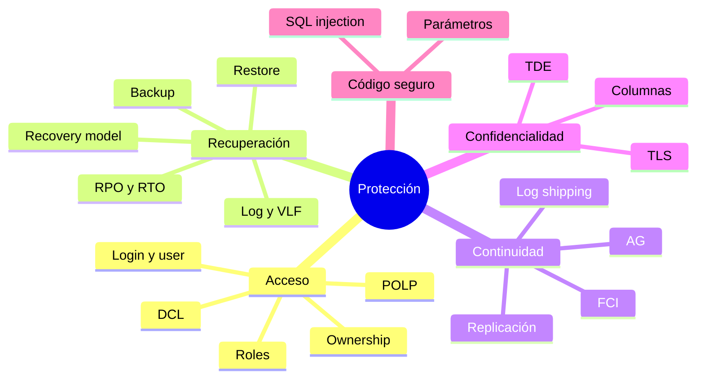

[← Unidad 5](../../)

# Guía para el parcial — Unidad 5

## Mapa mental

## Comparaciones obligatorias

| Comparación | Diferencia esencial |
|-------------|---------------------|
| Seguridad vs protección | Estado/riesgo frente a mecanismos para reducirlo |
| Autenticación vs autorización | Probar identidad frente a decidir acciones |
| Login vs user | Instancia frente a base de datos |
| User vs role | Principal individual frente a agrupador funcional |
| Role vs schema | Agrupa principals frente a agrupar objetos |
| `REVOKE` vs `DENY` | Quita decisión explícita frente a negación que suele vencer herencia |
| Truncar vs shrink | Reutilizar espacio lógico frente a reducir archivo físico |
| SIMPLE vs FULL | Sin backup de log/PITR frente a cadena de log y point-in-time |
| Full vs diferencial | Toda la base frente a cambios acumulados desde full base |
| Diferencial vs log | Estado acumulado de extensiones frente a secuencia incremental de registros |
| RPO vs RTO | Pérdida admisible frente a demora admisible |
| `NORECOVERY` vs `RECOVERY` | Admite más piezas frente a poner online y cerrar secuencia |
| HA vs DR | Reducir interrupción frente a recuperarse de desastre |
| AG vs replicación | Réplica física/lógica de bases para HA frente a distribución de artículos |
| Replicación vs backup | Distribución del estado actual frente a recuperación histórica |
| TDE vs TLS | Archivos en reposo frente a conexión en tránsito |
| Cifrado vs hash | Reversible con clave frente a unidireccional |
| Validar vs parametrizar | Regla de negocio frente a separación código/dato |

## Preguntas de desarrollo

### ¿Qué es POLP y por qué reduce impacto?

Otorga solo datos y operaciones necesarios. Reduce la probabilidad de abuso y limita el daño si una cuenta es comprometida o una consulta es inyectada.

### ¿Cómo llega un permiso hasta una tabla?

Por un `GRANT` directo, por membresía de rol o por un permiso superior de base/esquema. También influyen `DENY`, ownership chaining y roles de servidor. Se verifica el permiso efectivo, no solo una fila de catálogo.

### ¿Por qué crece el log en FULL?

Puede faltar backup de log (`LOG_BACKUP`), existir transacción activa, réplica retrasada u otro consumidor. Se consulta `log_reuse_wait_desc`; achicar sin resolver la causa no sirve.

### ¿Cómo restaurar a las 10:37?

Tail-log si es posible; full con `NORECOVERY`; diferencial compatible con `NORECOVERY`; logs en orden; último log con `STOPAT = 10:37` y `RECOVERY`; luego integridad y validación funcional.

### ¿HA reemplaza backup?

No. HA reduce caída y replica el estado, incluidos errores lógicos. Backup conserva puntos históricos y copias aisladas.

### ¿Cómo prevenir SQL injection?

Parametrizar en el punto de ejecución, validar por reglas de negocio, aplicar POLP y no exponer errores. Ni ORM ni SP garantizan seguridad si concatenan.

## Errores que quitan puntos

- Decir que login y user son lo mismo.
- Afirmar que `REVOKE` es una negación.
- Usar `db_owner` como rol normal de aplicación.
- Confundir default schema con permiso.
- Decir que checkpoint es un backup o que truncamiento reduce el `.ldf`.
- Llamar “incremental” al diferencial sin aclarar que es acumulativo desde el full.
- Restaurar el full con `RECOVERY` antes de los logs.
- Definir RPO como tiempo de caída.
- Presentar replicación o RAID como backup.
- Afirmar que toda réplica AG permite lectura o failover automático.
- Decir que TDE evita `SELECT` de usuarios autorizados.
- Recomendar escapar comillas en lugar de parametrizar.
- Asumir que un SP u ORM siempre evita inyección.

## Simulacro

1. Dibujá la ruta login → user → role → permission → securable.
2. Diseñá permisos para vendedores, supervisores y auditores aplicando POLP.
3. Explicá `GRANT`, `DENY`, `REVOKE`, `WITH GRANT OPTION` y `CASCADE`.
4. Describí WAL, checkpoint, LSN, VLF y truncamiento.
5. Compará SIMPLE, FULL y BULK_LOGGED.
6. Proponé backups para RPO 10 minutos y RTO 1 hora.
7. Escribí el orden de restore full + diferencial + cuatro logs.
8. Elegí AG, FCI, replicación o log shipping para cuatro escenarios y justificá.
9. Diferenciá cifrado de columna, TDE y TLS.
10. Transformá una consulta concatenada en `sp_executesql` parametrizado.

## Método de respuesta

Para cada desarrollo incluí:

1. **definición precisa**;
2. **mecanismo**: cómo funciona;
3. **contraste** con el concepto vecino;
4. **ejemplo T-SQL o escenario**;
5. **limitación**: qué no resuelve.

Una respuesta que solo enumera comandos demuestra memoria; una que explica garantías y límites demuestra comprensión profesional.

