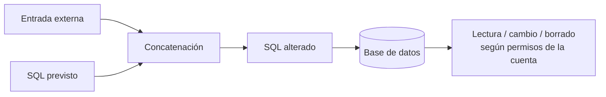
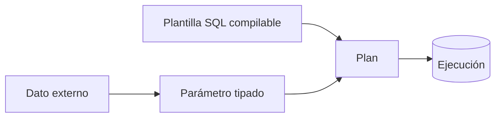
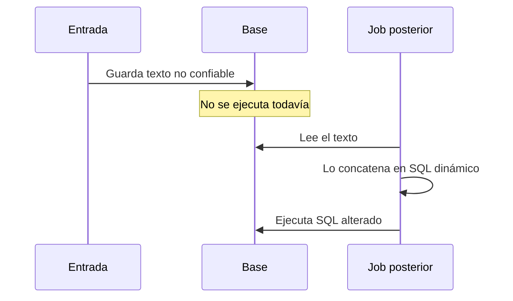

[← Unidad 5](../../)

# Inyección SQL y programación segura

Una inyección ocurre cuando la aplicación mezcla **estructura SQL** con **datos no confiables**. El atacante no “rompe SQL Server”: aprovecha una consulta construida incorrectamente.

## Anatomía



El impacto máximo queda limitado —o amplificado— por los permisos de la cuenta de aplicación.

## Vectores

| Vector | Ejemplo conceptual |
|--------|--------------------|
| Entrada del usuario | Login, búsqueda, comentario, filtro |
| URL | `?category=...` concatenado en un `WHERE` |
| Cookie | Valor alterado que el servidor considera confiable |
| Variable de servidor | Encabezado HTTP o dato de infraestructura guardado/consultado |
| Herramienta automática | Prueba masiva de parámetros y respuestas |
| Segundo orden | Payload almacenado que se concatena en otra operación posterior |

Validar solo el formulario visible no alcanza: toda frontera externa es no confiable.

## Autenticación vulnerable

```sql
-- Ejemplo deliberadamente incorrecto; no ejecutar en producción.
DECLARE @sql nvarchar(max) =
  N'SELECT UsuarioId
    FROM seguridad.Usuario
    WHERE Nombre = ''' + @nombre + N'''
      AND Clave = ''' + @clave + N''';';

EXEC (@sql);
```

Una comilla dentro de `@nombre` puede cerrar el literal y cambiar la lógica. Además, comparar contraseñas recuperables en SQL es un diseño inseguro.

## Parametrización



```sql
DECLARE @sql nvarchar(max) =
  N'SELECT UsuarioId, Nombre
    FROM seguridad.Usuario
    WHERE Nombre = @p_nombre;';

EXEC sys.sp_executesql
  @stmt = @sql,
  @params = N'@p_nombre nvarchar(100)',
  @p_nombre = @nombre;
```

El valor no puede convertirse en operador SQL porque se enlaza después como dato tipado.

### Cuando ni siquiera hace falta SQL dinámico

```sql
CREATE OR ALTER PROCEDURE seguridad.BuscarUsuario
    @Nombre nvarchar(100)
AS
BEGIN
    SET NOCOUNT ON;
    SELECT UsuarioId, Nombre
    FROM seguridad.Usuario
    WHERE Nombre = @Nombre;
END;
```

Un procedimiento es seguro solo si no vuelve a concatenar entradas internamente.

## Identificadores dinámicos

Los parámetros representan **valores**, no nombres de tabla, columna ni dirección `ASC/DESC`. Para estructura dinámica se usa una lista permitida y `QUOTENAME`:

```sql
IF @columna NOT IN (N'Nombre', N'FechaAlta', N'Pais')
    THROW 50001, 'Columna no permitida.', 1;

DECLARE @sql nvarchar(max) =
    N'SELECT ClienteId, Nombre, FechaAlta, Pais
      FROM ventas.Cliente
      ORDER BY ' + QUOTENAME(@columna) + N';';

EXEC sys.sp_executesql @sql;
```

`QUOTENAME` ayuda a delimitar, pero la allowlist expresa la regla de negocio.

## Validación vs parametrización

| Control | Responde a | ¿Sustituye parámetros? |
|---------|------------|:-----------------------:|
| Tipo y longitud | ¿Tiene forma válida? | No |
| Rango | ¿Es un valor admisible? | No |
| Allowlist | ¿Pertenece al conjunto permitido? | No |
| Parametrización | ¿Puede alterar la sintaxis? | Es el control primario |
| Escapado manual | Intenta corregir caracteres | No recomendado como defensa principal |

## ORM y stored procedures

Un ORM suele parametrizar APIs normales, pero puede exponer métodos “raw SQL”. Un SP puede concatenar. La herramienta no garantiza seguridad: importa cómo se usa.

## Mínimo privilegio

La cuenta web no debería:

- pertenecer a `sysadmin` o `db_owner`;
- crear o eliminar objetos;
- consultar tablas sensibles sin necesidad;
- delegar permisos;
- compartir credenciales con tareas administrativas.

Preferir `EXECUTE` sobre procedimientos específicos y acceso por roles/esquemas.

## Contraseñas

No se almacenan cifradas para luego compararlas con `WHERE Clave = ...`. Se usa un algoritmo de password hashing adaptativo —Argon2id, bcrypt, scrypt o PBKDF2 según plataforma— con salt único y parámetros de costo, generalmente en el servicio de identidad.

## Defensa en profundidad

- parametrizar en cada capa;
- validar tamaño, tipo y allowlist;
- usar cuentas específicas con POLP;
- ocultar mensajes internos y stack traces al cliente;
- mantener motor, framework y drivers actualizados;
- registrar eventos, no secretos;
- aplicar revisiones de código y pruebas de seguridad autorizadas;
- usar WAF como capa adicional, nunca como sustituto del código seguro.

## Segundo orden

Un valor puede guardarse sin causar daño inmediato y volverse peligroso cuando otro job lo concatena:



Por eso se parametriza **en el punto de ejecución**, incluso si el dato proviene de nuestra propia base.

## Respuesta esperada de parcial

> La inyección SQL aparece cuando una entrada no confiable se concatena con una consulta y altera su sintaxis. Se previene separando código y datos mediante consultas parametrizadas o `sp_executesql`, validando entradas y aplicando mínimo privilegio. ORM y procedimientos no son seguros automáticamente si construyen SQL por concatenación.

