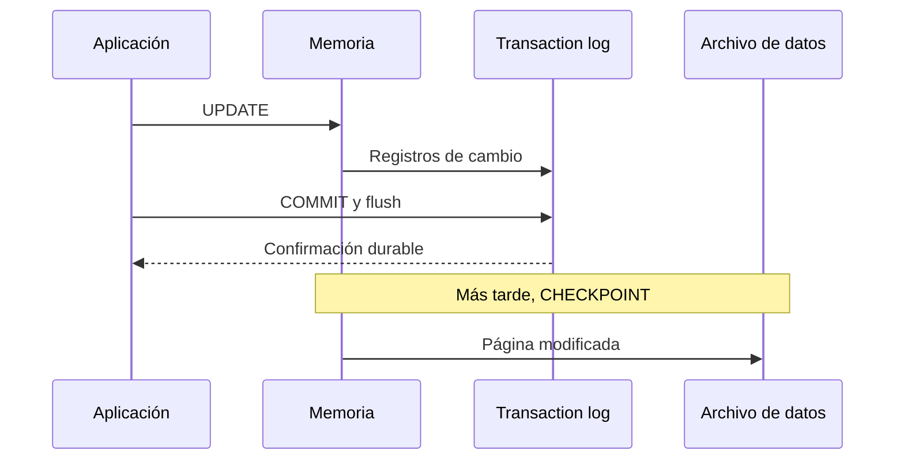
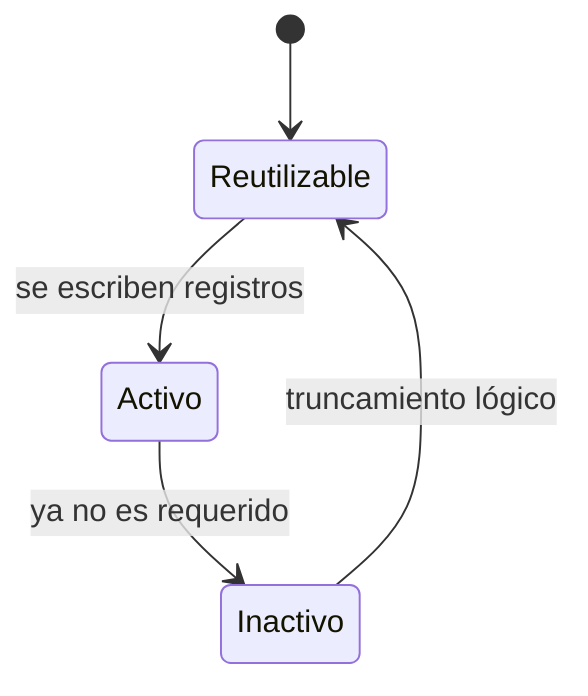

[← Unidad 5](../../)

# Registro de transacciones y modelos de recuperación

El log no es “un historial opcional”: es una estructura esencial para atomicidad, durabilidad y recuperación ante fallos.

## De una modificación al disco



En un reinicio, SQL Server analiza el log, rehace cambios confirmados que aún no estaban en datos y deshace transacciones incompletas.

## Componentes

- **Archivo físico de log (`.ldf`):** se configura con tamaño y crecimiento.
- **VLF:** segmentos internos creados al generar o extender el archivo.
- **LSN:** número de secuencia que ordena registros lógicos.
- **MinLSN:** comienzo de la parte activa más antigua que todavía se necesita.
- **Checkpoint:** escribe páginas sucias y establece un punto que reduce trabajo de recuperación; no equivale a backup.

### Ciclo de los VLF



El motor avanza circularmente, pero no puede sobrescribir un VLF activo. Si no encuentra espacio reutilizable, crece el archivo si tiene autogrowth y hay disco; de lo contrario las escrituras fallan.

## Truncar, respaldar y achicar

| Acción | Qué hace | Qué no hace |
|--------|----------|-------------|
| Truncamiento | Marca VLF inactivos reutilizables | No reduce `.ldf` |
| Backup de log | Conserva registros de la cadena y permite truncar cuando no hay otro bloqueo | No respalda páginas de datos como un full |
| `DBCC SHRINKFILE` | Puede reducir físicamente un archivo en una intervención excepcional | No resuelve la causa del crecimiento |

El patrón grow–shrink–grow consume I/O, genera VLF adicionales y empeora la operación. Se dimensiona el log para su carga normal y se corrige la causa de retención.

## Diagnóstico

```sql
SELECT name,
       recovery_model_desc,
       log_reuse_wait_desc
FROM sys.databases
WHERE database_id > 4;

DBCC SQLPERF(LOGSPACE);

SELECT *
FROM sys.dm_db_log_space_usage;
```

Cantidad y tamaño promedio de VLF:

```sql
SELECT d.name,
       COUNT(*) AS cantidad_vlf,
       CONVERT(decimal(12,2), AVG(v.vlf_size_mb)) AS promedio_mb
FROM sys.databases AS d
CROSS APPLY sys.dm_db_log_info(d.database_id) AS v
GROUP BY d.name
ORDER BY cantidad_vlf DESC;
```

Transacciones abiertas:

```sql
DBCC OPENTRAN;

SELECT at.transaction_id,
       at.name,
       at.transaction_begin_time,
       st.session_id
FROM sys.dm_tran_active_transactions AS at
LEFT JOIN sys.dm_tran_session_transactions AS st
  ON st.transaction_id = at.transaction_id;
```

## Cuándo puede reutilizarse un registro

Entre otras condiciones:

- la transacción correspondiente finalizó;
- las páginas requeridas alcanzaron un checkpoint;
- ningún backup necesita ese rango;
- replicación, AG, mirroring, CDC u otro consumidor ya lo procesó.

`log_reuse_wait_desc` indica la causa dominante: `LOG_BACKUP`, `ACTIVE_TRANSACTION`, `AVAILABILITY_REPLICA`, `REPLICATION`, `CHECKPOINT`, etc.

## Modelos de recuperación

### SIMPLE

El checkpoint puede truncar partes inactivas. No se permiten backups del transaction log y no hay recuperación a un instante entre backups de datos.


### FULL

Mantiene la cadena de log mediante backups regulares y permite point-in-time recovery. Si no se hacen backups de log, el archivo puede crecer porque `LOG_BACKUP` impide reutilización.


### BULK_LOGGED

Minimiza registro de determinadas operaciones masivas bajo condiciones específicas. Requiere backup de log, pero si un backup contiene una operación mínimamente registrada puede no permitir detenerse en un punto interno y debe incluir extensiones de datos modificadas.

No es “FULL más rápido” para dejar permanentemente; se usa en ventanas planificadas y se comprende su impacto sobre RPO.

## Cambios de modelo

```sql
ALTER DATABASE Ventas SET RECOVERY FULL;
GO
BACKUP DATABASE Ventas
TO DISK = 'D:\SQLBackups\Ventas_base.bak'
WITH INIT, CHECKSUM;
GO
BACKUP LOG Ventas
TO DISK = 'D:\SQLBackups\Ventas_001.trn'
WITH INIT, CHECKSUM;
```

Al pasar de `SIMPLE` a `FULL` o `BULK_LOGGED`, se realiza un backup full o diferencial para iniciar la cadena. Al pasar a `SIMPLE`, la cadena se interrumpe.

## Mitos de parcial

- “Checkpoint vacía el log”: no; persiste páginas y puede habilitar truncamiento según el modelo.
- “Truncar achica”: no; vuelve reutilizable espacio interno.
- “FULL hace backup solo”: no; es una política que exige jobs de backup.
- “Más archivos de log mejoran rendimiento”: normalmente no; el log se escribe secuencialmente, no en paralelo como data files.
- “Un full reemplaza backups de log”: no; no rompe ni sustituye la cadena.

