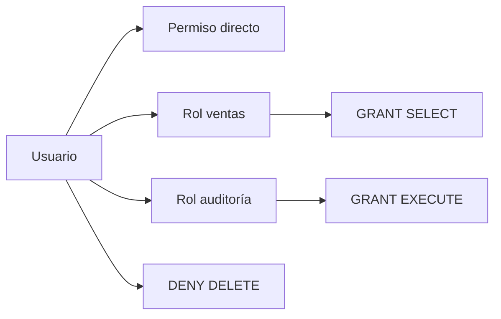

[← Unidad 5](../../)

# Seguridad, usuarios y permisos

Guía operativa para diseñar, implementar y auditar accesos con mínimo privilegio.

## Diseño antes que comandos

Una matriz de autorización evita otorgar permisos “hasta que funcione”:

| Rol funcional | Leer pedidos | Crear pedidos | Cambiar estado | Ver costo | Administrar usuarios |
|---------------|:------------:|:-------------:|:-------------:|:---------:|:--------------------:|
| Vendedor | Sí | Sí | Solo propios | No | No |
| Supervisor | Sí | Sí | Sí | Sí | No |
| Auditor | Sí | No | No | Sí | No |
| DBA seguridad | Según necesidad | No | No | No | Sí |

El flujo recomendable es **persona/aplicación → login → user → rol funcional → permiso sobre esquema/objeto**.

## Login y user

```sql
USE master;
GO
CREATE LOGIN login_vendedor
WITH PASSWORD = 'Reemplazar_por_secreto_robusto!',
     CHECK_POLICY = ON,
     CHECK_EXPIRATION = ON,
     DEFAULT_DATABASE = Ventas;
GO

USE Ventas;
GO
CREATE USER usr_vendedor
FOR LOGIN login_vendedor
WITH DEFAULT_SCHEMA = ventas;
GO
```

`DEFAULT_DATABASE` define adónde intenta conectarse el login; `DEFAULT_SCHEMA` resuelve nombres no calificados dentro de la base. Ninguno concede permisos.

Para identidades humanas integradas a un dominio, se prefiere autenticación Windows y grupos:

```sql
CREATE LOGIN [EMPRESA\Vendedores] FROM WINDOWS;
USE Ventas;
CREATE USER [EMPRESA\Vendedores] FOR LOGIN [EMPRESA\Vendedores];
```

## Rol funcional y permiso de esquema

```sql
CREATE ROLE rol_vendedores AUTHORIZATION dbo;
ALTER ROLE rol_vendedores ADD MEMBER usr_vendedor;

GRANT SELECT, INSERT ON SCHEMA::ventas TO rol_vendedores;
GRANT EXECUTE ON SCHEMA::operaciones TO rol_vendedores;
DENY DELETE ON SCHEMA::ventas TO rol_vendedores;
```

El permiso de esquema incluye objetos nuevos, lo cual simplifica administración pero exige gobernar qué se crea dentro de él.

## Permisos efectivos

Un usuario puede recibir permisos por varias rutas:



`REVOKE` sobre la ruta directa no elimina lo heredado de roles. Para analizar un incidente no alcanza con revisar `sys.database_permissions`: también hay que considerar membresías, jerarquía, ownership, contexto y roles de servidor.

### Probar desde otro contexto

```sql
EXECUTE AS USER = 'usr_vendedor';
SELECT USER_NAME() AS usuario_db, ORIGINAL_LOGIN() AS login_original;
SELECT * FROM fn_my_permissions('ventas.Pedido', 'OBJECT');
SELECT HAS_PERMS_BY_NAME('ventas.Pedido', 'OBJECT', 'SELECT') AS puede_select;
REVERT;
```

`EXECUTE AS` debe cerrarse con `REVERT`, incluso al capturar errores.

## Consultas de auditoría

### Roles de servidor

```sql
SELECT rol.name AS rol,
       miembro.name AS miembro
FROM sys.server_role_members AS rm
JOIN sys.server_principals AS rol
  ON rol.principal_id = rm.role_principal_id
JOIN sys.server_principals AS miembro
  ON miembro.principal_id = rm.member_principal_id
ORDER BY rol.name, miembro.name;
```

### Roles de base de datos

```sql
SELECT rol.name AS rol,
       miembro.name AS miembro
FROM sys.database_role_members AS drm
JOIN sys.database_principals AS rol
  ON rol.principal_id = drm.role_principal_id
JOIN sys.database_principals AS miembro
  ON miembro.principal_id = drm.member_principal_id
ORDER BY rol.name, miembro.name;
```

### Permisos explícitos, incluyendo esquema y objeto

```sql
SELECT p.state_desc,
       p.permission_name,
       p.class_desc,
       USER_NAME(p.grantee_principal_id) AS principal,
       CASE p.class_desc
         WHEN 'DATABASE' THEN DB_NAME()
         WHEN 'SCHEMA' THEN SCHEMA_NAME(p.major_id)
         WHEN 'OBJECT_OR_COLUMN'
           THEN QUOTENAME(OBJECT_SCHEMA_NAME(p.major_id)) + '.'
              + QUOTENAME(OBJECT_NAME(p.major_id))
       END AS securable
FROM sys.database_permissions AS p
ORDER BY principal, p.class_desc, securable, p.permission_name;
```

La consulta del material que hace `INNER JOIN sys.objects` omite permisos de base y esquema; la versión anterior conserva esos ámbitos.

### Propietarios de bases y esquemas

```sql
SELECT name AS base,
       SUSER_SNAME(owner_sid) AS propietario
FROM sys.databases;

SELECT s.name AS esquema,
       USER_NAME(s.principal_id) AS propietario
FROM sys.schemas AS s
ORDER BY s.name;
```

Evitar que propietarios dependan de cuentas personales que puedan desaparecer. Reasignar con `ALTER AUTHORIZATION`.

## `GRANT OPTION` y delegación

```sql
GRANT SELECT ON OBJECT::ventas.Pedido
TO supervisor
WITH GRANT OPTION;

REVOKE SELECT ON OBJECT::ventas.Pedido
FROM supervisor CASCADE;
```

`CASCADE` es necesario si el principal delegó el permiso. Antes de ejecutarlo se debe conocer a quién afectará.

## Vista y procedimiento como API de datos

```sql
CREATE OR ALTER VIEW ventas.vw_ClienteVisible
AS
SELECT ClienteId, Nombre, Email, Pais
FROM ventas.Cliente
WHERE Activo = 1;
GO

GRANT SELECT ON OBJECT::ventas.vw_ClienteVisible TO rol_vendedores;
DENY SELECT ON OBJECT::ventas.Cliente TO rol_vendedores;
```

```sql
CREATE OR ALTER PROCEDURE operaciones.RegistrarPedido
    @ClienteId int,
    @Importe decimal(18,2)
AS
BEGIN
    SET NOCOUNT ON;
    INSERT ventas.Pedido(ClienteId, Importe, Fecha)
    VALUES (@ClienteId, @Importe, SYSDATETIME());
END;
GO

GRANT EXECUTE ON OBJECT::operaciones.RegistrarPedido TO rol_vendedores;
```

El usuario consume una interfaz estable sin modificar la tabla libremente. El ownership chaining funciona cuando propietarios coinciden y las referencias son estáticas; SQL dinámico requiere otro análisis, como firma mediante certificado o `EXECUTE AS` controlado.

## Checklist POLP

- [ ] Aplicaciones y personas usan cuentas separadas.
- [ ] No usan `sa`, `sysadmin` ni `db_owner` por defecto.
- [ ] Los permisos se asignan a roles funcionales.
- [ ] Se prefieren esquema, vista o procedimiento antes que permisos masivos.
- [ ] Los secretos no están en scripts.
- [ ] Roles anidados y `WITH GRANT OPTION` están justificados.
- [ ] Propietarios son cuentas estables.
- [ ] Se prueban permisos efectivos con `EXECUTE AS` y DMVs/catálogo.
- [ ] Servicios y características innecesarios están deshabilitados.

## Preguntas para razonar

1. ¿Por qué `CREATE LOGIN` no permite consultar automáticamente `Ventas`?
2. ¿Qué diferencia práctica existe entre `REVOKE SELECT` y `DENY SELECT`?
3. ¿Por qué un permiso de esquema puede ser más mantenible y también más riesgoso?
4. ¿Cuándo una vista protege información y cuándo no alcanza?
5. ¿Cómo comprobarías el acceso efectivo de un usuario que pertenece a tres roles?

