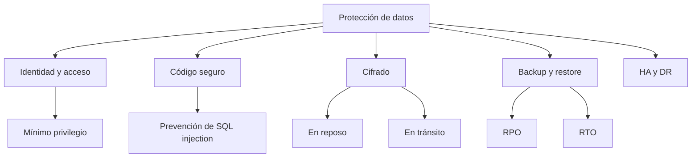
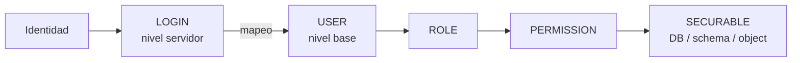
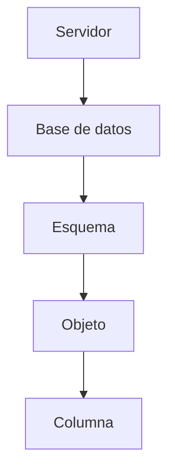
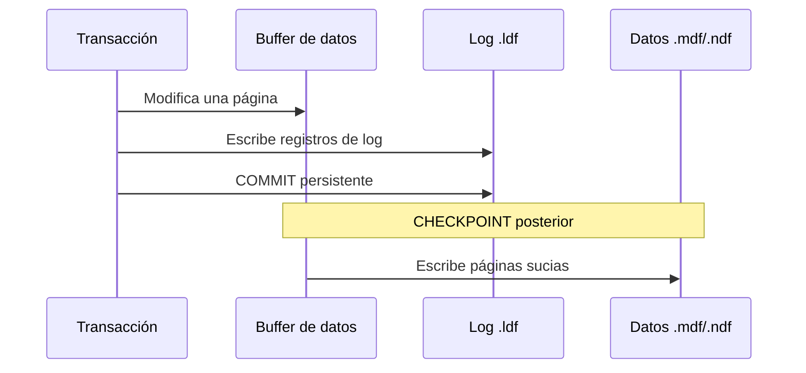
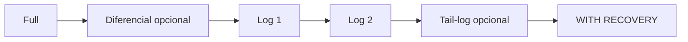
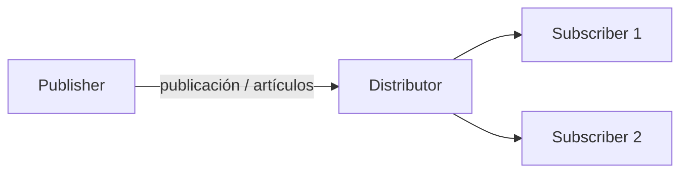
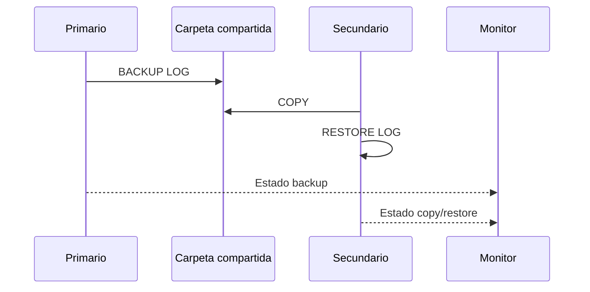
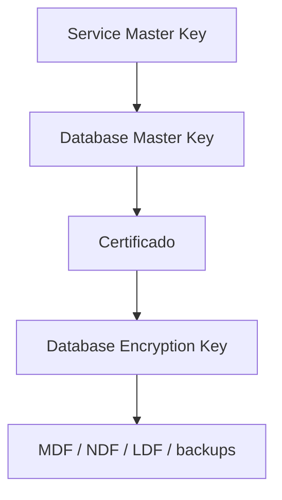

[← Unidad 5](../../)

# Unidad 5 — Protección de los datos

La protección de datos no se obtiene con una única herramienta. Requiere controles preventivos, detectivos y correctivos que cubran identidades, permisos, programación, cifrado, respaldo, recuperación y continuidad.



## 1. Seguridad y protección

**Seguridad** describe el grado en que un sistema está libre de riesgos inaceptables: acceso no autorizado, alteración, divulgación, pérdida o manipulación de configuraciones.

**Protección** es el conjunto de mecanismos aplicados para reducir esos riesgos. Aumentar controles eleva la seguridad, pero ningún control aislado evita todos los incidentes. Un sistema con permisos estrictos todavía puede sufrir ransomware; una réplica puede copiar inmediatamente una eliminación accidental; un backup que nunca se restauró es solo una promesa.

### Principios fundamentales

- **POLP — Principle of Least Privilege:** cada persona, proceso y aplicación recibe únicamente los permisos imprescindibles, durante el tiempo necesario.
- **Reducción de superficie de ataque:** deshabilitar servicios, protocolos, puertos, cuentas y características que no se utilizan.
- **Defensa en profundidad:** combinar controles independientes; si uno falla, otro limita el impacto.
- **Separación de funciones:** quien administra, desarrolla, audita y opera no debería concentrar permisos incompatibles.
- **Actualización continua:** mantener sistema operativo, motor, drivers y herramientas con parches soportados.
- **Verificación:** auditar permisos, probar restauraciones, monitorear logs y revisar configuraciones.

Las medidas no terminan dentro del DBMS: también abarcan sistema operativo, red, firewall, hardware, secretos, aplicaciones y procedimientos humanos.

## 2. Modelo de seguridad de SQL Server

SQL Server responde tres preguntas:

1. **¿Quién sos?** Autenticación.
2. **¿A qué ámbito ingresás?** Login de servidor y usuario de base.
3. **¿Qué podés hacer allí?** Autorización mediante permisos y roles.



### Principals y securables

Una **entidad de seguridad** o *principal* es un individuo, grupo o proceso que puede solicitar recursos. Puede existir en Windows, en la instancia o en una base de datos.

Un **securable** es un recurso protegible: servidor, endpoint, login, base, esquema, tabla, vista, procedimiento, función o columna. Cada clase admite permisos específicos.

| Nivel | Principals típicos | Securables típicos |
|-------|--------------------|--------------------|
| Sistema operativo | Usuario o grupo Windows | Archivos, servicio y recursos del SO |
| Servidor SQL | Login, rol de servidor | Instancia, endpoint, login, base de datos |
| Base de datos | User, rol de DB, application role | Base, esquema, tabla, vista, procedimiento, columna |

### `sa` y cuentas administrativas

`sa` es un login SQL miembro de `sysadmin`. Puede deshabilitarse y no debe utilizarse desde aplicaciones. Los miembros de `sysadmin` omiten comprobaciones normales de permiso y actúan como `dbo`; por eso un `DENY` no los limita de la forma habitual.

## 3. Login, usuario y esquema

Un **login** autentica contra la instancia, pero no concede por sí mismo acceso a cada base. El **user** representa a ese login dentro de una base concreta.

```sql
USE master;
GO
CREATE LOGIN app_ventas
WITH PASSWORD = 'Usar_un_secreto_externo_2026!',
     CHECK_POLICY = ON,
     CHECK_EXPIRATION = ON;
GO

USE Ventas;
GO
CREATE USER app_ventas_user
FOR LOGIN app_ventas
WITH DEFAULT_SCHEMA = ventas;
GO
```

El nombre del user puede diferir del login. Un login suele mapearse a un solo usuario por base; el mismo login puede tener usuarios en varias bases.

El **default schema** es la primera ubicación donde SQL Server busca un objeto sin calificar y donde puede crear objetos si tiene permiso. No otorga por sí mismo permisos sobre ese esquema. Conviene escribir siempre nombres de dos partes: `ventas.Pedido`, no solo `Pedido`.

### Formas habituales de usuario

- usuario mapeado a un login SQL;
- usuario mapeado a login o grupo Windows;
- usuario contenido con contraseña, cuando la base lo admite;
- usuario sin login, útil para `EXECUTE AS` y permisos internos;
- usuario basado en certificado o clave asimétrica para firma de módulos.

### Directivas de contraseña

`CHECK_POLICY = ON` aplica la directiva de complejidad del sistema operativo. `CHECK_EXPIRATION = ON` habilita vencimiento y `MUST_CHANGE` obliga a cambiarla en el próximo inicio. Las contraseñas deben gestionarse como secretos, no quedar en scripts ni repositorios. Los caracteres especiales también deben tratarse correctamente en connection strings y drivers ODBC.

## 4. Roles

Un rol agrupa principals para asignar permisos por función y no persona por persona.

### Roles fijos de servidor

| Rol | Alcance resumido |
|-----|------------------|
| `sysadmin` | Control irrestricto de la instancia |
| `serveradmin` | Configuración del servidor y apagado |
| `securityadmin` | Logins y permisos de servidor; rol de alto riesgo |
| `processadmin` | Procesos en ejecución |
| `setupadmin` | Servidores vinculados y ciertas tareas de configuración |
| `bulkadmin` | Operaciones bulk |
| `diskadmin` | Administración de archivos de disco heredada |
| `dbcreator` | Crear, modificar, restaurar y eliminar bases |
| `public` | Permisos base que recibe todo login |

Las versiones recientes incorporan roles de servidor más granulares con nombres `##MS_*##`. Antes de usar un rol fijo amplio, debe verificarse si existe un permiso o rol personalizado más limitado.

```sql
ALTER SERVER ROLE bulkadmin ADD MEMBER operador_cargas;
ALTER SERVER ROLE bulkadmin DROP MEMBER operador_cargas;
```

### Roles de base de datos

| Rol fijo | Capacidad principal |
|----------|---------------------|
| `db_owner` | Control completo de la base |
| `db_securityadmin` | Administrar membresía y permisos |
| `db_accessadmin` | Administrar acceso de usuarios |
| `db_backupoperator` | Ejecutar backups |
| `db_ddladmin` | Ejecutar DDL |
| `db_datareader` | Leer todas las tablas y vistas de usuario |
| `db_datawriter` | Insertar, actualizar y eliminar en todas las tablas de usuario |
| `db_denydatareader` | Denegar lectura |
| `db_denydatawriter` | Denegar escritura |
| `public` | Permisos comunes a todo usuario de la base |

Es mejor crear roles funcionales y otorgarles permisos de esquema:

```sql
USE Ventas;
GO
CREATE ROLE vendedores AUTHORIZATION dbo;
GRANT SELECT, INSERT, UPDATE ON SCHEMA::ventas TO vendedores;
ALTER ROLE vendedores ADD MEMBER ricardo;
ALTER ROLE vendedores DROP MEMBER ricardo;
```

Los roles pueden anidarse, pero una red profunda vuelve difícil explicar permisos efectivos y detectar escaladas.

## 5. DCL: `GRANT`, `DENY` y `REVOKE`

| Sentencia | Efecto |
|-----------|--------|
| `GRANT` | Concede explícitamente un permiso |
| `DENY` | Niega explícitamente; normalmente prevalece sobre permisos heredados |
| `REVOKE` | Elimina un `GRANT` o `DENY`; no equivale a negar |

```sql
GRANT SELECT ON OBJECT::ventas.Pedido TO ana;
DENY DELETE ON OBJECT::ventas.Pedido TO ana;
REVOKE SELECT ON OBJECT::ventas.Pedido TO ana;
```

Después del `REVOKE`, Ana podría seguir leyendo si otro rol le concede `SELECT`. `DENY` está pensado para impedir esa herencia, con excepciones de alto privilegio como `sysadmin` y matices de permisos de columna.

### `WITH GRANT OPTION` y `CASCADE`

```sql
GRANT INSERT ON OBJECT::ventas.Pedido TO pablo WITH GRANT OPTION;

-- Si Pablo ya delegó ese permiso, se revoca la cadena:
REVOKE INSERT ON OBJECT::ventas.Pedido TO pablo CASCADE;
```

Delegar permisos amplía la superficie de administración; debe usarse de manera excepcional y auditable.

### Jerarquía de permisos

Un permiso concedido arriba alcanza objetos inferiores:



- `GRANT SELECT ON DATABASE::Ventas` alcanza sus esquemas y objetos.
- `GRANT SELECT ON SCHEMA::ventas` alcanza tablas y vistas actuales y futuras del esquema.
- `GRANT SELECT ON OBJECT::ventas.Pedido` se limita a ese objeto.
- `CONTROL` sobre un securable implica normalmente sus demás permisos.

Agrupar objetos con igual política dentro del mismo esquema simplifica el diseño.

## 6. Propiedad, vistas y código como frontera

Los propietarios tienen capacidades implícitas sobre lo que poseen. Un principal no puede eliminarse mientras sea dueño de objetos o esquemas; la propiedad puede reasignarse:

```sql
ALTER AUTHORIZATION ON SCHEMA::ventas TO dbo;
ALTER AUTHORIZATION ON OBJECT::ventas.Pedido TO dbo;
```

### Ownership chaining

Si un procedimiento y sus objetos subyacentes tienen el mismo propietario, SQL Server puede comprobar `EXECUTE` sobre el procedimiento sin requerir `SELECT` directo sobre cada tabla.

```sql
CREATE OR ALTER PROCEDURE reportes.ListarAlumnosJovenes
AS
BEGIN
    SET NOCOUNT ON;
    SELECT TOP (10) Nombre, Carrera
    FROM dbo.Alumno
    WHERE DNI > 40000000;
END;
GO

GRANT EXECUTE ON OBJECT::reportes.ListarAlumnosJovenes TO lector_reportes;
```

Así se expone una operación limitada. El encadenamiento no debe asumirse ciegamente: SQL dinámico, cambio de propietario o referencias entre bases pueden interrumpirlo.

Una vista también puede ocultar columnas o filas:

```sql
CREATE OR ALTER VIEW ventas.ClientesPublicos
AS
SELECT Id, NombreCompleto, Email, NumeroCuenta, Pais
FROM ventas.Customer
WHERE Pais <> 'US';
GO

GRANT SELECT ON OBJECT::ventas.ClientesPublicos TO consulta_clientes;
```

No se concede acceso a la tabla base. Una vista es una frontera de acceso, no cifrado: protege mientras permisos y ownership chain estén correctamente diseñados.

## 7. Registro de transacciones

El transaction log registra transacciones y cambios necesarios para recuperar la base a un estado coherente. Se almacena en uno o más archivos físicos `.ldf`, separados de los archivos de datos.

SQL Server aplica **write-ahead logging (WAL)**: antes de escribir una página modificada al archivo de datos, el registro correspondiente debe persistir en el log.



### LSN y VLF

- Cada registro posee un **LSN (Log Sequence Number)** que determina su posición lógica.
- **MinLSN** marca el inicio del registro activo necesario más antiguo.
- Cada archivo de log se divide internamente en **VLF (Virtual Log Files)**.
- Al llenarse un VLF, el motor continúa en el siguiente reutilizable.
- El log se comporta como una estructura circular cuando los VLF inactivos pueden reutilizarse.

**Truncar el log** marca espacio lógico como reutilizable; **no reduce el tamaño físico del `.ldf`**. Achicar repetidamente el archivo para que vuelva a crecer genera fragmentación y demasiados VLF.

```sql
SELECT d.name,
       COUNT(*) AS cantidad_vlf,
       CONVERT(decimal(10,2), AVG(li.vlf_size_mb)) AS promedio_vlf_mb
FROM sys.databases AS d
CROSS APPLY sys.dm_db_log_info(d.database_id) AS li
GROUP BY d.name
ORDER BY cantidad_vlf DESC;

DBCC SQLPERF(LOGSPACE);
```

Un registro puede seguir activo por una transacción abierta, un backup de log pendiente, replicación, Availability Groups u otra característica que lo consuma. Se diagnostica con `sys.databases.log_reuse_wait_desc`.

## 8. Modelos de recuperación

| Modelo | Backup de log | Recuperación temporal | Uso típico |
|--------|---------------|-----------------------|-----------|
| `SIMPLE` | No | Hasta el último full/diferencial | Datos reconstruibles o RPO amplio |
| `FULL` | Sí | A un instante dentro de la cadena de log | OLTP y baja pérdida admisible |
| `BULK_LOGGED` | Sí | Limitada si el backup contiene operaciones bulk mínimamente registradas | Ventanas controladas de carga masiva |

```sql
ALTER DATABASE Ventas SET RECOVERY FULL;
SELECT name, recovery_model_desc FROM sys.databases WHERE name = 'Ventas';
```

Cambiar a `FULL` no inicia por sí solo una cadena utilizable: se debe realizar un backup full o diferencial que establezca la base de la cadena y luego programar backups de log.

## 9. Backups

El backup protege frente a fallas de hardware y software, errores humanos, malware y corrupción. **Alta disponibilidad no reemplaza backup:** una réplica puede propagar una operación incorrecta.

### Tipos

| Tipo | Contenido | Relación con la cadena |
|------|-----------|------------------------|
| Full | Toda la base y log suficiente para consistencia | Base de restauración |
| Diferencial | Extensiones modificadas desde el último full convencional | Acumulativo; crece hasta el próximo full |
| Log | Registros desde el backup de log anterior | Incremental y secuencial |
| Tail-log | Cola aún no respaldada antes de restaurar | Minimiza pérdida tras incidente |
| Copy-only full | Copia independiente | No cambia la base diferencial |
| Copy-only log | Copia de log independiente | No trunca el log ni altera la cadena normal |

```sql
BACKUP DATABASE Ventas
TO DISK = 'D:\SQLBackups\Ventas_full.bak'
WITH COMPRESSION, CHECKSUM, INIT, STATS = 10;

BACKUP DATABASE Ventas
TO DISK = 'D:\SQLBackups\Ventas_diff.bak'
WITH DIFFERENTIAL, COMPRESSION, CHECKSUM, INIT;

BACKUP LOG Ventas
TO DISK = 'D:\SQLBackups\Ventas_1200.trn'
WITH COMPRESSION, CHECKSUM, INIT;
```

El full no rompe la cadena de logs y un diferencial no sustituye los backups de log.

### Estrategia 3-2-1

- al menos **3 copias** contando la productiva;
- en **2 medios o sistemas** diferentes;
- al menos **1 copia externa**, aislada o inmutable.

La nube puede ser la copia externa, pero “nube” no es sinónimo de aislada: deben configurarse credenciales separadas, retención e inmutabilidad.

Los backups pueden comprimirse y cifrarse. Deben verificarse y, sobre todo, restaurarse periódicamente en un entorno controlado. Después del restore se ejecutan comprobaciones como `DBCC CHECKDB`.

### RPO y RTO

- **RPO (Recovery Point Objective):** máxima pérdida de datos admisible medida en tiempo. Si el RPO es 5 minutos, la estrategia necesita puntos recuperables con una separación compatible.
- **RTO (Recovery Time Objective):** máximo tiempo aceptable para restablecer el servicio.

```mermaid
timeline
    title Incidente y objetivos de recuperación
    10:00 : Último punto recuperable
    10:05 : Incidente
    10:05 a 10:35 : Restauración y validación
    10:35 : Servicio recuperado
```

En el ejemplo, RPO real = 5 minutos y RTO real = 30 minutos.

## 10. Restauración

Orden típico para recuperar una base `FULL`:

1. Capturar tail-log si es posible.
2. Restaurar el último full con `NORECOVERY`.
3. Restaurar el último diferencial posterior a ese full con `NORECOVERY`.
4. Restaurar todos los logs posteriores en orden con `NORECOVERY`.
5. Restaurar el tail-log o detenerse en el instante requerido.
6. Finalizar con `RECOVERY` y validar.



`NORECOVERY` mantiene la base en estado Restoring y admite piezas adicionales. `RECOVERY` ejecuta la recuperación final y no permite continuar esa secuencia.

```sql
RESTORE HEADERONLY FROM DISK = 'D:\SQLBackups\Ventas_full.bak';
RESTORE FILELISTONLY FROM DISK = 'D:\SQLBackups\Ventas_full.bak';
RESTORE VERIFYONLY FROM DISK = 'D:\SQLBackups\Ventas_full.bak' WITH CHECKSUM;
```

Opciones relevantes:

- `MOVE`: reubica archivos físicos;
- `REPLACE`: sobrescribe aun cuando ciertas verificaciones de seguridad fallan; usar con extremo cuidado;
- `KEEP_REPLICATION`: conserva configuración de replicación cuando corresponde;
- `RESTRICTED_USER`: limita conexiones tras recuperar;
- `STOPAT`, `STOPATMARK` o `STOPBEFOREMARK`: recuperación temporal o por marca.

Documentar y ensayar la secuencia es parte de la estrategia, no una tarea posterior al incidente.

## 11. Alta disponibilidad y recuperación ante desastres

**HA (High Availability)** reduce interrupciones. **DR (Disaster Recovery)** recupera el servicio tras una pérdida mayor de sitio, infraestructura o datos. Una arquitectura puede necesitar ambos.

### Always On Availability Groups

Un Availability Group mantiene réplicas de bases seleccionadas. Un failover cambia el rol primario/secundario.

| Modo | Confirmación | Latencia y riesgo | Failover |
|------|--------------|-------------------|----------|
| `SYNCHRONOUS_COMMIT` | Primario espera endurecimiento del log en secundario | Más latencia, menor pérdida | Automático posible si está sincronizada y configurada |
| `ASYNCHRONOUS_COMMIT` | Primario no espera al secundario | Menor latencia, posible pérdida | Manual/forzado |

Las secundarias pueden configurarse para lectura, routing read-only y backups según edición, licencia y configuración. Si una secundaria síncrona deja de responder, la sesión puede pasar a estado no sincronizado; no debe suponerse que toda caída se transforma mágicamente en “modo async” sin evaluar estado y configuración.

### Failover Cluster Instance

Una FCI protege la **instancia completa** mediante nodos de Windows Server Failover Cluster y almacenamiento compartido o equivalente. Solo un nodo posee activamente los recursos. Un AG protege grupos de bases y mantiene copias independientes; una FCI conmuta la instancia y comparte el almacenamiento.

## 12. Replicación

La replicación copia y sincroniza datos u objetos para distribución e integración; no equivale a un backup ni necesariamente ofrece failover transparente.



- **Publisher:** origen de la publicación.
- **Distributor:** almacena y distribuye cambios; puede compartir servidor con Publisher.
- **Subscriber:** destino.
- **Article:** tabla, vista, procedimiento u objeto incluido; admite filtros de filas/columnas.
- **Publication:** conjunto de artículos.
- **Subscription:** relación de entrega al suscriptor.

Las tablas publicadas suelen requerir clave primaria para replicación transaccional.

| Tipo | Funcionamiento y uso |
|------|----------------------|
| Snapshot | Copia un estado completo; inicializa otras replicaciones o actualiza conjuntos pequeños |
| Transaccional | Propaga cambios con baja latencia; reporting, integración y descarga de lecturas |
| Merge | Permite cambios en varios nodos y resuelve conflictos; escenarios desconectados y POS |

## 13. Log shipping

Automatiza tres trabajos:

1. backup del log en el primario;
2. copia del archivo a cada secundario;
3. restore periódico en cada secundario.

Un servidor monitor opcional registra estado e historial.



Es una solución de DR simple y robusta, pero no ofrece failover automático. El secundario puede quedar en `STANDBY` para lectura entre restores; cada restore interrumpe esas consultas. El retraso configurado puede ser útil para evitar propagar inmediatamente una catástrofe lógica.

## 14. ¿Qué tecnología elegir?

| Necesidad dominante | Tecnología orientativa |
|---------------------|------------------------|
| Failover de instancia | FCI |
| Failover por grupo de bases y réplicas legibles | Availability Groups |
| Distribuir subconjuntos o integrar datos | Replicación |
| DR económico con RPO/RTO de minutos y failover manual | Log shipping |
| Recuperar borrado, corrupción o ransomware | Backups aislados y probados |

La respuesta correcta suele comenzar con “depende” y continuar con RPO, RTO, distancia, latencia, licenciamiento, lectura secundaria, automatización y tipo de desastre.

## 15. Cifrado

El cifrado transforma datos mediante una clave para volverlos inútiles a quien los obtenga sin autorización. No reemplaza permisos, backup ni monitoreo; el manejo de claves pasa a ser crítico.

### En reposo

**TDE (Transparent Data Encryption)** cifra páginas de datos y log al escribirlas en disco. Protege MDF/NDF/LDF y backups derivados frente a robo de medios, pero no oculta datos a un usuario autorizado que ejecuta `SELECT`.

La jerarquía simplificada es:



El certificado y su clave privada deben respaldarse por separado; sin ellos puede ser imposible restaurar una base TDE en otra instancia.

También se pueden cifrar columnas con claves simétricas/asimétricas, certificados o funciones como `EncryptByPassPhrase`. El resultado se almacena como `varbinary` y puede autenticarse con un valor adicional, por ejemplo la PK, para dificultar el intercambio de ciphertext entre filas.

### En tránsito

TLS cifra la conexión cliente-servidor mediante certificados digitales. Deben configurarse el certificado del servidor, confianza de la CA, nombre coincidente y opciones de cifrado en servidor y drivers. `TrustServerCertificate=true` cifra, pero omite validación de identidad y no es una configuración deseable de producción.

## 16. Inyección SQL

Existe SQL injection cuando datos controlados externamente se concatenan con instrucciones y pasan a cambiar la estructura del SQL ejecutado. Puede permitir eludir autenticación, leer información, alterar o eliminar datos.

Vectores mencionados en el material:

- formularios o parámetros de URL;
- cookies modificadas;
- variables y encabezados de servidor;
- herramientas automatizadas;
- **segundo orden:** el payload se almacena y se ejecuta más tarde al construir otra consulta.

### Patrón vulnerable

```sql
-- NO usar: el valor queda convertido en código.
SET @sql = N'SELECT Id, Usuario
             FROM seguridad.Usuario
             WHERE Usuario = ''' + @usuario + N'''';
EXEC (@sql);
```

### Patrón seguro

```sql
DECLARE @sql nvarchar(max) =
    N'SELECT Id, Usuario
      FROM seguridad.Usuario
      WHERE Usuario = @p_usuario;';

EXEC sys.sp_executesql
    @sql,
    N'@p_usuario nvarchar(100)',
    @p_usuario = @usuario;
```

El dato permanece dato aunque contenga comillas u operadores.

### Defensa en profundidad

1. Parametrizar todas las entradas; en código de aplicación usar parámetros del driver.
2. Validar formato, longitud, rango y listas permitidas por reglas de negocio.
3. No asumir que ORM o stored procedure son seguros si internamente concatenan.
4. Aplicar POLP a la cuenta de aplicación; nunca `sysadmin` ni `db_owner` por comodidad.
5. No devolver errores internos ni metadatos al cliente.
6. Registrar y monitorear intentos anómalos, sin almacenar secretos.
7. Separar cuentas por servicio y rotar credenciales.

Las contraseñas de usuarios finales no deberían recuperarse con `SELECT`: se almacenan como hashes lentos con salt individual en la capa de identidad.

## 17. Síntesis para el parcial

- Autenticación prueba identidad; autorización decide operaciones.
- Login vive en servidor; user vive en base; rol agrupa; esquema organiza y delimita permisos.
- `REVOKE` quita una decisión explícita; `DENY` niega y suele vencer permisos heredados.
- Truncar el log reutiliza espacio; no achica el archivo.
- Full + diferencial + logs forman una estrategia; solo una restauración probada demuestra recuperabilidad.
- RPO mide pérdida tolerable; RTO mide tiempo de recuperación.
- HA reduce caída, DR recupera de desastre y backup recupera estados históricos.
- Replicación distribuye datos; log shipping restaura logs; AG mantiene réplicas para disponibilidad.
- TDE protege archivos en reposo; TLS protege conexiones; ninguno reemplaza POLP.
- La defensa principal contra SQL injection es parametrizar, complementada por validación y mínimo privilegio.

Continuar con las guías temáticas y la [Guía para el parcial](../guia-parcial/).
