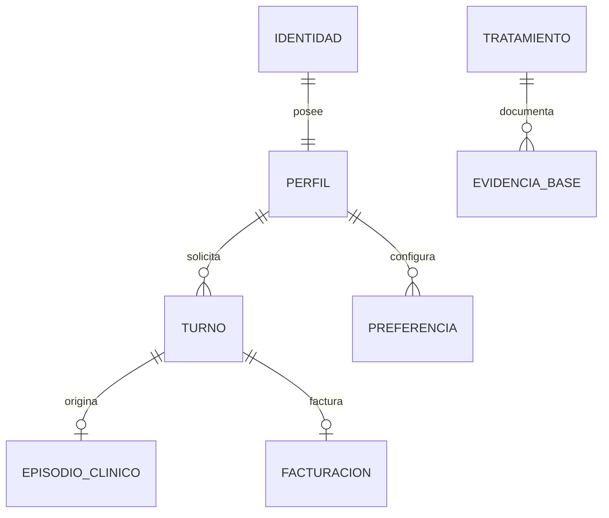

[← Unidad 6](../../)

# Laboratorio — Inventario, minimización y derechos

## Escenario

`SaludEnCasa` ofrece turnos médicos en Argentina y campañas dirigidas a usuarios en España. Guarda en una misma tabla nombre, DNI, contraseña sin hash, diagnóstico, religión, tarjeta, IP, consentimiento, médico y fecha. Un proveedor de analítica recibe una copia semanal indefinida.

{: .warning }
Es un ejercicio de diseño. No uses datos personales reales ni cargues secretos en el repositorio.

## Parte 1 — Inventario

Completá una fila por propósito, no una sola fila por sistema:

| Tratamiento | Finalidad | Datos | Categoría | Titulares | Responsable/encargado | Ubicación | Destinatarios | Retención |
|-------------|----------|-------|-----------|-----------|------------------------|-----------|---------------|-----------|
| Gestión de turnos | | | | | | | | |
| Atención clínica | | | | | | | | |
| Facturación | | | | | | | | |
| Analítica | | | | | | | | |
| Marketing | | | | | | | | |

Preguntas:

1. ¿Qué datos son personales, sensibles bajo Ley 25.326 y especiales bajo GDPR?
2. ¿Qué finalidad parece necesitar cada atributo?
3. ¿La campaña dirigida a España activa GDPR? Fundamentá con artículo 3.
4. ¿El proveedor es encargado o responsable? ¿Qué decisión falta conocer?

## Parte 2 — Minimización y separación

Proponé un modelo lógico que separe autenticación, perfil, episodio clínico, facturación y preferencias. No almacenes contraseñas reversibles: conserva derivadores resistentes con sal única mediante el componente de identidad apropiado.

Explicá qué rol accede a cada entidad. Recepción necesita gestionar turno, no leer diagnóstico; analítica puede trabajar con datos agregados o seudonimizados si la finalidad lo permite.

## Parte 3 — Matriz normativa

Para cada finalidad indicá:

- base/habilitación y, si hay categoría especial, condición adicional;
- información que recibe el titular;
- dato mínimo;
- conservación y evento disparador;
- controles de seguridad;
- transferencia y contrato con proveedor;
- mecanismo para acceso, rectificación y supresión.

No respondas “consentimiento para todo”. Analizá contrato, obligación legal, atención sanitaria y marketing por separado, según el marco aplicable.

## Parte 4 — Solicitud de rectificación y acceso

Una paciente informa que el diagnóstico asociado es de otra persona y pide copia completa.

Diseñá el flujo:

1. recibir por canal autenticado y registrar fecha;
2. verificar identidad de forma proporcional;
3. localizar identificadores en sistemas, logs y proveedor;
4. bloquear o marcar el dato discutido cuando corresponda;
5. contrastar con fuente clínica autorizada, sin inventar;
6. rectificar y propagar;
7. responder en formato comprensible dentro del plazo aplicable;
8. conservar evidencia mínima y analizar causa raíz.

Indicá los plazos de Ley 25.326 y el plazo general GDPR. Explicá qué norma usarías si ambas resultaran aplicables.

## Parte 5 — Retención

Creá una matriz:

| Dataset | Evento inicial | Plazo | Justificación | Borrado/anonimización | Excepción | Evidencia |
|---------|----------------|-------|---------------|-----------------------|-----------|----------|
| Turnos | | | | | | |
| Historia clínica | | | | | | |
| Marketing | | | | | | |
| Logs | | | | | | |
| Copia analítica | | | | | | |
| Backups | | | | | | |

“Indefinido” necesita fundamento excepcional; la comodidad analítica no lo proporciona.

## Parte 6 — Incidente

Un bucket del proveedor fue público durante 36 horas. Construí una línea de tiempo con detección, contención, evidencia, evaluación de riesgo, comunicación interna, autoridad/titulares cuando corresponda y remediación. Identificá confidencialidad, conformidad, credibilidad y trazabilidad como características potencialmente afectadas.

## Entregable y criterio

- 20 % inventario y clasificación;
- 20 % finalidad, base y minimización;
- 20 % modelo de acceso y proveedor;
- 20 % derechos, retención e incidente;
- 20 % relación explícita con ISO 25012 y evidencia.
