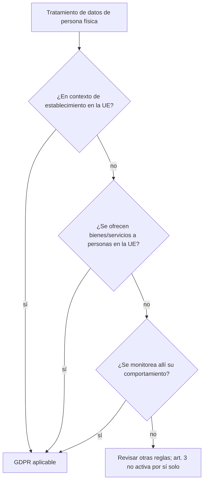
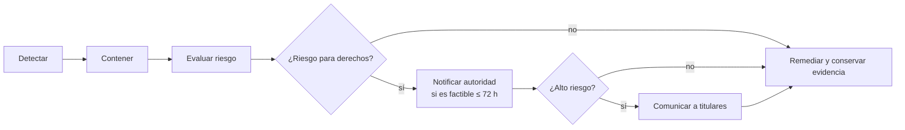

[← Unidad 6](../../)

# GDPR — Reglamento General de Protección de Datos

## Test de aplicabilidad

Estar accesible desde Europa no prueba una oferta dirigida. Se analizan idioma, moneda, publicidad, entrega y actividad real. Tampoco la ciudadanía europea por sí sola activa la aplicación fuera de la Unión.

## Datos personales y categorías especiales

Una persona es identificable directa o indirectamente mediante nombre, número, localización, identificador en línea o elementos de su identidad. Se incluyen datos seudonimizados si aún es posible atribuirlos con información adicional.

Las categorías especiales del artículo 9 son: origen racial o étnico; opiniones políticas; convicciones religiosas o filosóficas; afiliación sindical; datos genéticos; biométricos para identificación unívoca; salud; vida sexual u orientación sexual. El dato biométrico no es especial por cualquier uso: importa que se trate para identificar de manera unívoca.

## Principios del artículo 5

| Principio | Pregunta práctica |
|-----------|------------------|
| Licitud, lealtad y transparencia | ¿Hay base y se explica honestamente? |
| Limitación de finalidad | ¿El nuevo uso es compatible con lo declarado? |
| Minimización | ¿Cada campo es necesario? |
| Exactitud | ¿Se corrigen datos inexactos sin demora? |
| Limitación de conservación | ¿Existe plazo y borrado efectivo? |
| Integridad y confidencialidad | ¿Riesgo y controles son apropiados? |
| Responsabilidad proactiva | ¿Podemos demostrar todo lo anterior? |

## Seis bases del artículo 6

1. consentimiento;
2. ejecución de contrato o medidas precontractuales solicitadas;
3. obligación legal;
4. intereses vitales;
5. interés público o ejercicio de autoridad;
6. interés legítimo, salvo prevalencia de derechos e intereses del titular.

No se elige la base después del incidente. Debe definirse antes y corresponder a la finalidad. Para categorías especiales se necesita, además, una condición del artículo 9; una base del artículo 6 por sí sola no basta.

## Responsable, encargado y DPO

El responsable decide **para qué** y **cómo**; el encargado actúa por instrucciones documentadas. Un contrato debe regular objeto, duración, naturaleza, finalidad, tipos de datos, titulares, confidencialidad, seguridad, subencargados, asistencia, devolución/eliminación y auditoría. Si el encargado decide fines propios, puede pasar a ser responsable para ese tratamiento.

El DPO es obligatorio en supuestos como tratamiento a gran escala que requiera observación habitual y sistemática, gran escala de categorías especiales o tratamiento por autoridad pública con excepciones. Debe actuar con independencia, recursos y acceso a la alta dirección.

## Derechos

| Derecho | Resultado esperado |
|---------|--------------------|
| Información y acceso | Conocer tratamiento y obtener copia |
| Rectificación | Corregir o completar |
| Supresión | Borrar cuando se configura un supuesto, sujeto a excepciones |
| Limitación | Restringir operaciones mientras se resuelve situación |
| Portabilidad | Recibir/transmitir datos en formato estructurado bajo condiciones |
| Oposición | Objetar interés público/legítimo y marketing directo |
| Decisiones automatizadas | No quedar sujeto a ciertas decisiones exclusivamente automatizadas |

Como regla general, se responde sin demora y dentro de un mes; puede ampliarse dos meses por complejidad o cantidad informando dentro del primer mes. El proceso debe localizar réplicas y encargados, pero no se debe borrar evidencia o backups de forma que destruya obligaciones legales: se diseñan restricciones de restauración y re-aplicación del borrado.

## Privacidad desde el diseño, seguridad y DPIA

El artículo 25 exige medidas desde el diseño y por defecto: mínima cantidad, alcance, conservación y accesibilidad. El artículo 32 pide seguridad apropiada al riesgo, considerando estado de la técnica, costos, naturaleza, contexto y gravedad.

Una **DPIA** se realiza antes de tratamientos probablemente de alto riesgo, por ejemplo evaluación sistemática con efectos significativos, gran escala de datos especiales o vigilancia sistemática a gran escala. Describe tratamiento y necesidad, evalúa riesgos y define medidas.

## Brechas

Una brecha afecta confidencialidad, integridad o disponibilidad. El reloj no empieza cuando termina la investigación, sino cuando el responsable toma conocimiento suficiente. Si la notificación se demora, se justifican razones.

## Transferencias internacionales

Orden de análisis:

1. ¿Existe transferencia a tercer país u organización internacional?
2. ¿Hay decisión de adecuación?
3. Si no, ¿hay garantía del artículo 46 —SCC, BCR u otra— y derechos efectivos?
4. ¿El ordenamiento del destino interfiere y hacen falta medidas complementarias?
5. Solo excepcionalmente, ¿aplica una derogación del artículo 49?

Una ubicación europea del servidor tampoco basta si un proveedor de un tercer país puede acceder jurídicamente.

## Multas

| Escalón | Máximo |
|---------|--------|
| Determinadas obligaciones organizativas | €10 millones o 2 % de facturación mundial anual, el mayor |
| Principios, derechos, transferencias y otras infracciones graves | €20 millones o 4 %, el mayor |

No toda infracción recibe el máximo. Se consideran naturaleza, duración, intención/negligencia, daño, cooperación, categorías, antecedentes y medidas adoptadas.

## Diferencias útiles con Ley 25.326

| Tema | Ley 25.326 | GDPR |
|------|------------|------|
| Personas protegidas | Incluye en lo pertinente personas jurídicas | Personas físicas |
| Alcance extraterritorial | Reglas argentinas y transferencias | Test explícito del artículo 3 |
| Base | Consentimiento con excepciones | Seis bases jurídicas |
| Responsabilidad proactiva | Obligaciones y control | Principio expreso, registros, DPIA, diseño |
| Brecha | Seguridad y lineamientos locales | Notificación regulada de 72 h según riesgo |
| Multas máximas | Régimen local y reglamentación | Escalones €10m/2 % y €20m/4 % |

Fuente primaria: [Reglamento (UE) 2016/679](https://eur-lex.europa.eu/eli/reg/2016/679/oj).

{: .note }
Material académico; no sustituye asesoramiento jurídico.
