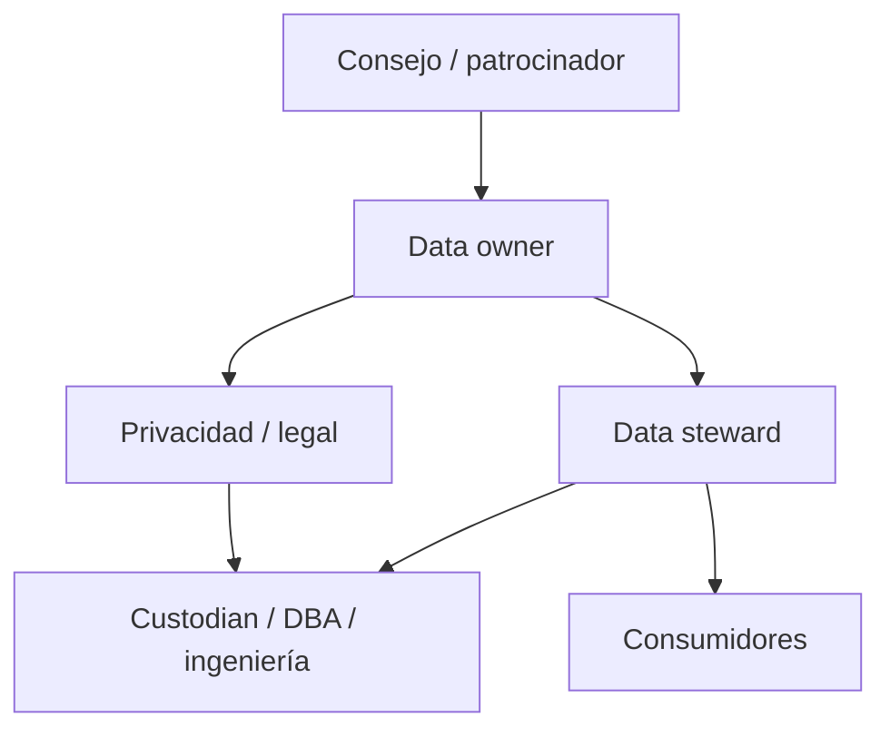

[← Unidad 6](../../)

# Gobierno, privacidad y calidad desde el diseño

## Gobierno no es administración técnica

Administrar una base asegura operación del motor. Gobernar define quién decide significado, finalidad, calidad, acceso, conservación y resolución de conflictos a lo largo de varias aplicaciones.

### RACI simplificada

| Decisión | Owner | Steward | Custodian | Privacidad |
|----------|-------|---------|-----------|------------|
| Definir “cliente activo” | A/R | C | I | C |
| Mantener catálogo y reglas | A | R | C | C |
| Implementar permisos | A | C | R | C |
| Aprobar nueva finalidad | A | C | C | R/C |
| Atender defecto | A | R | R | I |
| Evaluar retención | A | C | C | R |

`R` ejecuta, `A` responde finalmente, `C` es consultado e `I` informado. Debe existir un solo accountable claro por decisión.

## Inventario y clasificación

No se protege lo que no se conoce. El inventario registra sistema, dataset, finalidad, base jurídica, owner, encargado, ubicación, destinatarios, transferencia, retención y controles. La clasificación puede usar niveles público, interno, confidencial y restringido, con etiquetas adicionales personal, sensible, financiero o secreto.

Clasificar por columna no siempre basta: tres atributos no sensibles aislados pueden reidentificar al combinarse. También se inventarían archivos, logs, colas, exports, notebooks y backups.

## Catálogo, glosario y linaje

- **Glosario:** términos de negocio, definición y owner.
- **Diccionario:** tablas, columnas, tipos, dominios y relaciones.
- **Catálogo:** búsqueda, clasificación, ownership, políticas y contexto.
- **Linaje:** origen, transformaciones, movimientos y consumos.

El linaje permite responder qué reportes cambian al corregir un origen, dónde localizar datos ante un derecho y qué transformación introdujo una inconsistencia.

## Privacidad desde el diseño

Antes de recolectar:

1. definir finalidad y base;
2. minimizar atributos y resolución;
3. separar identificadores de datos analíticos;
4. limitar accesos por rol y propósito;
5. fijar retención y borrado;
6. asegurar transferencias y encargados;
7. diseñar atención de derechos e incidentes;
8. medir calidad y conservar evidencia.

**Por defecto** significa que, sin acción adicional del usuario, la configuración expone la menor cantidad necesaria: perfil privado, ubicación desactivada, retención corta y acceso restringido, cuando el contexto lo permite.

## Retención y eliminación

Una política se define por categoría y evento disparador, no con “guardar para siempre por si acaso”. Ejemplo:

| Categoría | Disparador | Plazo | Acción | Excepción |
|-----------|------------|-------|--------|-----------|
| Cuenta operativa | cierre | plazo acordado/legal | borrar o anonimizar | litigio vigente |
| Log de auditoría | creación | plazo de seguridad | eliminación segura | investigación |
| Backup | creación | rotación | vencer copia | preservación formal |

El borrado debe alcanzar réplicas y derivados razonables. En backups inmutables se puede impedir uso ordinario, vencer según ciclo y re-aplicar supresiones si se restaura. Se documenta la limitación en lugar de prometer borrado físicamente imposible e inmediato.

## Calidad y derechos

La rectificación revela por qué trazabilidad y consistencia importan: corregir la tabla maestra sin propagar a data warehouse, buscador o proveedor deja versiones contradictorias. El workflow requiere identidad, búsqueda, decisión, propagación, validación y evidencia.

La supresión también necesita calidad de identidad. Un emparejamiento débil puede borrar datos de otra persona; uno demasiado estricto puede omitir datos del solicitante.

## Antipatrones

- recopilar “por si algún día sirve”;
- dar `db_owner` para resolver demoras;
- exportar planillas fuera del inventario;
- aceptar toda solicitud sin verificar identidad;
- considerar anonimizado un hash reversible por diccionario;
- medir solo nulos y declarar “calidad total”;
- corregir en el dashboard sin reparar el origen;
- conservar backups sin restauraciones probadas;
- delegar responsabilidad completa al proveedor cloud.

## Checklist de un nuevo dataset

- [ ] finalidad y usuarios definidos;
- [ ] base jurídica y transparencia revisadas;
- [ ] atributos mínimos y categorías sensibles identificados;
- [ ] owner, steward y custodian asignados;
- [ ] fuente, linaje y diccionario documentados;
- [ ] reglas ISO relevantes y umbrales acordados;
- [ ] roles, cifrado, logs y backups diseñados;
- [ ] terceros y transferencias evaluados;
- [ ] retención, borrado, derechos e incidentes probados;
- [ ] monitoreo y revisión periódica activos.
