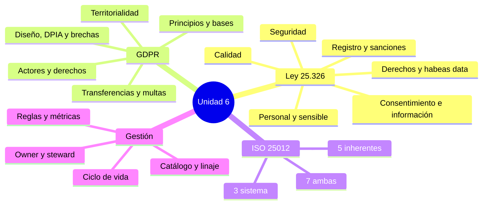

[← Unidad 6](../../)

# Guía para el parcial — Unidad 6

## Mapa mental

## Listas que conviene saber sin consultar

### ISO/IEC 25012: 5 + 7 + 3

- Inherentes: exactitud, completitud, consistencia, credibilidad, actualidad.
- Ambas: accesibilidad, conformidad, confidencialidad, eficiencia, precisión, trazabilidad, comprensibilidad.
- Sistema: disponibilidad, portabilidad, recuperabilidad.

### Principios GDPR

Licitud/lealtad/transparencia; limitación de finalidad; minimización; exactitud; conservación limitada; integridad/confidencialidad; responsabilidad proactiva.

### Artículos destacados de Ley 25.326

| Artículo | Núcleo |
|----------|--------|
| 4 | Calidad |
| 5 | Consentimiento |
| 6 | Información previa |
| 7 | Datos sensibles |
| 9 | Seguridad |
| 14 | Acceso: 10 días corridos |
| 16 | Rectificar/suprimir/actualizar: 5 días hábiles |
| 21 | Inscripción de archivos |
| 31 | Sanciones administrativas |
| 32 | Sanciones penales incorporadas |
| 33 | Procedencia del hábeas data |

## Comparaciones obligatorias

| Comparación | Diferencia esencial |
|-------------|---------------------|
| Calidad vs privacidad | Aptitud para el uso frente a legitimidad/control sobre datos personales |
| Seguridad vs calidad | Reduce acceso/alteración/pérdida frente a adecuación a requisitos |
| Personal vs sensible | Identifica o refiere frente a categoría de protección reforzada |
| Seudonimizar vs anonimizar | Reidentificación con información adicional frente a imposibilidad razonable |
| Consentimiento vs información | Base/habilitación frente a transparencia previa |
| Exactitud sintáctica vs semántica | Forma válida frente a correspondencia con realidad |
| Exactitud vs precisión | Cercanía a verdad frente a granularidad |
| Completitud vs consistencia | Presencia necesaria frente a ausencia de contradicción |
| Actualidad vs disponibilidad | Vigencia del dato frente a acceso al sistema |
| Accesibilidad vs confidencialidad | Acceso apropiado para autorizado frente a restricción a no autorizado |
| Disponibilidad vs recuperabilidad | Servicio accesible ahora frente a restauración tras falla |
| Owner vs steward | Responsabilidad decisoria frente a gestión cotidiana |
| Responsable vs encargado GDPR | Decide fines/medios frente a tratar por instrucciones |
| RPO/RTO vs retención | Recuperación de servicio frente a cuánto tiempo conservar por finalidad/ley |

## Respuestas modelo

### ¿La calidad depende solo del dato?

No. ISO 25012 distingue características inherentes, dependientes del sistema y mixtas. Exactitud pertenece al dato y su contexto; disponibilidad depende de la plataforma; confidencialidad depende tanto de sensibilidad y reglas como de controles técnicos.

### ¿Más completitud siempre es mejor?

No. Solo deben estar completos los datos necesarios. Recolectar atributos extra puede violar minimización o el artículo 4; completar con valores inventados destruye exactitud.

### ¿GDPR alcanza a cualquier empresa que procese datos de un europeo?

No con esa formulación. Se aplica por establecimiento en la Unión o, fuera de ella, por oferta dirigida a personas que están en la Unión o monitoreo de su comportamiento allí. Ciudadanía sola no es el criterio del artículo 3.

### ¿Consentimiento es siempre obligatorio?

No. Ambos regímenes contemplan tratamientos sin consentimiento en supuestos definidos; GDPR posee seis bases del artículo 6. La organización debe identificar y documentar la habilitación correcta, no inventar una aceptación.

### ¿Cómo se mide exactitud?

Se define población, atributo, instante, tolerancia y fuente autorizada; se contrasta una muestra o totalidad y se calcula conformes sobre evaluados. Validar tipo o formato prueba exactitud sintáctica, no semántica.

### ¿Por qué backup no demuestra recuperabilidad?

Porque una copia puede estar corrupta, incompleta o sin procedimiento. Recuperabilidad exige restaurar dentro de objetivos, mantener integridad y validar el resultado.

## Casos cortos resueltos

### Caso 1 — DNI duplicados

En una tabla hay 30 filas con DNI repetido. El síntoma operacional es falta de unicidad; según el modelo puede afectar consistencia y exactitud. Antes de fusionar se verifica si son personas duplicadas o un DNI erróneo. Control: validación en origen, índice único cuando la regla lo permita, algoritmo de matching y revisión humana para casos dudosos.

### Caso 2 — Fecha bien formada, hecho falso

`2001-02-10` pasa el tipo `date`, pero el titular nació en 1991. Existe exactitud sintáctica, no semántica. Se contrasta fuente autorizada, se rectifica, se propaga a cesionarios y se conserva evidencia.

### Caso 3 — Réplica pública de salud

La réplica mejora disponibilidad pero expone diagnósticos. Fallan confidencialidad, conformidad y seguridad; son datos sensibles/especiales. Se debe retirar exposición, contener, evaluar incidente, aplicar mínimo privilegio y revisar arquitectura y obligaciones de notificación.

### Caso 4 — Datos europeos en empresa argentina

Si la empresa ofrece deliberadamente servicios a personas en la UE o monitorea su comportamiento allí, puede aplicar GDPR aunque no tenga sede europea. Además, el tratamiento y transferencia deben analizarse bajo reglas argentinas.

## Errores que quitan puntos

- decir que ISO 25012 tiene “unicidad” como característica número 16;
- confundir precisión con exactitud;
- llamar dato sensible a todo dato secreto;
- afirmar que cifrar vuelve lícito el tratamiento;
- afirmar que anonimizar es reemplazar DNI por un ID reversible;
- presentar consentimiento como única base GDPR;
- usar nacionalidad como único test territorial;
- olvidar el 4 % de facturación mundial en multas graves GDPR;
- citar a la DNPDP como autoridad autónoma actual sin mencionar AAIP;
- dar un porcentaje sin alcance, denominador, fuente ni fecha;
- proponer corregir datos sin reparar causa de origen.

## Simulacro

Una plataforma argentina vende tests genéticos en español, inglés y francés, pauta anuncios dirigidos a Francia y envía muestras a un laboratorio externo. Conserva nombre, tarjeta, genoma, geolocalización y respuestas de salud sin plazo. El 15 % de resultados no puede vincularse con la versión del algoritmo y una caída destruyó los últimos dos días porque el backup no restauraba.

Respondé:

1. Clasificá datos, actores y jurisdicciones.
2. Indicá cinco principios u obligaciones comprometidos.
3. Identificá al menos seis características ISO 25012 afectadas.
4. Proponé una métrica con fórmula y umbral.
5. Diseñá controles preventivos, detectivos y correctivos.
6. Explicá transferencias, proveedor, retención y derechos.

### Pauta de corrección

- Genoma, salud e identificadores son datos personales; genéticos y salud son categorías especiales GDPR, y la salud es sensible en Ley 25.326.
- La oferta dirigida a Francia activa el test del artículo 3 GDPR; también se analiza normativa argentina y transferencia.
- Falta conservación limitada, minimización, transparencia/base, trazabilidad, seguridad y gestión de encargado.
- ISO: trazabilidad, recuperabilidad, disponibilidad, consistencia, credibilidad y conformidad; potencialmente completitud/actualidad.
- Métrica válida: resultados con versión de algoritmo y linaje completo / resultados emitidos × 100, por versión y día; el umbral puede ser 100 % por criticidad.
- Controles: versionado inmutable, claves y trazas, contrato e instrucciones, segregación, cifrado, retención, restore probado y workflow de derechos.

## Autoevaluación final

Podés considerarte preparado si, sin mirar:

- clasificás las 15 características en 5/7/3;
- explicás artículos 4, 5, 6, 7, 9, 31 y 32 de Ley 25.326;
- resolvés alcance, principios, bases, derechos, transferencias y multas GDPR;
- proponés una métrica reproducible y tres tipos de control;
- integrás la respuesta técnica con finalidad, actores, retención y evidencia.
