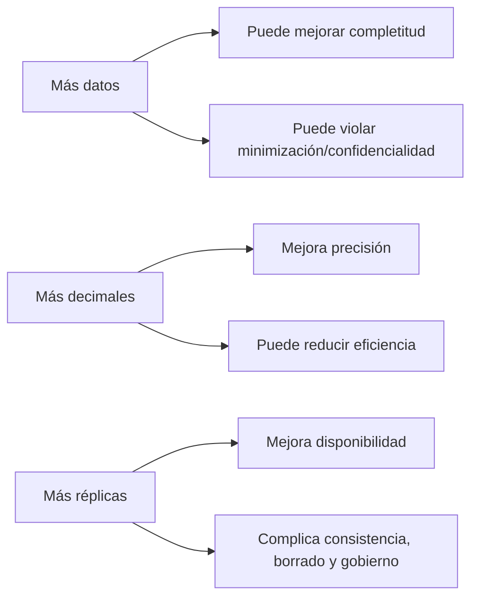

[← Unidad 6](../../)

# ISO/IEC 25012 — Modelo de calidad de datos

El modelo ofrece vocabulario común para definir requisitos, evaluar calidad, identificar responsables y priorizar mejoras en datos estructurados de un sistema. No prescribe una única fórmula ni un umbral universal: cada organización operacionaliza las características según contexto.

## Clasificación exacta de las 15 características

| Perspectiva | Características |
|-------------|-----------------|
| Inherente | exactitud, completitud, consistencia, credibilidad, actualidad |
| Inherente y dependiente del sistema | accesibilidad, conformidad, confidencialidad, eficiencia, precisión, trazabilidad, comprensibilidad |
| Dependiente del sistema | disponibilidad, portabilidad, recuperabilidad |

Regla mnemotécnica: **5 + 7 + 3 = 15**.

## Perspectiva inherente

### Exactitud

Grado en que atributos representan correctamente el valor verdadero en un contexto. Tiene dos caras:

- **sintáctica:** forma y dominio válidos, por ejemplo una fecha parseable;
- **semántica:** correspondencia con la realidad, por ejemplo la fecha real del nacimiento.

Fuente de referencia, momento y tolerancia deben declararse. Comparar dos sistemas no demuestra cuál es correcto.

### Completitud

Datos necesarios presentes. Puede analizarse por atributo, registro, entidad o población. `NULL` puede significar desconocido, no aplicable o aún no capturado; mezclar significados produce métricas engañosas.

### Consistencia

Ausencia de contradicciones respecto de reglas internas, temporales o entre fuentes. Ejemplos: total igual a suma de ítems; fecha de alta no posterior a baja; código de país coherente con provincia.

### Credibilidad

Grado en que usuarios consideran los datos verdaderos y confiables. Aumenta con fuente autorizada, firma, certificación, proceso controlado y reputación. No equivale a exactitud: una fuente creíble todavía puede equivocarse.

### Actualidad

Grado en que edad del dato es adecuada. La ventana depende del uso: segundos para fraude, meses para una fecha de nacimiento. Se distingue `event_time` de `load_time` para no confundir hecho reciente con carga reciente.

## Ambas perspectivas

### Accesibilidad

El dato puede ser accedido en un contexto de uso específico por usuarios autorizados. Involucra formato y significado del dato, interfaces y capacidades del sistema, incluidas necesidades de accesibilidad humana.

### Conformidad

Cumplimiento de estándares, convenciones, normas o reglas. Ejemplos: ISO 8601, catálogo institucional, contrato de API o normativa de privacidad.

### Confidencialidad

Solo sujetos autorizados acceden o interpretan. Depende de sensibilidad inherente y controles: permisos, cifrado, enmascaramiento, segregación y auditoría.

### Eficiencia

Procesamiento con desempeño y recursos aceptables. Un modelo innecesariamente ancho o formato pesado puede degradarla; índices, partición y compresión pueden mejorar el sistema.

### Precisión

Nivel de detalle o discriminación. Guardar temperatura entera no satisface un requisito de décimas. No confundir con exactitud: `20,123456 °C` puede ser muy preciso y completamente falso.

### Trazabilidad

Capacidad de seguir origen, movimientos, transformaciones y, según contexto, accesos. Requiere identificadores, versiones, linaje, marcas temporales y logs protegidos.

### Comprensibilidad

Datos y metadatos pueden ser leídos e interpretados. `IMP = 100` no se entiende sin moneda, unidad, definición, zona horaria y significado. Glosario y diccionario son controles de calidad.

## Perspectiva dependiente del sistema

### Disponibilidad

Datos recuperables por usuarios autorizados cuando se necesitan. Se mide con ventanas de servicio, tiempo activo y fallas; no implica que el contenido sea correcto.

### Portabilidad

Capacidad de instalar, reemplazar o mover datos entre sistemas preservando significado y calidad. Exportar CSV no garantiza portabilidad si se pierden tipos, zona horaria, claves, codificación o metadatos.

### Recuperabilidad

Capacidad de recuperar datos y mantener operaciones e integridad tras una falla. Necesita backups, log, redundancia, procedimientos, RPO/RTO y pruebas reales de restauración.

## Relaciones y tensiones

Las características pueden reforzarse o tensionarse. La solución no es maximizar todas, sino acordar niveles apropiados al riesgo.

## Matriz de diagnóstico

| Síntoma | Característica primaria | Posibles relacionadas |
|---------|-------------------------|-----------------------|
| 12 % de emails vacíos | Completitud | Conformidad |
| DNI válido pero de otra persona | Exactitud semántica | Credibilidad |
| Dos saldos distintos | Consistencia | Trazabilidad, actualidad |
| Stock de ayer | Actualidad | Exactitud para el uso actual |
| Solo DBA entiende códigos | Comprensibilidad | Accesibilidad |
| Consulta tarda 40 minutos | Eficiencia | Disponibilidad percibida |
| Backup nunca restaurado | Recuperabilidad | Disponibilidad |
| CSV pierde tildes y zona horaria | Portabilidad | Exactitud, comprensibilidad |
| Analista ve diagnósticos sin necesidad | Confidencialidad | Conformidad |

## Confusiones típicas

- **Exactitud ≠ precisión:** cercanía a verdad frente a granularidad.
- **Actualidad ≠ disponibilidad:** dato vigente frente a sistema accesible.
- **Accesibilidad ≠ permiso universal:** acceso para quien está autorizado y en el contexto requerido.
- **Completitud ≠ llenar todo:** solo lo necesario; inventar valores empeora exactitud.
- **Credibilidad ≠ verdad demostrada:** confianza sustentada, no garantía.
- **Backup ≠ recuperabilidad:** existe recuperabilidad cuando se puede restaurar y validar.
- **Unicidad:** útil en programas de calidad, pero no es una de las 15 del estándar.

Fuente: [ficha oficial ISO/IEC 25012:2008](https://www.iso.org/standard/35736.html).
