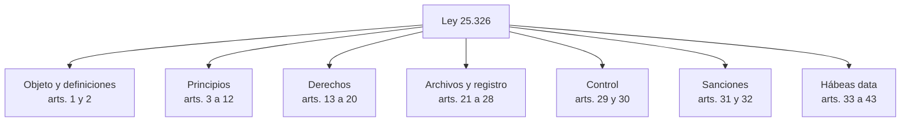
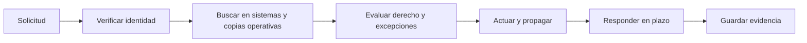

[← Unidad 6](../../)

# Ley 25.326 — Protección de los datos personales

## Mapa de estudio

La ley busca proteger honor e intimidad y garantizar acceso a la información registrada. Comprende archivos públicos y archivos privados destinados a proporcionar informes; varias disposiciones también alcanzan, cuando corresponde, datos de personas jurídicas.

## Definiciones que hay que dominar

| Concepto | Definición operativa | Ejemplo |
|----------|----------------------|---------|
| Dato personal | Información de cualquier tipo sobre persona determinada o determinable | DNI, voz, IP vinculable, deuda |
| Dato sensible | Revela categorías especialmente protegidas | Salud, religión, afiliación sindical |
| Archivo o banco | Conjunto organizado sujeto a tratamiento | CRM, legajos, planilla estructurada |
| Tratamiento | Operaciones sistemáticas que permiten recolectar, conservar, ordenar, modificar, relacionar, evaluar, bloquear, destruir o ceder | Importar clientes y segmentarlos |
| Responsable | Titular que decide sobre el archivo | Empresa dueña del CRM |
| Usuario | Quien trata datos en archivo propio o por conexión | Analista autorizado |
| Disociación | Impide relacionar información con persona determinada o determinable | Estadística realmente anónima |

Que un dato sea público no significa que pueda reutilizarse sin finalidad, proporcionalidad ni límites.

## Principios fundamentales

### Licitud y registro

La formación de archivos debe ser lícita y sus fines no pueden contrariar leyes ni moral pública. Los archivos alcanzados deben observar las reglas de inscripción correspondientes.

### Calidad — artículo 4

Una respuesta completa en parcial debe mencionar:

1. adecuados, pertinentes y no excesivos;
2. recolección leal, sin fraude;
3. uso compatible con la finalidad;
4. exactitud y actualización;
5. corrección, completado o supresión de inexactos/incompletos;
6. almacenamiento que permita el derecho de acceso;
7. destrucción cuando dejaron de ser necesarios o pertinentes.

La calidad legal excede la validación técnica. Un campo puede cumplir tipo y formato, pero ser excesivo para el propósito.

### Consentimiento — artículo 5

La regla es consentimiento libre, expreso e informado, documentado. Entre las excepciones legales se encuentran ciertos datos de fuentes públicas irrestrictas, ejercicio de funciones estatales u obligaciones legales, listados limitados, relaciones contractuales/profesionales y operaciones de entidades financieras. Siempre se debe identificar cuál excepción concreta se invoca.

**No son consentimiento válido:** silencio ambiguo, casilla premarcada, finalidad escondida, aceptación atada a datos innecesarios o texto imposible de comprender.

### Información — artículo 6

El aviso previo permite decidir y ejercer derechos. Debe identificar finalidad, destinatarios, archivo y responsable, obligatoriedad, consecuencias y derechos. Es diferente de pedir consentimiento: aun cuando exista otra habilitación, subsiste el deber de transparencia en los términos aplicables.

### Datos sensibles — artículo 7

Su tratamiento tiene barreras reforzadas. No se puede obligar a suministrarlos ni crear, como regla, archivos con la finalidad de almacenarlos. Las excepciones deben estar autorizadas y justificadas; la disociación puede habilitar determinados usos estadísticos o científicos.

### Seguridad — artículo 9 y secreto — artículo 10

Seguridad comprende disponibilidad, integridad y confidencialidad, además de detección de desvíos. El deber de secreto continúa después de finalizar la relación laboral o contractual. La AAIP aprobó en la Resolución 47/2018 medidas recomendadas para medios informatizados.

### Cesión y transferencia internacional

La cesión requiere finalidad directamente relacionada, legitimidad y, como regla, consentimiento informado sobre destinatario y finalidad, con excepciones legales. Cedente y cesionario asumen obligaciones. La transferencia a países u organismos que no proporcionen protección adecuada está restringida, salvo excepciones o mecanismos reconocidos.

## Derechos y circuito operativo

| Derecho | Qué permite | Plazo legal destacado |
|---------|-------------|-----------------------|
| Información | Consultar existencia, finalidad e identidad de responsables | Registro público y gratuito |
| Acceso | Obtener los propios datos de manera clara y comprensible | 10 días corridos desde intimación fehaciente |
| Rectificación | Corregir dato falso o inexacto | 5 días hábiles |
| Actualización | Poner al día el dato | 5 días hábiles |
| Supresión | Eliminar cuando proceda | 5 días hábiles |

El acceso es gratuito con intervalos no inferiores a seis meses, salvo interés legítimo. La supresión puede no proceder ante obligación legal de conservación o perjuicio a derechos legítimos de terceros. Mientras se verifica una impugnación, corresponde bloquear o indicar que el dato está en revisión. Si hubo cesión, la corrección o supresión debe notificarse al cesionario.

El hábeas data permite conocer datos y finalidad, y exigir supresión, rectificación, confidencialidad o actualización ante falsedad, inexactitud, desactualización o tratamiento prohibido.

## Registro Nacional de Bases de Datos

La inscripción no “legaliza” cualquier tratamiento. Transparenta responsable, finalidad, naturaleza de datos, obtención, destinatarios, interrelaciones, seguridad, personas con acceso, conservación y mecanismos de derechos. El trámite actual se realiza ante la AAIP.

## Sanciones

- **Administrativas:** apercibimiento, suspensión, multa, clausura o cancelación; se gradúan por gravedad, extensión y perjuicio con debido proceso.
- **Civiles:** reparación de daños cuando corresponda.
- **Penales:** conductas dolosas como insertar o comunicar información falsa, acceso ilegítimo o revelación de secretos de un banco personal.

No debe afirmarse que toda falla de calidad constituye delito: el tipo penal exige la conducta y elemento subjetivo previstos.

## Caso resuelto

Una app de descuentos pide DNI, religión, geolocalización permanente y diagnóstico médico para enviar cupones, con una aceptación genérica.

1. Hay datos personales y sensibles.
2. Religión y diagnóstico no son pertinentes para cupones; geolocalización permanente parece excesiva.
3. La aceptación genérica no explica finalidad, destinatarios ni consecuencias.
4. Se deben minimizar campos, separar finalidades, identificar habilitación, establecer conservación, accesos y derechos.
5. Si no existe razón legal para sensibles, no se recolectan; protegerlos mejor no corrige la falta de legitimidad.

## Preguntas de autoevaluación

1. ¿Por qué un dato válido puede violar el artículo 4?
2. ¿Qué diferencia hay entre dato sensible y confidencial?
3. ¿Cuándo seudonimizar no equivale a disociar?
4. ¿Qué información debe incluir el aviso del artículo 6?
5. ¿Qué debe ocurrir con cesionarios después de una rectificación?
6. ¿Qué acciones habilita el hábeas data?

Consulta: [texto actualizado de la Ley 25.326](https://www.argentina.gob.ar/normativa/nacional/64790/actualizacion).

{: .note }
Material académico; no sustituye asesoramiento jurídico.
