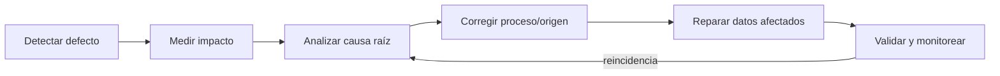

[← Unidad 6](../../)

# Medición y mejora de la calidad

## Ficha de una regla bien definida

| Elemento | Pregunta |
|----------|----------|
| Identificador y nombre | ¿Cómo se referencia sin ambigüedad? |
| Dato crítico | ¿Qué tabla/campo/concepto evalúa? |
| Descripción | ¿Qué condición de negocio debe cumplir? |
| Dimensión ISO | ¿Qué característica representa? |
| Alcance | ¿Qué filas, fecha, país o producto incluye? |
| Fórmula | ¿Cuál es numerador y denominador? |
| Umbral | ¿Qué valor dispara advertencia o rechazo? |
| Frecuencia | ¿En captura, cada hora, diario? |
| Owner/steward | ¿Quién decide y quién opera? |
| Acción | ¿Qué se hace ante defecto? |
| Evidencia | ¿Dónde queda resultado y excepción? |

Una métrica sin denominador, alcance o instante no es reproducible. Un promedio general puede ocultar que una sucursal está muy por debajo: conviene segmentar por fuente, período y criticidad.

## Perfilado con SQL Server

```sql
-- Volumen, completitud y cardinalidad
SELECT
    COUNT_BIG(*) AS filas,
    SUM(CASE WHEN Email IS NULL OR LTRIM(RTRIM(Email)) = '' THEN 1 ELSE 0 END) AS email_faltante,
    COUNT(DISTINCT PaisCodigo) AS paises_distintos,
    MIN(FechaActualizacion) AS actualizacion_mas_antigua,
    MAX(FechaActualizacion) AS actualizacion_mas_reciente
FROM calidad.Cliente;
```

```sql
-- Posibles duplicados: primero se normaliza una clave de comparación
SELECT LOWER(LTRIM(RTRIM(Email))) AS email_normalizado, COUNT(*) AS cantidad
FROM calidad.Cliente
WHERE NULLIF(LTRIM(RTRIM(Email)), '') IS NOT NULL
GROUP BY LOWER(LTRIM(RTRIM(Email)))
HAVING COUNT(*) > 1;
```

```sql
-- Validez sintáctica de fecha textual; no prueba que el hecho sea verdadero
SELECT ClienteId, FechaNacimientoTexto
FROM calidad.Cliente
WHERE TRY_CONVERT(date, FechaNacimientoTexto, 23) IS NULL
  AND FechaNacimientoTexto IS NOT NULL;
```

## Cálculo porcentual seguro

```sql
SELECT CAST(
         100.0 * SUM(CASE WHEN Email IS NOT NULL
                           AND LTRIM(RTRIM(Email)) <> '' THEN 1 ELSE 0 END)
         / NULLIF(COUNT_BIG(*), 0)
       AS decimal(6,2)) AS completitud_email_pct
FROM calidad.Cliente
WHERE Activo = 1;
```

El `100.0` evita división entera y `NULLIF` evita división por cero. Debe aclararse si “no aplicable” entra en el denominador.

## Controles preventivos, detectivos y correctivos

| Tipo | Objetivo | Ejemplos |
|------|----------|----------|
| Preventivo | Evitar que nazca el defecto | tipo, `NOT NULL`, FK, catálogo, formulario |
| Detectivo | Encontrarlo rápidamente | perfilado, reconciliación, alerta, auditoría |
| Correctivo | Restaurar y evitar recurrencia | subsanar con fuente, reprocesar, corregir origen |

```sql
ALTER TABLE calidad.Cliente
ADD CONSTRAINT CK_Cliente_Pais
CHECK (PaisCodigo IN ('ARG', 'BRA', 'URY'));

CREATE UNIQUE INDEX UX_Cliente_DNI
ON calidad.Cliente(DNI)
WHERE DNI IS NOT NULL;
```

Una restricción puede ser inaplicable sobre datos heredados. El plan correcto es perfilar, poner excepciones en cuarentena, corregir con evidencia y recién entonces hacer cumplir la regla; usar `NOCHECK` indefinidamente crea confianza falsa.

## Causa raíz y mejora continua



Causas frecuentes: definición ambigua, campo opcional por error, interfaz sin catálogo, integración que trunca, zonas horarias distintas, fuente no autorizada, operación manual, demora de carga o incentivos contrapuestos.

Para cada defecto se documenta impacto, datos afectados, causa, owner, remediación, fecha y prueba posterior. “Actualizar con cero” rara vez es corrección: puede borrar la diferencia entre desconocido y valor real cero.

## Indicadores de proceso

Además del porcentaje conforme, conviene medir:

- cantidad y severidad de incidencias abiertas;
- tiempo medio hasta detección y resolución;
- tasa de reincidencia;
- fuentes que originan defectos;
- cobertura de reglas sobre datos críticos;
- excepciones vencidas;
- porcentaje de controles automatizados.

Un tablero sirve para decidir. Los colores no reemplazan owner ni acción; un 99 % puede ser inaceptable si el 1 % son alergias médicas o cuentas de alto riesgo.

## Diseño de una evaluación

1. Seleccionar proceso y datos críticos.
2. Definir significado con negocio y metadatos.
3. Elegir características relevantes.
4. Perfilar y establecer línea base.
5. Formular reglas y métricas.
6. Acordar umbrales según riesgo.
7. Automatizar controles cerca del origen.
8. Gestionar excepciones sin ocultarlas.
9. Corregir causa y datos.
10. Monitorear tendencia y revisar reglas.

## Pregunta modelo

**“El 8 % de clientes no tiene teléfono: ¿la calidad es 92 %?”**

Solo puede afirmarse que la completitud del teléfono, para la población y criterio definidos, es 92 %. No describe exactitud, actualidad ni calidad global. Si teléfono es opcional para ciertos clientes, se los excluye justificadamente del denominador; si hay valores falsos como `0000`, la simple presencia sobreestima calidad.
