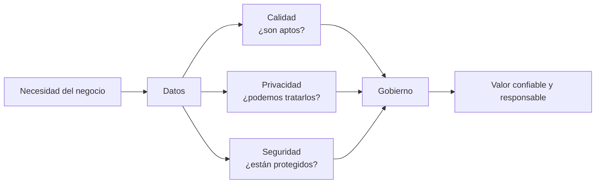
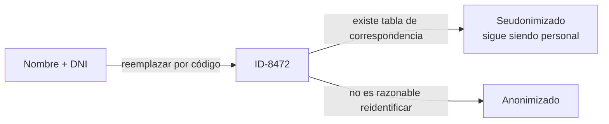
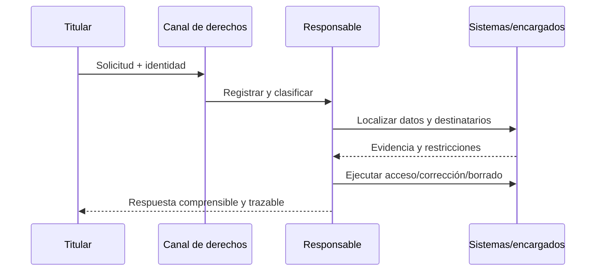
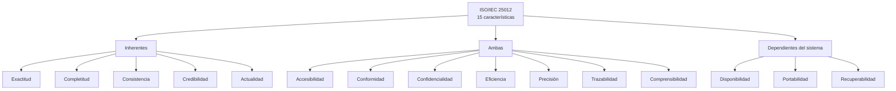
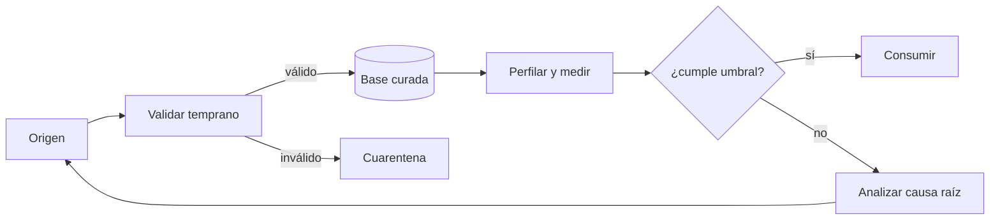
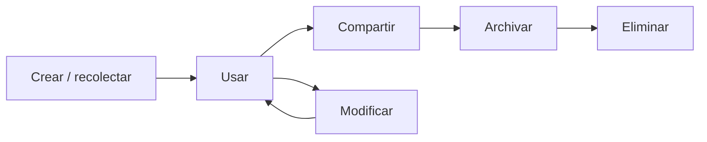

[← Unidad 6](../../)

# Unidad 6 — Calidad y protección de los datos

Una base puede estar disponible y responder rápido, pero producir decisiones equivocadas porque sus datos son incompletos o falsos. También puede contener datos correctos y, aun así, tratarlos de forma ilícita. Esta unidad estudia las dos preguntas juntas:

1. **¿Los datos sirven para el propósito previsto?** Calidad de datos e ISO/IEC 25012.
2. **¿Es legítimo y seguro tratarlos?** Ley 25.326, GDPR y gobierno de datos.



{: .important }
Calidad, seguridad y privacidad se relacionan, pero no son sinónimos. El cifrado protege confidencialidad; no corrige una fecha falsa. Una restricción `CHECK` mejora consistencia; no convierte en lícita una recolección sin base jurídica.

### Conocimientos previos que se reutilizan

El material presupone conceptos de la unidad anterior: principio de mínimo privilegio (POLP), clasificación de usuarios, autenticación y políticas de contraseña, estructura de permisos, DCL (`GRANT`, `DENY`, `REVOKE`), propietarios y roles. Aquí se aplican para materializar confidencialidad, seguridad y responsabilidad; conviene repasarlos antes de los laboratorios.

## 1. ¿Qué significa calidad?

La calidad es el grado en que un conjunto de características satisface requisitos. En datos, no existe calidad absoluta: se evalúa respecto de un **uso**, sus reglas y el riesgo de equivocarse.

Un domicilio sin número de piso puede ser suficiente para segmentar ventas por barrio e insuficiente para entregar un paquete. Por eso, antes de medir se debe conocer:

- propósito y proceso que consume el dato;
- definición de negocio;
- fuente considerada confiable;
- instante de referencia;
- población y campos críticos;
- umbral aceptable y consecuencias del incumplimiento.

La frase atribuida a Henry Ford que abre el material resume una idea central: calidad no es un arreglo final, sino ejecutar correctamente el proceso incluso cuando nadie lo observa. Prevenir el defecto en el origen cuesta menos que perseguirlo por todos los sistemas derivados.

### Dato, información y metadato

- **Dato:** representación de un hecho, por ejemplo `2026-07-20`.
- **Información:** dato interpretado en contexto, por ejemplo “fecha de última actualización del domicilio”.
- **Metadato:** dato que describe al dato: significado, tipo, propietario, origen, transformación, sensibilidad o regla de calidad.

La misma cadena puede tener distintas interpretaciones; por eso la calidad también depende de definiciones y metadatos compartidos.

## 2. Marco argentino: Ley 25.326

La Ley 25.326 fue sancionada el 4 de octubre de 2000. Protege los datos personales asentados en archivos públicos o privados destinados a dar informes, garantiza honor e intimidad y permite conocer la información registrada. La acción constitucional que tutela estos derechos es el **hábeas data**.

La autoridad nacional actual es la **Agencia de Acceso a la Información Pública (AAIP)**. La Dirección Nacional de Protección de Datos Personales funciona dentro de ella. Nombrar solamente a la antigua DNPDP como autoridad independiente, como aparece en materiales históricos, queda desactualizado.

### 2.1 Categorías

**Dato personal** es cualquier información referida a una persona humana o jurídica determinada o determinable. Ejemplos: DNI, domicilio, teléfono, imagen, correo, ubicación o historial crediticio. Un identificador técnico también puede ser personal si permite singularizar o vincular a alguien.

**Dato sensible** revela origen racial o étnico, opiniones políticas, convicciones religiosas, filosóficas o morales, afiliación sindical, salud o vida sexual. Nadie puede ser obligado a proporcionarlo; su recolección y tratamiento están especialmente restringidos.

**Dato disociado o anonimizado** no puede asociarse a una persona determinada o determinable mediante medios razonables. Seudonimizar no es anonimizar: sustituir el DNI por un código reduce exposición, pero si existe una tabla que revierte la relación, sigue siendo dato personal.



### 2.2 Calidad: artículo 4

Los datos deben ser adecuados, pertinentes y no excesivos respecto de la finalidad; obtenerse lealmente; usarse de manera compatible; ser exactos y actualizarse cuando corresponda. Si son inexactos o incompletos, deben corregirse, completarse o suprimirse. Deben almacenarse de modo que el titular pueda ejercer acceso y eliminarse cuando dejaron de ser necesarios o pertinentes.

De este artículo se desprenden reglas técnicas concretas:

- pedir solo atributos necesarios;
- registrar propósito y procedencia;
- definir responsable y fecha de actualización;
- habilitar corrección y propagación a destinatarios;
- establecer plazos de conservación y eliminación verificable.

### 2.3 Consentimiento: artículo 5

Como regla, el tratamiento requiere consentimiento **libre, expreso e informado**, documentado por escrito o por un medio equivalente. No todo tratamiento depende del consentimiento: la ley contempla excepciones, por ejemplo datos de fuentes públicas irrestrictas, obligaciones legales, funciones estatales, relaciones contractuales o profesionales y ciertas operaciones financieras. La excepción debe analizarse y documentarse; no se presume por conveniencia.

Consentir una finalidad no habilita cualquier uso posterior. Un correo entregado para recibir una factura no autoriza automáticamente perfilar preferencias políticas.

### 2.4 Deber de informar: artículo 6

Antes de recolectar se debe informar de forma clara:

- finalidad y destinatarios;
- existencia del archivo y responsable;
- carácter obligatorio o facultativo de las respuestas;
- consecuencias de entregar, negarse o suministrar datos inexactos;
- posibilidad de ejercer acceso, rectificación y supresión.

### 2.5 Datos sensibles: artículo 7

No se puede obligar a revelar datos sensibles. Solo pueden tratarse con razones de interés general autorizadas por ley; también pueden utilizarse con fines estadísticos o científicos si no es posible identificar a las personas. Se prohíbe formar archivos cuya finalidad sea almacenar información sensible, con excepciones legales específicas. Los establecimientos sanitarios pueden tratar datos de salud respetando secreto profesional.

### 2.6 Seguridad y confidencialidad

El artículo 9 exige medidas técnicas y organizativas para evitar adulteración, pérdida, consulta o tratamiento no autorizado y para detectar desviaciones. No deben registrarse datos personales en archivos que no reúnan condiciones técnicas de integridad y seguridad. El artículo 10 agrega deber de secreto incluso después de terminada la relación con el tratamiento.

Controles típicos:

- autenticación robusta, mínimo privilegio y segregación de funciones;
- cifrado en tránsito y, según riesgo, en reposo;
- backups probados y registros de auditoría;
- clasificación, minimización y enmascaramiento;
- gestión de vulnerabilidades, incidentes y proveedores;
- baja de accesos y eliminación segura.

### 2.7 Derechos, registro y sanciones

El titular puede conocer si existen datos, acceder a ellos y solicitar rectificación, actualización, supresión o confidencialidad. La ley fija hasta **10 días corridos** para responder acceso y **5 días hábiles** para rectificar, suprimir o actualizar. Si el responsable incumple, puede proceder el hábeas data.

Los archivos públicos y los privados destinados a proporcionar informes deben inscribirse en el Registro Nacional de Bases de Datos. Se declara, entre otros elementos, finalidad, clases de datos, destinatarios, seguridad, conservación y procedimiento para derechos.

El artículo 31 prevé sanciones administrativas: apercibimiento, suspensión, multa, clausura o cancelación del archivo, además de posibles daños y responsabilidades penales. El artículo 32 incorporó delitos vinculados con insertar o proporcionar datos falsos a sabiendas, acceder ilegítimamente o revelar información que debía mantenerse secreta.

## 3. GDPR

El Reglamento (UE) 2016/679 —GDPR o RGPD— protege personas físicas respecto del tratamiento de datos y permite la libre circulación de esos datos dentro de la Unión. Es aplicable desde el 25 de mayo de 2018.

### 3.1 Alcance territorial preciso

No alcanza a toda empresa del mundo solo porque Internet sea global. Se aplica cuando:

1. el tratamiento ocurre en el contexto de un establecimiento de responsable o encargado en la Unión, aunque el procesamiento físico suceda fuera; o
2. un responsable o encargado fuera de la Unión ofrece bienes o servicios a personas que se encuentran en ella, o monitorea allí su comportamiento.

La nacionalidad del titular no es la prueba decisiva. Importan establecimiento, oferta dirigida y monitoreo según el artículo 3.

### 3.2 Conceptos y actores

- **Dato personal:** información sobre una persona física identificada o identificable.
- **Tratamiento:** cualquier operación: recoger, consultar, modificar, comunicar, combinar o borrar.
- **Titular o data subject:** persona a la que se refieren los datos.
- **Responsable o controller:** decide fines y medios.
- **Encargado o processor:** trata por cuenta del responsable.
- **Destinatario/tercero:** recibe datos bajo las condiciones aplicables.
- **DPO:** delegado de protección de datos exigido en determinados supuestos y útil como función independiente de asesoramiento y control.

Las categorías especiales incluyen origen racial o étnico, opiniones políticas, creencias religiosas o filosóficas, afiliación sindical, datos genéticos, biométricos usados para identificar unívocamente, salud, vida sexual u orientación sexual. Su tratamiento está en principio prohibido, salvo las excepciones del artículo 9.

### 3.3 Principios y bases jurídicas

Los principios del artículo 5 son:

- licitud, lealtad y transparencia;
- limitación de finalidad;
- minimización;
- exactitud;
- limitación del plazo de conservación;
- integridad y confidencialidad;
- responsabilidad proactiva: poder demostrar cumplimiento.

Todo tratamiento necesita una base del artículo 6: consentimiento, contrato, obligación legal, intereses vitales, misión de interés público/autoridad pública o interés legítimo ponderado. El consentimiento es solo una de seis bases y debe poder retirarse tan fácilmente como se otorgó.

### 3.4 Derechos

El GDPR reconoce información transparente, acceso, rectificación, supresión, limitación, portabilidad, oposición y protección frente a decisiones exclusivamente automatizadas con efectos jurídicos o similares significativos. No son absolutos: cada solicitud exige verificar identidad, alcance, excepciones, plazos y trazabilidad.



### 3.5 Responsabilidad, seguridad e incidentes

El responsable debe mantener registros cuando corresponda, celebrar contratos con encargados, aplicar protección de datos desde el diseño y por defecto, evaluar riesgos, implementar seguridad apropiada y efectuar una evaluación de impacto cuando un tratamiento de alto riesgo lo requiera.

Una violación de seguridad de datos personales debe notificarse a la autoridad de control sin dilación indebida y, cuando sea factible, dentro de **72 horas**, salvo que sea improbable que entrañe riesgo. Si existe alto riesgo, normalmente también se comunica al titular.

### 3.6 Transferencias y multas

Enviar datos fuera del Espacio Económico Europeo no está prohibido automáticamente. El capítulo V exige preservar el nivel de protección mediante:

- decisión de adecuación;
- garantías apropiadas, como cláusulas contractuales tipo o normas corporativas vinculantes;
- derogaciones excepcionales aplicables al caso.

Debe evaluarse destino, mecanismo, acceso por autoridades y medidas complementarias. Que un proveedor tenga servidores “en la nube” no resuelve por sí solo la legitimidad.

El régimen tiene dos escalones máximos: hasta **10 millones de euros o 2 %** de la facturación mundial anual, y para infracciones más graves hasta **20 millones o 4 %**; se aplica el valor mayor y se gradúa según el caso. Decir solamente “hasta 20 millones” deja incompleta la regla.

## 4. ISO/IEC 25012: modelo de calidad de datos

ISO/IEC 25012:2008 define un modelo general para datos estructurados conservados en sistemas informáticos. Organiza **15 características** desde dos perspectivas.

- **Inherente:** la calidad pertenece al dato y a sus relaciones con dominios, reglas y metadatos.
- **Dependiente del sistema:** la calidad se alcanza o preserva mediante capacidades del hardware, software y entorno.

Algunas características pertenecen a ambas perspectivas.



### 4.1 Características inherentes

| Característica | Pregunta de control | Ejemplo |
|----------------|---------------------|---------|
| Exactitud | ¿Representa correctamente el valor real? | La fecha de nacimiento coincide con fuente autorizada |
| Completitud | ¿Están todos los valores y registros necesarios? | Todo pedido tiene cliente y fecha |
| Consistencia | ¿Respeta reglas y no se contradice? | `fecha_fin >= fecha_inicio` |
| Credibilidad | ¿Es considerado verdadero y confiable? | Domicilio verificado y con fuente conocida |
| Actualidad | ¿Tiene la antigüedad apropiada para su uso? | Stock actualizado hace menos de cinco minutos |

La exactitud puede ser **sintáctica** —valor dentro del conjunto o formato esperado— y **semántica** —valor que coincide con la realidad—. `2026-01-31` es sintácticamente válido, pero puede ser semánticamente falso como fecha de nacimiento de un cliente adulto.

### 4.2 Características inherentes y dependientes del sistema

| Característica | Idea central |
|----------------|--------------|
| Accesibilidad | Usuarios autorizados pueden acceder, incluso considerando necesidades de interacción |
| Conformidad | El dato cumple estándares, convenciones o regulaciones aplicables |
| Confidencialidad | Solo sujetos autorizados acceden o interpretan el dato |
| Eficiencia | Se procesa con recursos y tiempos aceptables |
| Precisión | Posee el nivel de detalle o discriminación requerido |
| Trazabilidad | Se conocen origen, transformaciones y accesos relevantes |
| Comprensibilidad | Significado, unidades, códigos y relaciones pueden interpretarse correctamente |

### 4.3 Características dependientes del sistema

| Característica | Idea central |
|----------------|--------------|
| Disponibilidad | Datos accesibles cuando y durante el tiempo requerido |
| Portabilidad | Pueden transferirse o utilizarse en otro entorno preservando significado y calidad |
| Recuperabilidad | Pueden recuperarse y mantener un estado íntegro ante fallas |

{: .warning }
**Unicidad no figura entre las 15 características de ISO/IEC 25012.** Es una dimensión operativa muy usada y suele apoyar exactitud o consistencia. En un parcial, no debe agregarse como “la número 16” del estándar.

## 5. De la característica a una métrica

Una característica es abstracta. Para gestionarla se define una regla y una medición reproducible:

```text
requisito → dato crítico → regla → indicador → umbral → acción → evidencia
```

Ejemplo: “los teléfonos deben permitir contacto” no es medible. Una operacionalización posible es:

- alcance: clientes activos de Argentina;
- regla: teléfono no nulo y normalizado en formato acordado;
- indicador: filas conformes / filas evaluadas × 100;
- umbral: 98 %;
- responsable: dueño de Clientes;
- acción: corregir origen y reprocesar excepciones;
- frecuencia: diaria.

### Métricas básicas

Sea `N` la población evaluada:

| Dimensión | Indicador posible |
|-----------|-------------------|
| Completitud | valores obligatorios presentes / valores obligatorios esperados |
| Consistencia | registros que cumplen reglas / registros evaluados |
| Actualidad | registros dentro de ventana / registros evaluados |
| Unicidad operativa | entidades sin duplicado / entidades evaluadas |
| Exactitud | valores correctos contra fuente / valores contrastados |

Un `NOT NULL` mide presencia, no exactitud. Una regex o `TRY_CONVERT` prueba forma, no verdad. Para exactitud semántica suele ser necesaria una fuente maestra, verificación externa o muestreo.

### Perfilado y controles

El **perfilado** descubre distribución, nulos, cardinalidad, duplicados, patrones, rangos, valores atípicos y relaciones. Sirve para establecer línea base; no reemplaza las reglas de negocio.

Los controles pueden ubicarse:

- en captura: validación de interfaz y catálogos;
- en base: tipos, `NOT NULL`, `CHECK`, `UNIQUE`, claves y referencias;
- en integración: contratos de esquema, reconciliación y cuarentena;
- en consumo: pruebas de datasets, alertas y acuerdos de nivel de calidad.



Corregir exclusivamente en el reporte oculta la causa y deja defectuosos los demás consumidores. Se priorizan datos por impacto y se repara el proceso que produce el error.

## 6. Gobierno de datos

Gobierno es el sistema de decisiones, responsabilidades, políticas, procesos y controles que permite administrar datos como activo. No es solo comprar un catálogo ni nombrar un comité.

### Roles habituales

- **Data owner:** responde por definición, uso, calidad, acceso y prioridades de un dominio.
- **Data steward:** mantiene definiciones, reglas, metadatos, incidencias y coordinación cotidiana.
- **Custodian/administrador:** implementa almacenamiento, disponibilidad, backup y controles técnicos.
- **Responsable/encargado legal:** decide fines y medios, o procesa por cuenta del responsable.
- **DPO o función de privacidad:** asesora y supervisa obligaciones cuando corresponde.
- **Consumidor:** usa conforme a propósito y reporta defectos.

Una persona puede ocupar varios roles en una organización pequeña, pero las responsabilidades deben quedar explícitas y evitar conflictos incompatibles.

### Artefactos

- glosario de negocio y diccionario técnico;
- catálogo, clasificación y propietario;
- linaje desde origen hasta reporte;
- reglas, métricas, umbrales y tablero;
- matriz de acceso y registro de tratamientos;
- políticas de retención, eliminación e incidentes;
- backlog de problemas con causa raíz y evidencia de cierre.

### Ciclo de vida



En cada etapa se pregunta: ¿qué finalidad?, ¿qué base jurídica?, ¿qué mínimo dato?, ¿quién accede?, ¿cómo se asegura?, ¿cuánto se conserva?, ¿cómo se atienden derechos? **Privacidad desde el diseño y por defecto** significa resolverlo antes de producción y configurar por defecto la menor exposición compatible con el propósito.

## 7. Cómo integrar los marcos

| Pregunta | Ley 25.326 / GDPR | ISO/IEC 25012 | Gobierno y técnica |
|----------|---------------------|---------------|---------------------|
| ¿Debemos recolectarlo? | Finalidad, base, información, minimización | Conformidad | Inventario y aprobación |
| ¿Es correcto? | Exactitud/calidad y rectificación | Exactitud, completitud, consistencia | Reglas y fuente maestra |
| ¿Quién lo ve? | Seguridad y confidencialidad | Confidencialidad, accesibilidad | IAM, roles y auditoría |
| ¿De dónde vino? | Responsabilidad y derechos | Trazabilidad, credibilidad | Linaje y logs |
| ¿Cuánto dura? | Necesidad y conservación limitada | Actualidad, conformidad | Política y borrado |
| ¿Sobrevive una falla? | Seguridad apropiada | Disponibilidad y recuperabilidad | Backup, restore y DR |

Cumplimiento legal no certifica alta calidad, e ISO 25012 no prueba licitud. Un diseño responsable necesita ambos análisis.

## 8. Método para resolver casos de parcial

Ante un escenario, responder en este orden:

1. **Identificar datos y actores:** personal/sensible, titular, responsable, encargado, owner.
2. **Delimitar finalidad y jurisdicción:** qué se pretende, Ley 25.326, criterio territorial GDPR.
3. **Detectar problemas:** principio o característica afectada; no escribir solo “mala calidad”.
4. **Proponer controles:** preventivo, detectivo y correctivo, con responsable.
5. **Medir:** numerador, denominador, alcance, frecuencia, umbral y fuente de verdad.
6. **Cerrar el ciclo:** derechos, destinatarios, conservación, evidencia y monitoreo.

### Ejemplo breve

Una clínica exporta una planilla con diagnósticos y correos a un proveedor sin contrato ni cifrado. Además, 18 % de diagnósticos carece de fecha.

- son datos personales y sensibles de salud;
- deben justificarse finalidad y habilitación, informarse tratamiento y limitarse destinatarios;
- fallan confidencialidad/conformidad y seguridad; también completitud y actualidad potencial;
- controles: contrato e instrucciones, mínimo privilegio, canal cifrado, seudonimización, retención, auditoría y respuesta a incidentes;
- métrica: diagnósticos con fecha requerida / diagnósticos evaluados, segmentada por origen;
- acción de fondo: hacer obligatoria la fecha cuando clínicamente corresponda y corregir el proceso de captura, no inventarla.

## 9. Fuentes normativas y estándar

- [Ley 25.326 — texto actualizado](https://www.argentina.gob.ar/normativa/nacional/64790/actualizacion)
- [AAIP — derechos de las personas](https://www.argentina.gob.ar/aaip/datospersonales/derechos)
- [AAIP — inscripción en el Registro Nacional de Bases de Datos](https://www.argentina.gob.ar/aaip/datospersonales/tramites)
- [Resolución AAIP 47/2018 — medidas de seguridad recomendadas](https://www.argentina.gob.ar/normativa/nacional/resoluci%C3%B3n-47-2018-312662)
- [Reglamento (UE) 2016/679 — EUR-Lex](https://eur-lex.europa.eu/eli/reg/2016/679/oj)
- [ISO/IEC 25012:2008 — ficha oficial](https://www.iso.org/standard/35736.html)

{: .note }
Este apunte tiene finalidad académica. En un caso real se debe consultar el texto vigente, la reglamentación, la autoridad competente y asesoramiento profesional.
